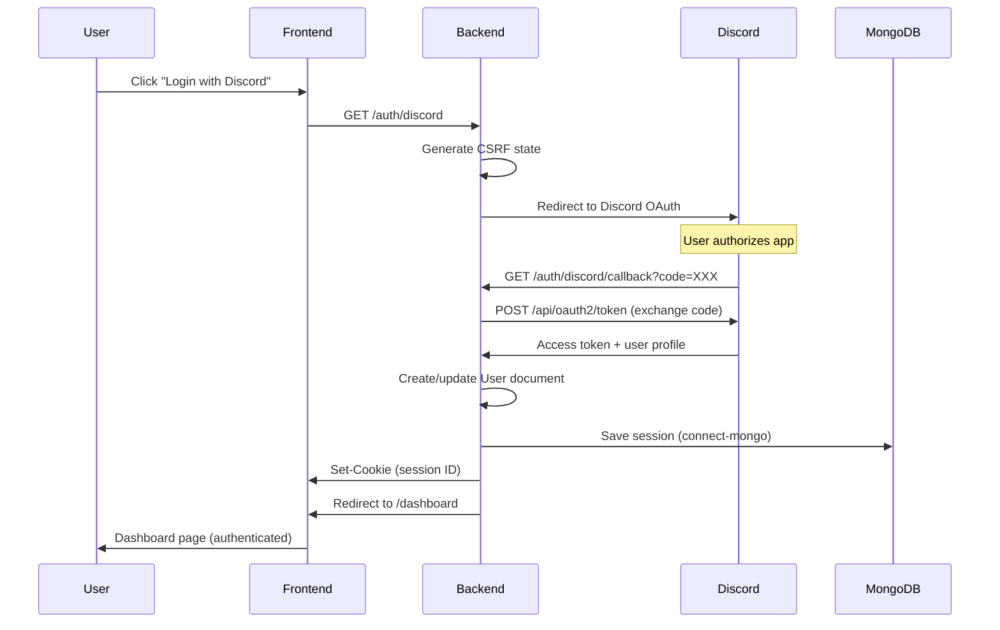
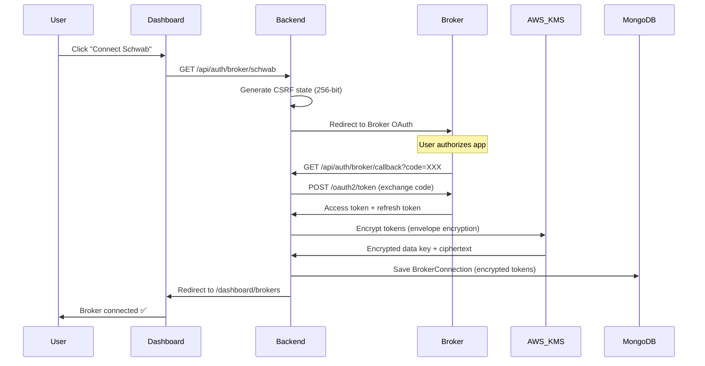
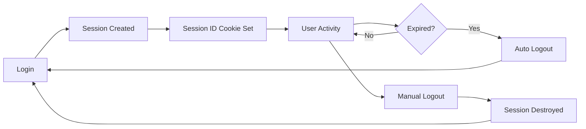
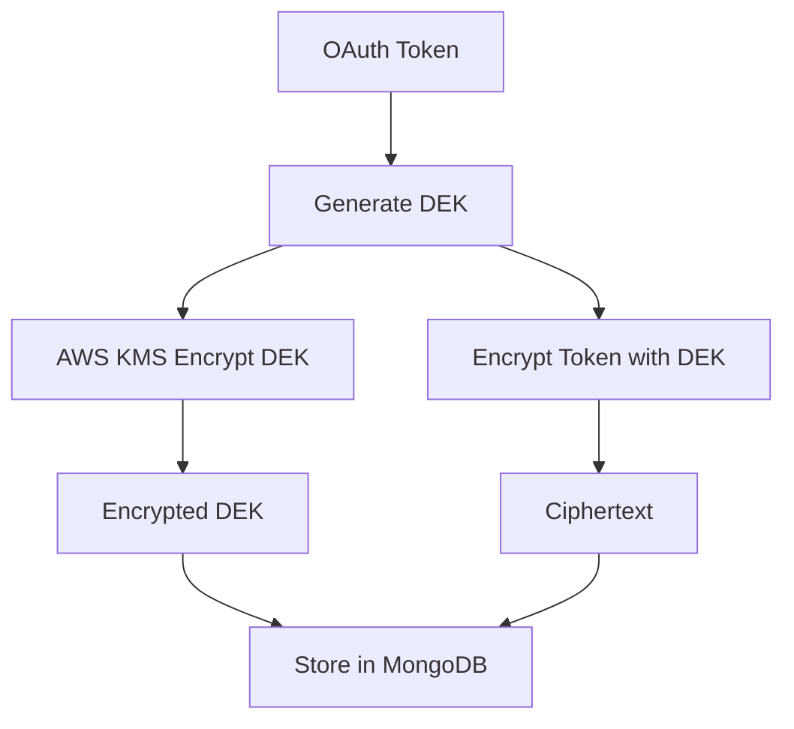

# OAuth2 Authentication Architecture

**Last Updated**: 2025-10-20
**Status**: Production
**Owner**: Backend Team
**Related Proposals**: `openspec/changes/implement-unified-oauth2-authentication`

---

## Table of Contents

1. [Overview](#overview)
2. [OAuth2 Flow Diagram](#oauth2-flow-diagram)
3. [Discord OAuth2 Integration](#discord-oauth2-integration)
4. [Broker OAuth2 Integration](#broker-oauth2-integration)
5. [Session Management](#session-management)
6. [Security Architecture](#security-architecture)
7. [Implementation Reference](#implementation-reference)
8. [Troubleshooting](#troubleshooting)

---

## Overview

### System Purpose

The OAuth2 authentication system provides secure, delegated access to:
- **Discord OAuth2**: User identity verification and community association
- **Broker APIs**: Secure access to trading platforms (Alpaca, Schwab, IBKR, TD Ameritrade, E*TRADE)
- **Session Management**: Persistent authentication state using MongoDB-backed sessions

### Architecture Principles

1. **Secure by Default**: All OAuth tokens encrypted at rest using AES-256-GCM + AWS KMS
2. **Graceful Degradation**: Continues operation when AWS KMS unavailable (local encryption only)
3. **Multi-Tenant Isolation**: All credentials scoped to tenant ID using AsyncLocalStorage
4. **Zero Trust**: Never trust client-supplied credentials, always validate server-side

### Technology Stack

| Component | Technology | Purpose |
|-----------|-----------|---------|
| OAuth2 Library | Passport.js | Strategy-based authentication |
| Session Store | connect-mongo + MongoDB | Persistent session storage |
| Encryption | AES-256-GCM + AWS KMS | Token encryption at rest |
| Cookie Security | express-session | Secure, httpOnly cookies |
| CSRF Protection | Helmet + custom middleware | Cross-site request forgery prevention |

---

## OAuth2 Flow Diagram

### Discord OAuth2 Login Flow



### Broker OAuth2 Connection Flow



---

## Discord OAuth2 Integration

### Configuration

**Environment Variables** (`.env`):
```bash
# Discord OAuth2 Application
DISCORD_CLIENT_ID=your_discord_app_client_id_here
DISCORD_CLIENT_SECRET=your_discord_app_client_secret_here
DISCORD_CALLBACK_URL=https://yourdomain.com/auth/discord/callback

# Session Configuration
SESSION_SECRET=generate_strong_random_string_here
NODE_ENV=production
```

### Implementation Files

| File | Purpose | Key Functions |
|------|---------|---------------|
| `src/routes/auth.js` | Auth routes | Login, callback, logout endpoints |
| `src/middleware/auth.js` | Passport config | Discord strategy, serialization |
| `src/models/User.js` | User model | Discord ID, guilds, profile |
| `src/index.js` | Session setup | express-session + connect-mongo |

### Login Flow Code Reference

**Step 1: Initiate OAuth** (`src/routes/auth.js:15-20`)
```javascript
router.get('/discord', (req, res, next) => {
  // Preserve deep link for post-auth redirect
  req.session.returnTo = req.query.returnTo || '/dashboard';
  passport.authenticate('discord')(req, res, next);
});
```

**Step 2: Handle Callback** (`src/routes/auth.js:22-35`)
```javascript
router.get('/discord/callback',
  passport.authenticate('discord', { failureRedirect: '/' }),
  (req, res) => {
    const returnTo = req.session.returnTo || '/dashboard';
    delete req.session.returnTo;
    res.redirect(returnTo);
  }
);
```

**Step 3: Session Serialization** (`src/middleware/auth.js:45-65`)
```javascript
passport.serializeUser((user, done) => {
  done(null, user._id);
});

passport.deserializeUser(async (id, done) => {
  try {
    const user = await User.findById(id);
    done(null, user);
  } catch (err) {
    done(err);
  }
});
```

### Deep Link Preservation

**Problem**: User navigates to `/dashboard/analytics` → redirected to login → should return to analytics after auth

**Solution**:
```javascript
// Before auth redirect (src/middleware/access-control.js:25-30)
if (!req.isAuthenticated()) {
  const returnTo = encodeURIComponent(req.originalUrl);
  return res.redirect(`/auth/discord?returnTo=${returnTo}`);
}

// After successful auth (src/routes/auth.js:25)
const returnTo = req.session.returnTo || '/dashboard';
res.redirect(returnTo);
```

---

## Broker OAuth2 Integration

### Supported Brokers

| Broker | OAuth2 Support | Implementation | Status |
|--------|---------------|----------------|--------|
| Alpaca | ✅ Yes | `src/adapters/alpaca.js` | Production |
| Charles Schwab | ✅ Yes | `src/adapters/schwab.js` | Production |
| Interactive Brokers | ❌ API Key | `src/adapters/ibkr.js` | Production |
| TD Ameritrade | ✅ Yes | `src/adapters/tdameritrade.js` | Production |
| E*TRADE | ✅ Yes | `src/adapters/etrade.js` | Production |

### OAuth2 Adapter Pattern

**Base Interface** (`src/services/oauth2/BrokerOAuth2Adapter.js`):
```javascript
class BrokerOAuth2Adapter {
  // Abstract methods all adapters must implement
  abstract getAuthorizationURL(state: string): string;
  abstract exchangeCodeForTokens(code: string): Promise<Tokens>;
  abstract refreshAccessToken(refreshToken: string): Promise<Tokens>;
  abstract revokeToken(token: string): Promise<void>;
}
```

### Example: Schwab OAuth2 Adapter

**Authorization URL** (`src/adapters/schwab.js:35-50`)
```javascript
getAuthorizationURL(state) {
  const params = new URLSearchParams({
    response_type: 'code',
    client_id: process.env.SCHWAB_CLIENT_ID,
    redirect_uri: process.env.SCHWAB_CALLBACK_URL,
    scope: 'api',
    state: state  // CSRF protection
  });

  return `https://api.schwabapi.com/v1/oauth/authorize?${params}`;
}
```

**Token Exchange** (`src/adapters/schwab.js:52-75`)
```javascript
async exchangeCodeForTokens(code) {
  const response = await fetch('https://api.schwabapi.com/v1/oauth/token', {
    method: 'POST',
    headers: {
      'Content-Type': 'application/x-www-form-urlencoded',
      'Authorization': `Basic ${Buffer.from(`${clientId}:${clientSecret}`).toString('base64')}`
    },
    body: new URLSearchParams({
      grant_type: 'authorization_code',
      code: code,
      redirect_uri: process.env.SCHWAB_CALLBACK_URL
    })
  });

  const tokens = await response.json();
  return {
    access_token: tokens.access_token,
    refresh_token: tokens.refresh_token,
    expires_in: tokens.expires_in,
    token_type: tokens.token_type
  };
}
```

### Broker Connection Storage

**Encrypted Token Storage** (`src/services/oauth2/OAuth2Service.js:120-145`):
```javascript
async saveBrokerConnection(userId, broker, tokens) {
  const tenantId = await getTenantId(userId);

  // Encrypt tokens using AES-256-GCM + AWS KMS
  const encryptedTokens = await encryptTokens(tokens);

  await BrokerConnection.updateOne(
    { userId, tenantId, broker },
    {
      $set: {
        accessToken: encryptedTokens.accessToken,
        refreshToken: encryptedTokens.refreshToken,
        iv: encryptedTokens.iv,  // Unique IV per encryption
        authTag: encryptedTokens.authTag,  // GCM authentication tag
        expiresAt: new Date(Date.now() + tokens.expires_in * 1000),
        scopes: tokens.scope,
        updatedAt: new Date()
      },
      $setOnInsert: { createdAt: new Date() }
    },
    { upsert: true }
  );
}
```

---

## Session Management

### Session Configuration

**Setup** (`src/index.js:115-135`):
```javascript
const session = require('express-session');
const MongoStore = require('connect-mongo');

app.use(session({
  secret: process.env.SESSION_SECRET,
  resave: false,
  saveUninitialized: false,
  store: MongoStore.create({
    mongoUrl: process.env.MONGODB_URI,
    collectionName: 'sessions',
    ttl: 7 * 24 * 60 * 60  // 7 days
  }),
  cookie: {
    httpOnly: true,  // Prevents XSS access
    secure: process.env.NODE_ENV === 'production',  // HTTPS only in prod
    sameSite: 'lax',  // CSRF protection
    maxAge: 7 * 24 * 60 * 60 * 1000  // 7 days
  }
}));
```

### Session Lifecycle



### Session Security

**Protection Mechanisms**:

1. **httpOnly Cookie**: JavaScript cannot access session ID (prevents XSS)
2. **secure Flag**: Cookie only sent over HTTPS (prevents MITM)
3. **sameSite: lax**: Cookie not sent on cross-site requests (prevents CSRF)
4. **MongoDB TTL**: Automatic expiration after 7 days of inactivity
5. **HTTPS Enforcement**: Helmet HSTS middleware forces HTTPS

**Logout Flow** (`src/routes/auth.js:40-50`):
```javascript
router.post('/logout', (req, res) => {
  req.session.destroy((err) => {
    if (err) {
      console.error('Session destruction error:', err);
    }
    res.clearCookie('connect.sid');
    res.json({ success: true, message: 'Logged out successfully' });
  });
});
```

---

## Security Architecture

### Encryption at Rest (OAuth Tokens)

**Encryption Algorithm**: AES-256-GCM (Galois/Counter Mode)
- **Key Size**: 256 bits
- **IV Size**: 96 bits (unique per encryption)
- **Auth Tag**: 128 bits (GCM authentication tag for integrity)

**Key Management**: AWS KMS Envelope Encryption



**Encryption Code** (`src/services/encryption.js:25-55`):
```javascript
async function encryptTokens(tokens) {
  // Generate unique data encryption key (DEK)
  const dek = crypto.randomBytes(32);  // 256-bit key

  // Encrypt DEK using AWS KMS (envelope encryption)
  const kmsResponse = await kmsClient.encrypt({
    KeyId: process.env.AWS_KMS_CMK_ID,
    Plaintext: dek
  });

  // Encrypt tokens using DEK
  const iv = crypto.randomBytes(12);  // 96-bit IV for GCM
  const cipher = crypto.createCipheriv('aes-256-gcm', dek, iv);

  let ciphertext = cipher.update(JSON.stringify(tokens), 'utf8', 'base64');
  ciphertext += cipher.final('base64');
  const authTag = cipher.getAuthTag();

  return {
    accessToken: ciphertext,
    refreshToken: ciphertext,
    iv: iv.toString('base64'),
    authTag: authTag.toString('base64'),
    encryptedDEK: kmsResponse.CiphertextBlob.toString('base64')
  };
}
```

### CSRF Protection

**State Parameter Strategy** (256-bit random):
```javascript
// Generate CSRF state (src/services/oauth2/OAuth2Service.js:85-95)
function generateCSRFState() {
  const state = crypto.randomBytes(32).toString('hex');  // 256 bits
  // Store in session for validation
  req.session.oauthState = state;
  req.session.oauthStateExpiry = Date.now() + (5 * 60 * 1000);  // 5 min
  return state;
}

// Validate state on callback (src/services/oauth2/OAuth2Service.js:105-120)
function validateCSRFState(receivedState, sessionState, expiry) {
  if (!receivedState || !sessionState) {
    throw new Error('CSRF state missing');
  }
  if (Date.now() > expiry) {
    throw new Error('CSRF state expired');
  }
  if (receivedState !== sessionState) {
    throw new Error('CSRF state mismatch');
  }
}
```

### Security Headers (Helmet)

**Configuration** (`src/index.js:85-105`):
```javascript
app.use(helmet({
  contentSecurityPolicy: {
    directives: {
      defaultSrc: ["'self'"],
      styleSrc: ["'self'", "'unsafe-inline'"],
      scriptSrc: ["'self'", "'unsafe-inline'"],
      imgSrc: ["'self'", 'data:', 'https://cdn.discordapp.com'],
      connectSrc: ["'self'", 'ws:', 'wss:', 'https://discord.com'],
      fontSrc: ["'self'"],
      objectSrc: ["'none'"],
      mediaSrc: ["'self'"],
      frameSrc: ["'none'"]
    }
  },
  hsts: {
    maxAge: 31536000,  // 1 year
    includeSubDomains: true,
    preload: true
  }
}));
```

### Rate Limiting

**OAuth Callback Protection** (`src/middleware/rateLimiter.js:35-45`):
```javascript
const oauthCallbackLimiter = rateLimit({
  windowMs: 15 * 60 * 1000,  // 15 minutes
  max: 10,  // Max 10 OAuth callbacks per IP per 15 min
  message: 'Too many OAuth callback attempts, please try again later',
  standardHeaders: true,
  legacyHeaders: false
});

app.use('/auth/discord/callback', oauthCallbackLimiter);
app.use('/api/auth/broker/callback', oauthCallbackLimiter);
```

---

## Implementation Reference

### File Structure

```
src/
├── routes/
│   ├── auth.js                          # Discord OAuth2 routes
│   └── api/
│       └── auth.js                      # Unified OAuth2 authentication
├── middleware/
│   ├── auth.js                          # Passport config + strategies
│   ├── access-control.js                # Role-based access control
│   └── rateLimiter.js                   # Rate limiting middleware
├── services/
│   ├── oauth2/
│   │   ├── OAuth2Service.js             # Broker OAuth2 orchestration
│   │   └── BrokerOAuth2Adapter.js       # Base adapter interface
│   └── encryption.js                    # AES-256-GCM + AWS KMS
├── adapters/
│   ├── alpaca.js                        # Alpaca OAuth2 adapter
│   ├── schwab.js                        # Schwab OAuth2 adapter
│   ├── ibkr.js                          # IBKR adapter (API key)
│   ├── tdameritrade.js                  # TD Ameritrade OAuth2
│   └── etrade.js                        # E*TRADE OAuth2
└── models/
    ├── User.js                          # User model (Discord)
    └── BrokerConnection.js              # Encrypted broker tokens
```

### Key Configuration Points

| Configuration | File | Line | Purpose |
|--------------|------|------|---------|
| Discord OAuth | `.env` | N/A | Client ID, secret, callback URL |
| Session Secret | `.env` | N/A | Express session encryption key |
| AWS KMS CMK | `.env` | N/A | Customer Master Key for token encryption |
| Session Store | `src/index.js` | 115-135 | MongoDB-backed session storage |
| CSRF State TTL | `src/services/oauth2/OAuth2Service.js` | 90 | 5-minute state expiry |
| Cookie MaxAge | `src/index.js` | 130 | 7-day session duration |

---

## Troubleshooting

### Common OAuth2 Errors

#### Error: "CSRF state mismatch"

**Cause**: OAuth state parameter doesn't match session value
**Root Causes**:
1. Session expired between redirect and callback (>5 minutes)
2. User cleared cookies before completing OAuth flow
3. CSRF attack detected

**Solution**:
```javascript
// Increase state TTL if users take >5 minutes
req.session.oauthStateExpiry = Date.now() + (10 * 60 * 1000);  // 10 min

// Log for debugging
console.log('Expected state:', req.session.oauthState);
console.log('Received state:', req.query.state);
console.log('State expiry:', new Date(req.session.oauthStateExpiry));
```

#### Error: "Invalid authorization code"

**Cause**: Authorization code already used or expired
**Root Causes**:
1. User refreshed callback URL (code reused)
2. Code expired (Discord: 10 minutes, Broker: varies)
3. Network timeout during token exchange

**Solution**:
```javascript
// Add retry logic for transient failures
async function exchangeCodeWithRetry(code, maxRetries = 2) {
  for (let i = 0; i < maxRetries; i++) {
    try {
      return await exchangeCodeForTokens(code);
    } catch (err) {
      if (err.message.includes('invalid_grant') && i < maxRetries - 1) {
        await sleep(1000 * (i + 1));  // Exponential backoff
        continue;
      }
      throw err;
    }
  }
}
```

#### Error: "AWS KMS encryption failed"

**Cause**: AWS KMS credentials invalid or unavailable
**Root Causes**:
1. `AWS_ACCESS_KEY_ID` / `AWS_SECRET_ACCESS_KEY` not set
2. IAM role lacks `kms:Encrypt` / `kms:Decrypt` permissions
3. Network timeout to AWS KMS API

**Solution**:
```javascript
// Graceful fallback to local encryption (src/services/encryption.js:15-25)
async function encryptTokens(tokens) {
  try {
    // Attempt AWS KMS envelope encryption
    return await encryptWithKMS(tokens);
  } catch (err) {
    console.warn('[Encryption] AWS KMS unavailable, using local encryption:', err.message);
    // Fallback to local AES-256-GCM (environment-specific key)
    return await encryptWithLocalKey(tokens);
  }
}
```

### Debugging OAuth Flows

**Enable Debug Logging**:
```bash
# Set environment variable
DEBUG=passport:*,oauth2:* npm start
```

**Check Session Data**:
```javascript
// Add temporary debug route (REMOVE IN PRODUCTION)
app.get('/debug/session', (req, res) => {
  res.json({
    sessionID: req.sessionID,
    isAuthenticated: req.isAuthenticated(),
    user: req.user?._id,
    oauthState: req.session.oauthState,
    returnTo: req.session.returnTo
  });
});
```

**Monitor MongoDB Sessions**:
```bash
# Connect to MongoDB
mongo $MONGODB_URI

# View active sessions
db.sessions.find().pretty()

# Count sessions by user
db.sessions.aggregate([
  { $group: { _id: "$session.passport.user", count: { $sum: 1 } } }
])
```

### Security Checklist

- [ ] `SESSION_SECRET` is strong random string (>64 characters)
- [ ] `DISCORD_CLIENT_SECRET` not committed to git
- [ ] `AWS_KMS_CMK_ID` configured in production
- [ ] HTTPS enforced (Helmet HSTS enabled)
- [ ] Session cookies have `secure: true` in production
- [ ] OAuth callback rate limiting enabled (10 req/15min)
- [ ] CSRF state TTL appropriate for user flows (5-10 min)
- [ ] Session TTL balances security and UX (7 days)
- [ ] MongoDB sessions collection has TTL index

---

## References

- [Discord OAuth2 Documentation](https://discord.com/developers/docs/topics/oauth2)
- [Passport.js Documentation](http://www.passportjs.org/docs/)
- [OWASP Session Management Cheat Sheet](https://cheatsheetseries.owasp.org/cheatsheets/Session_Management_Cheat_Sheet.html)
- [AWS KMS Best Practices](https://docs.aws.amazon.com/kms/latest/developerguide/best-practices.html)
- [OpenSpec Proposal](../openspec/changes/implement-unified-oauth2-authentication/proposal.md)
