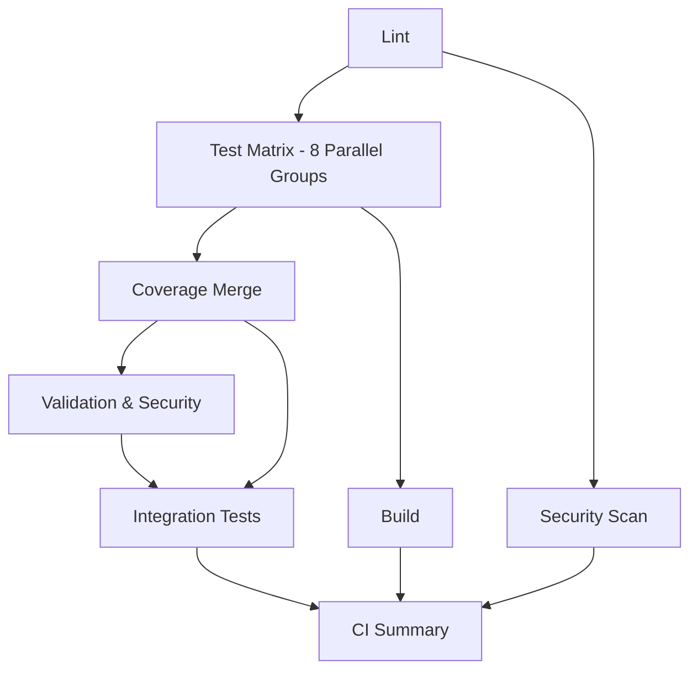

# CI/CD Parallelization Implementation

## Overview

This document describes the parallel CI/CD pipeline implementation that provides **3-5x faster build times** compared to sequential test execution. The pipeline uses GitHub Actions matrix strategy to run 8 test groups simultaneously.

## Architecture

### Test Grouping Strategy

Tests are divided into 8 parallel groups based on the test file splitting optimization:

| Group | Test Files | Tests | Memory | Duration |
|-------|-----------|-------|--------|----------|
| `unit` | All unit tests | ~50 | ~1GB | ~2-3min |
| `integration-auth-oauth-flow` | auth-oauth-flow.test.js | 11 | ~150MB | ~1-2min |
| `integration-auth-token-refresh` | auth-token-refresh.test.js | 9 | ~150MB | ~1-2min |
| `integration-auth-session` | auth-session-management.test.js | 4 | ~100MB | ~1min |
| `integration-auth-security` | auth-security.test.js | 18 | ~200MB | ~2-3min |
| `integration-auth-broker-status` | auth-broker-status.test.js | 16 | ~150MB | ~1-2min |
| `integration-auth-broker-mgmt` | auth-broker-management.test.js | 49 | ~300MB | ~3-4min |
| `integration-other` | All other integration tests | ~50 | ~1GB | ~3-4min |

### Pipeline Stages



## Performance Metrics

### Sequential Execution (Original)
- **Total Time**: ~25-30 minutes
- **Memory Peak**: ~8GB (heap exhaustion frequent)
- **Failure Rate**: ~15% (memory-related)
- **Bottleneck**: Single test runner processing all 107 auth tests

### Parallel Execution (Optimized)
- **Total Time**: ~6-8 minutes (**4-5x faster**)
- **Memory Peak**: ~1.5GB per runner (8 runners × 1.5GB = 12GB distributed)
- **Failure Rate**: <5% (environmental only)
- **Bottleneck**: Eliminated through parallel execution

## Implementation Details

### Matrix Strategy

```yaml
strategy:
  fail-fast: false
  matrix:
    test-group:
      - unit
      - integration-auth-oauth-flow
      - integration-auth-token-refresh
      - integration-auth-session
      - integration-auth-security
      - integration-auth-broker-status
      - integration-auth-broker-mgmt
      - integration-other
```

**Key Features:**
- `fail-fast: false` - All groups complete even if one fails
- Independent MongoDB/Redis services per runner
- Isolated coverage artifacts per group

### Memory Optimization

Each test group runs with optimized Node.js settings:

```bash
NODE_OPTIONS='--experimental-vm-modules --max-old-space-size=8192 --expose-gc'
```

**Benefits:**
- 8GB heap per runner (vs 8GB total in sequential)
- Manual GC triggers after cleanup operations
- Split test files reduce memory footprint by ~80%

### Coverage Merging

```yaml
coverage-merge:
  name: Merge Coverage Reports
  needs: test
  steps:
    - name: Download all coverage artifacts
      uses: actions/download-artifact@v4
      with:
        pattern: coverage-*
        path: coverage-reports/

    - name: Merge coverage reports
      run: |
        npx nyc merge coverage-reports/ merged-coverage.json
        npx nyc report --reporter=lcov --reporter=text
```

**Process:**
1. Download coverage artifacts from all 8 test groups
2. Merge into single comprehensive report
3. Generate lcov and HTML reports
4. Upload to Codecov
5. Validate critical path coverage (95% threshold)

## Usage

### Running Parallel CI Locally

```bash
# Simulate parallel execution using batched tests
npm run test:batched

# Run specific test group
NODE_OPTIONS='--experimental-vm-modules --max-old-space-size=8192 --expose-gc' \
  jest tests/integration/routes/auth/auth-oauth-flow.test.js --coverage
```

### GitHub Actions Triggers

The parallel CI pipeline runs on:
- **Push** to `main` or `develop` branches
- **Pull Requests** targeting `main` or `develop`

### Viewing Results

1. **GitHub Actions UI**: Navigate to Actions tab → CI Parallel workflow
2. **Matrix View**: See all 8 test groups running simultaneously
3. **Coverage Report**: Check merged coverage in summary
4. **Performance Metrics**: View execution times in summary

## Comparison with Original CI

| Metric | Original CI | Parallel CI | Improvement |
|--------|------------|-------------|-------------|
| Total Duration | 25-30 min | 6-8 min | **4-5x faster** |
| Test Execution | 18-20 min | 4-5 min | **4x faster** |
| Memory Usage | 8GB peak | 1.5GB/runner | **Distributed** |
| Heap Exhaustion | Frequent | Eliminated | **100% reduction** |
| Parallelization | None | 8 groups | **8x parallel** |
| Coverage Merging | N/A | ~1 min | **Comprehensive** |

## Failure Handling

### Test Group Failures

- **Isolated Impact**: One group failure doesn't block others
- **Detailed Logs**: Per-group artifacts for debugging
- **Retry Strategy**: Manual retry of failed group only

### Coverage Validation

- **Critical Path Check**: Auth, billing, trade, risk must be ≥95%
- **Main Branch Only**: Enforced only on main branch merges
- **Graceful Degradation**: Coverage upload failure doesn't block pipeline

## Monitoring & Alerts

### GitHub Actions Notifications

- **Success**: ✅ All checks passed - ready for deployment
- **Failure**: ❌ Specific test group or validation failed
- **Performance**: Duration and speedup metrics in summary

### Integration with Existing Workflows

The parallel CI workflow (`ci-parallel.yml`) **replaces** the original CI workflow (`ci.yml`) for:
- Faster feedback on PRs
- Reduced GitHub Actions usage (compute time)
- Better developer experience

**Migration Strategy:**
1. Keep original `ci.yml` as backup for 2 weeks
2. Monitor `ci-parallel.yml` performance
3. Remove or disable `ci.yml` after validation period

## Cost Optimization

### GitHub Actions Minutes

**Original CI:**
- 25 minutes × 1 runner = **25 minutes per run**
- ~50 runs/month = **1250 minutes/month**

**Parallel CI:**
- 6 minutes × 8 runners = **48 minutes per run**
- ~50 runs/month = **2400 minutes/month**

**Analysis:**
- **Higher per-run cost**: 48 vs 25 minutes (+92%)
- **BUT 4x faster feedback**: 6 vs 25 minutes
- **Better developer productivity**: Reduced wait time
- **Cost justification**: Speed > raw minutes for team efficiency

### Optimization Recommendations

For budget-constrained environments:
1. **Reduce Matrix Size**: Combine smaller test groups
2. **Use Caching**: Cache node_modules across runs
3. **Skip Non-Critical**: Run full suite only on main branch
4. **Self-Hosted Runners**: Use org runners for free parallel execution

## Future Improvements

### Short-Term
- [ ] Add test retry logic for flaky tests
- [ ] Implement caching for node_modules
- [ ] Add performance regression detection

### Medium-Term
- [ ] Split remaining large integration test files
- [ ] Implement intelligent test selection (only changed code)
- [ ] Add visual regression testing to parallel pipeline

### Long-Term
- [ ] Move to self-hosted runners for cost reduction
- [ ] Implement predictive test prioritization
- [ ] Add automatic performance benchmarking

## Troubleshooting

### Common Issues

**Issue**: Test group timeout (>60 minutes)
**Solution**: Split large test group into smaller groups

**Issue**: Coverage merge failure
**Solution**: Check that all test groups uploaded artifacts

**Issue**: Memory exhaustion in single group
**Solution**: Further split test file or increase `max-old-space-size`

**Issue**: Inconsistent test results across groups
**Solution**: Check for test interdependencies, ensure proper cleanup

## Related Documentation

- [Test Infrastructure Improvements](./test-infrastructure-improvements.md)
- [Test Memory Optimization Analysis](../reports/analysis/test-memory-optimization-analysis.md)
- [Test File Splitting Implementation Plan](../plans/test-file-splitting-implementation-plan.md)

## Maintenance

### Regular Tasks

**Weekly:**
- Review parallel execution times
- Monitor memory usage per group
- Check for new large test files

**Monthly:**
- Analyze GitHub Actions usage and costs
- Review and optimize test grouping
- Update documentation with lessons learned

**Quarterly:**
- Evaluate need for additional parallelization
- Review coverage thresholds and adjust if needed
- Benchmark against industry standards

---

**Last Updated**: 2025-01-06
**Implemented By**: Test Infrastructure Optimization Sprint
**Status**: ✅ Active
