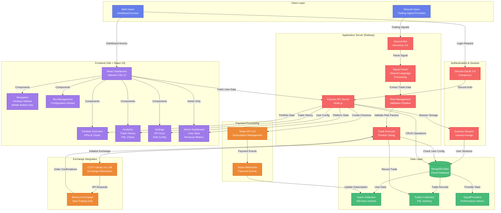

# Discord Trade Executor - Current System Architecture

## Overview
This diagram shows the current production architecture of the Discord Trade Executor SaaS platform.

## Architecture Diagram



## Component Details

### 1. Client Layer
- **Discord Users**: Trading signal providers posting signals in Discord channels
- **Web Users**: Traders accessing the dashboard for portfolio management

### 2. Authentication & Session
- **Discord OAuth 2.0**: User authentication via Discord accounts
- **Express Session**: Session management with MongoDB storage (connect-mongo)

### 3. Application Server (Node.js on Railway)
- **Discord Bot** (`discord.js v14`):
  - Monitors Discord channels for trading signals
  - Parses messages in real-time
  - Supports multiple signal providers

- **Signal Parser** (`natural` library):
  - Natural language processing
  - Extracts: symbol, side (BUY/SELL), price, stop-loss, take-profit
  - Handles variations in signal format

- **Risk Management**:
  - Daily loss limit validation (5% default)
  - Position sizing calculation (fixed/risk-based/Kelly Criterion)
  - Trading hours enforcement
  - Max open positions check (3 default)

- **Trade Executor**:
  - Position size calculation based on risk method
  - Stop-loss order placement (trailing/fixed)
  - Take-profit limit orders
  - Error handling and retry logic

### 4. Data Layer (MongoDB Atlas)
- **Users Collection** (`src/models/User.js`):
  - Discord identity & authentication
  - Subscription tier (free/basic/pro/premium)
  - Trading configuration & risk parameters
  - Exchange API credentials (encrypted)
  - Usage stats & limits

- **Trades Collection** (`src/models/Trade.js`):
  - Trade identification & tracking
  - Entry/exit prices & P&L
  - Risk management (stop-loss/take-profit)
  - Status tracking & error logs

- **SignalProviders Collection**:
  - Provider performance metrics
  - Historical accuracy tracking

### 5. Exchange Integration
- **CCXT Library v4.1.99**:
  - Unified exchange API abstraction
  - Currently configured for Binance only
  - Supports spot trading

- **Binance Exchange**:
  - Spot market only (no futures yet)
  - Stop-loss & take-profit orders
  - Balance checking & position management

### 6. Payment Processing (Stripe)
- **Subscription Tiers**:
  - Free: 10 signals/day, 1 exchange
  - Basic ($49/mo): 100 signals/day
  - Pro ($99/mo): Unlimited signals
  - Premium ($299/mo): Multi-broker support (planned)

- **Webhook Handling**:
  - `customer.subscription.created`
  - `customer.subscription.updated`
  - `customer.subscription.deleted`
  - `invoice.payment_succeeded`
  - `invoice.payment_failed`

### 7. Frontend Dashboard (React 19 + Vite)
- **Responsive Design**:
  - Desktop: Fixed sidebar navigation (256px)
  - Mobile: Top bar + bottom navigation
  - Tailwind CSS v3 for styling

- **Components**:
  - **Portfolio Overview**: KPIs, balance, P&L chart
  - **Bot Management**: Wizard for creating/editing bots
  - **Analytics**: Trade history table, performance charts
  - **Settings**: API key management, risk configuration
  - **Admin Dashboard**: User stats, MRR, revenue metrics (admin only)

## Current Limitations

### Exchange Support
- ❌ **Only Binance supported** - No other crypto exchanges
- ❌ **No stock brokers** - Missing Robinhood, Webull, Moomoo, TD Ameritrade, etc.
- ❌ **Spot trading only** - No futures or options

### Analytics
- ❌ **Basic charts only** - No real-time WebSocket updates
- ❌ **Limited metrics** - Missing Sharpe ratio, Sortino ratio, max drawdown
- ❌ **No benchmarking** - Can't compare to S&P 500, BTC, etc.

### Admin Dashboard
- ❌ **No cohort analysis** - Can't track user retention by signup period
- ❌ **No churn prediction** - Missing ML-based churn forecasting
- ❌ **No revenue forecasting** - Limited future revenue projections

## Technology Stack

### Backend
- **Runtime**: Node.js v22.11.0+
- **Framework**: Express.js v4.18.2
- **Discord**: discord.js v14.14.1
- **Database**: MongoDB (Mongoose v8.0.4)
- **Exchange**: CCXT v4.1.99
- **Payments**: Stripe v14.12.0
- **NLP**: Natural v6.12.0

### Frontend
- **Framework**: React v19.2.0
- **Build Tool**: Vite v6.0.5
- **Styling**: Tailwind CSS v3.4.16
- **Charts**: Recharts v3.2.1
- **UI Components**: Radix UI (Dialog, Dropdown, Select, Tabs, Toast, Tooltip)
- **Tables**: TanStack React Table v8.21.3

### Security
- **Authentication**: Passport.js (Discord OAuth)
- **Rate Limiting**: express-rate-limit v8.1.0
- **Security Headers**: Helmet v7.1.0
- **Session**: express-session v1.18.2

### Deployment
- **Platform**: Railway
- **Environment**: Production
- **CDN**: Built-in Railway CDN
- **SSL**: Automatic HTTPS

## Data Flow Paths

### Signal → Trade Execution Flow
```
Discord Signal
  ↓
Discord Bot (listen)
  ↓
NLP Parser (extract trade data)
  ↓
Risk Validator (check limits)
  ↓
User Config (fetch from MongoDB)
  ↓
Position Size Calculator
  ↓
Trade Executor
  ↓
CCXT → Binance API
  ↓
Order Confirmation
  ↓
Save to Trades Collection
```

### User Authentication Flow
```
Web User (login click)
  ↓
Discord OAuth 2.0
  ↓
Authorization Grant
  ↓
Express API (callback)
  ↓
Fetch User Profile
  ↓
Create/Update User in MongoDB
  ↓
Create Session (connect-mongo)
  ↓
Redirect to Dashboard
```

### Subscription Payment Flow
```
User (select plan)
  ↓
Stripe Checkout Session
  ↓
Payment Processing
  ↓
Stripe Webhook Event
  ↓
Express Webhook Handler
  ↓
Update User.subscription in MongoDB
  ↓
Update Usage Limits
```

## Source Code References
- Architecture: `src/index.js:1`
- Discord Bot: `src/bot.js:1`
- Signal Parser: `src/signal-parser.js:1`
- Trade Executor: `src/trade-executor.js:1`
- Risk Management: `src/models/User.js:200-350`
- User Model: `src/models/User.js:1`
- Trade Model: `src/models/Trade.js:1`
- Dashboard: `src/dashboard/App.jsx:1`
- Navigation: `src/dashboard/components/Navigation.jsx:1`
- Admin Dashboard: `src/dashboard/components/AdminDashboard.jsx:1`

## Next Steps
See [Future Architecture](./06-future-architecture.md) for planned enhancements including:
- Stock broker integration (Alpaca, TD Ameritrade, Robinhood)
- Multi-exchange crypto support (Coinbase, Kraken, KuCoin)
- Advanced analytics (WebSocket real-time, Sharpe ratio, benchmarks)
- Enhanced admin dashboard (cohort analysis, churn prediction)
