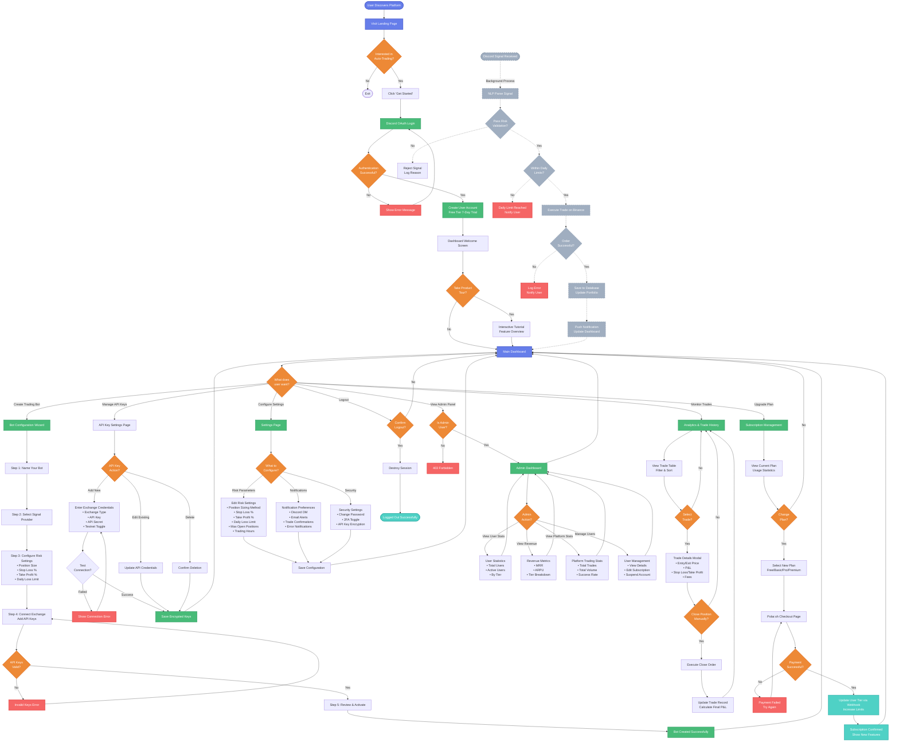

# Discord Trade Executor - User Experience Flow

## Overview
This diagram maps the complete user journey from initial discovery to active trading and subscription management.

## User Journey Diagram



## User Journey Stages

### 1. Discovery & Onboarding (15-30 minutes)
**Goal**: Get user from landing page to first bot setup

**Steps**:
1. **Landing Page** → Discover platform value proposition
2. **Discord OAuth** → Quick 1-click authentication
3. **Account Creation** → Automatic free tier (7-day trial, 10 signals/day)
4. **Welcome Screen** → Optional product tour
5. **Dashboard First View** → See example portfolio (demo data)

**Success Metrics**:
- Time to first login: <2 minutes
- Tour completion rate: Target 60%
- Bounce rate: <30%

### 2. Bot Setup & Configuration (10-20 minutes)
**Goal**: Create first automated trading bot

**Bot Configuration Wizard** (5 steps):
1. **Name Your Bot**
   - Input: Bot name (e.g., "BTC Scalper", "ETH Swing Trader")
   - Optional: Description/notes

2. **Select Signal Provider**
   - Browse available Discord signal providers
   - View provider stats (win rate, avg ROI, total signals)
   - Subscribe to provider channel

3. **Configure Risk Settings**
   - **Position Sizing Method**:
     - Fixed % of portfolio (default: 2%)
     - Risk-based (calculate from stop-loss distance)
     - Kelly Criterion (optimal bet sizing)
   - **Stop Loss**: Default 2%, adjustable 0.5%-10%
   - **Take Profit**: Default 4%, adjustable 1%-20%
   - **Daily Loss Limit**: Default 5%, max 10%
   - **Max Open Positions**: Default 3, max 10

4. **Connect Exchange**
   - Select exchange (currently Binance only)
   - Add API Key & Secret
   - Toggle testnet mode (recommended for first bot)
   - Validate connection

5. **Review & Activate**
   - Summary of all settings
   - Risk disclaimer acknowledgment
   - Activate bot

**Success Metrics**:
- Wizard completion rate: Target 70%
- Time to first bot activation: <15 minutes
- Testnet usage rate: Target 80% for first bot

### 3. Active Trading & Monitoring (Ongoing)
**Goal**: Execute trades automatically and monitor performance

**Real-Time Signal Processing** (Background):
```
Discord Signal Posted
  ↓ (< 1 second)
NLP Parsing & Validation
  ↓ (< 500ms)
Risk Checks (daily limits, position size, trading hours)
  ↓ (< 200ms)
Binance Order Execution
  ↓ (1-2 seconds)
Database Record & Dashboard Update
  ↓ (< 500ms)
User Notification (Discord DM or Email)
```

**User Monitoring Options**:
1. **Portfolio Overview**:
   - Total balance & P&L
   - Open positions chart
   - Daily/weekly/monthly performance

2. **Trade History Table**:
   - Sortable columns (date, symbol, P&L, status)
   - Filterable (exchange, bot, date range)
   - Export to CSV

3. **Live Trade Details**:
   - Entry/exit prices
   - Quantity & fees
   - Real-time P&L
   - Manual close option

**Success Metrics**:
- Trade execution latency: <3 seconds from signal
- Dashboard refresh rate: Every 10 seconds
- Manual intervention rate: <5% of trades

### 4. Subscription Upgrade (Conversion)
**Goal**: Convert free/trial users to paid plans

**Upgrade Triggers**:
- Daily signal limit reached (10 for free tier)
- 7-day trial expiring (3-day warning)
- User requests advanced features (multi-exchange, higher limits)

**Upgrade Flow**:
1. **Current Plan View**:
   - Usage statistics (signals used today)
   - Plan limits comparison table
   - "Upgrade Now" CTA

2. **Plan Selection**:
   - **Basic ($49/mo)**: 100 signals/day, 1 exchange
   - **Pro ($99/mo)**: Unlimited signals, multi-exchange
   - **Premium ($299/mo)**: Multi-broker (stocks), priority support

3. **Polar.sh Checkout**:
   - Secure payment processing
   - Credit card or bank account
   - Automatic billing
   - Webhook-based subscription activation

4. **Instant Activation**:
   - Immediate tier upgrade
   - Limits updated in real-time
   - Access to premium features

**Success Metrics**:
- Free → Paid conversion rate: Target 15%
- Average time to upgrade: <5 days
- Plan distribution: 40% Basic, 50% Pro, 10% Premium

### 5. Advanced Features & Settings
**Goal**: Power users customize platform for optimal results

**Risk Management Customization**:
- **Position Sizing**:
  - Fixed: Simple % of portfolio
  - Risk-based: Account for stop-loss distance
  - Kelly Criterion: Mathematically optimal sizing

- **Trading Hours**:
  - Enable/disable time-based trading
  - Set start/end hours (UTC)
  - Avoid overnight positions

- **Advanced Stops**:
  - Trailing stop-loss (auto-adjust with profit)
  - Trailing stop % (default 1.5%)
  - Multiple take-profit levels

**Notification Preferences**:
- Discord DM for trade confirmations
- Email for daily summaries
- SMS for critical alerts (Premium only)
- Webhook integrations (custom endpoints)

**API Key Management**:
- Add multiple exchanges (Pro/Premium)
- Testnet/live mode toggle
- Encrypted storage (AES-256)
- Permission scoping (spot only, no withdrawals)

### 6. Admin Operations (Platform Operators)
**Goal**: Monitor platform health and user engagement

**Admin Dashboard Sections**:
1. **User Statistics**:
   - Total users by tier
   - Daily/weekly active users
   - Recent signups list

2. **Revenue Metrics**:
   - MRR (Monthly Recurring Revenue)
   - ARPU (Average Revenue Per User)
   - Revenue breakdown by tier

3. **Platform Trading Stats**:
   - Total trades executed today
   - Total trading volume (USD)
   - Overall success rate %

4. **Top Traders Leaderboard**:
   - Ranked by ROI %
   - Total P&L
   - Number of trades

5. **User Management**:
   - Search users by Discord ID/email
   - View detailed user profile
   - Manual subscription adjustments
   - Account suspension (ToS violations)

**Admin-Only Access**:
- Protected by `isAdmin` flag in User model
- Middleware check on all admin routes
- Audit log for admin actions

## Pain Points & Solutions

### Common User Friction Points

1. **API Key Setup Confusion**
   - **Problem**: Users don't know how to generate Binance API keys
   - **Solution**: Step-by-step visual guide with screenshots
   - **Enhancement**: Video tutorial embedded in wizard

2. **Risk Settings Overwhelm**
   - **Problem**: Too many options for beginners
   - **Solution**: Preset profiles (Conservative, Moderate, Aggressive)
   - **Enhancement**: AI-suggested settings based on portfolio size

3. **Signal Provider Selection**
   - **Problem**: Hard to choose from many providers
   - **Solution**: Show performance metrics (win rate, avg ROI)
   - **Enhancement**: Filter by strategy type (scalping, swing, long-term)

4. **Trade Execution Failures**
   - **Problem**: Trades fail due to insufficient balance or API errors
   - **Solution**: Pre-flight balance check, clear error messages
   - **Enhancement**: Retry logic with exponential backoff

5. **Daily Limit Reached**
   - **Problem**: Free users hit 10 signal limit, frustrated
   - **Solution**: Clear limit warning at 8/10 signals
   - **Enhancement**: One-click upgrade flow from warning

## Mobile Experience Considerations

### Current Mobile Support
- ✅ **Responsive Design**: Tailwind CSS breakpoints
- ✅ **Mobile Navigation**: Bottom tab bar
- ✅ **Touch-Optimized**: Larger tap targets
- ✅ **Fast Loading**: Vite optimized bundle

### Mobile-Specific Flows
1. **Login**: OAuth works seamlessly on mobile browsers
2. **Bot Setup**: Wizard adapts to vertical layout
3. **Monitoring**: Swipe gestures for trade details
4. **Charts**: Touch-responsive Recharts

### Future Mobile Enhancements
- ❌ **Native App** (iOS/Android): Planned for future
- ❌ **Push Notifications**: Native mobile alerts
- ❌ **Biometric Auth**: Face ID/Touch ID
- ❌ **Offline Mode**: Cache recent trades

## Accessibility Features

### Current Implementation
- ✅ **Keyboard Navigation**: Full keyboard support
- ✅ **Color Contrast**: WCAG AA compliant (dark theme)
- ✅ **Focus Indicators**: Visible focus rings
- ✅ **Screen Reader**: Semantic HTML, ARIA labels

### Future Enhancements
- ❌ **Voice Control**: Hands-free trading commands
- ❌ **High Contrast Mode**: Accessibility theme toggle
- ❌ **Text Scaling**: Respect browser font size preferences

## Source Code References
- Bot Wizard: `src/dashboard/components/BotConfigWizard.jsx:1`
- API Key Management: `src/dashboard/components/APIKeyManagement.jsx:1`
- Trade History: `src/dashboard/components/TradeHistoryTable.jsx:1`
- Analytics: `src/dashboard/components/AnalyticsView.jsx:1`
- Subscription: `src/routes/subscription.js:1`
- Admin Dashboard: `src/dashboard/components/AdminDashboard.jsx:1`
- User Model: `src/models/User.js:1`
- Risk Validation: `src/trade-executor.js:45-120`

## Next Diagram
See [Trade Execution Data Flow](./03-trade-execution-dataflow.md) for detailed technical flow of signal → trade processing.
