# Discord Trade Executor - Database Entity-Relationship Diagram

## Overview
This diagram shows the complete MongoDB database schema with all collections, fields, relationships, and indexes.

## Entity-Relationship Diagram

> **Note:** This diagram now models Polar.sh as the billing provider. Legacy Stripe terminology is retained in archived sections only.

```mermaid
erDiagram
    Users ||--o{ Trades : "executes"
    Users ||--o{ BotConfigs : "owns"
    Users }o--o{ SignalProviders : "subscribes_to"
    SignalProviders ||--o{ Signals : "posts"
    Trades }o--|| Signals : "triggered_by"
    Users ||--|| PolarCustomers : "has_polar_account"

    Users {
        ObjectId _id PK "Primary key"
        String discordId UK "Unique Discord user ID (indexed)"
        String discordUsername "Discord display name"
        String email "User email"
        String avatar "Discord avatar URL"
        Object subscription "Subscription details"
        String subscription_tier "free|basic|pro|premium"
        String subscription_status "active|inactive|trial|cancelled|past_due"
        String subscription_polarCustomerId FK "Polar customer UUID"
        String subscription_polarSubscriptionId "Polar subscription UUID"
        Date subscription_currentPeriodStart "Billing period start"
        Date subscription_currentPeriodEnd "Billing period end"
        Date subscription_trialEndsAt "Trial expiration (7 days default)"
        Object limits "Usage limits by tier"
        Number limits_signalsPerDay "10|100|Infinity"
        Number limits_signalsUsedToday "Reset at midnight UTC"
        Number limits_maxBrokers "1|3|5|10"
        Date limits_dailyResetAt "Last reset timestamp"
        Array tradingConfig_exchanges "Exchange credentials"
        String tradingConfig_exchanges_name "binance|coinbase|kraken"
        String tradingConfig_exchanges_apiKey "Encrypted API key"
        String tradingConfig_exchanges_apiSecret "Encrypted secret"
        Boolean tradingConfig_exchanges_isTestnet "Paper trading mode"
        Boolean tradingConfig_exchanges_isActive "Enable/disable"
        Object riskManagement "Risk parameters"
        Number riskManagement_maxPositionSize "0.02 = 2% of portfolio"
        String riskManagement_positionSizingMethod "fixed|risk_based|kelly"
        Number riskManagement_defaultStopLoss "0.02 = 2%"
        Number riskManagement_defaultTakeProfit "0.04 = 4%"
        Boolean riskManagement_useTrailingStop "Enable trailing stop"
        Number riskManagement_trailingStopPercent "0.015 = 1.5%"
        Number riskManagement_maxDailyLoss "0.05 = 5%"
        Number riskManagement_maxOpenPositions "3 default"
        Number riskManagement_maxPositionsPerSymbol "1 default"
        Boolean riskManagement_tradingHoursEnabled "Enable hours restriction"
        String riskManagement_tradingHoursStart "09:00 UTC"
        String riskManagement_tradingHoursEnd "21:00 UTC"
        Object stats "User statistics"
        Number stats_totalSignalsProcessed "Lifetime signal count"
        Number stats_totalTradesExecuted "Lifetime trade count"
        Number stats_successfulTrades "Winning trades"
        Number stats_failedTrades "Losing trades"
        Number stats_totalProfit "Sum of profits ($)"
        Number stats_totalLoss "Sum of losses ($)"
        Date stats_lastTradeAt "Most recent trade timestamp"
        Boolean isAdmin "Admin privileges (indexed)"
        Date createdAt "Account creation"
        Date updatedAt "Last modification"
    }

    Trades {
        ObjectId _id PK "Primary key"
        ObjectId userId FK "References Users._id (indexed)"
        String tradeId UK "Unique trade ID (indexed)"
        String exchange "binance|coinbase|kraken|ftx|bybit"
        String symbol "BTC/USDT (indexed)"
        String side "BUY|SELL|LONG|SHORT"
        Number entryPrice "Entry price (required)"
        Number exitPrice "Exit price (null if open)"
        Number quantity "Position size"
        Number profitLoss "Net P&L (calculated on close)"
        Number profitLossPercentage "P&L %"
        Object fees "Trading fees"
        Number fees_entry "Entry fee ($)"
        Number fees_exit "Exit fee ($)"
        Number fees_total "Total fees ($)"
        Number stopLoss "Stop-loss price"
        Number takeProfit "Take-profit price"
        String status "FILLED|PARTIAL|CANCELLED|FAILED|OPEN (indexed)"
        Date entryTime "Trade open time (indexed)"
        Date exitTime "Trade close time (null if open)"
        Object orderIds "Exchange order IDs"
        String orderIds_entry "Entry order ID"
        String orderIds_stopLoss "Stop-loss order ID"
        String orderIds_takeProfit "Take-profit order ID"
        Object signalSource "Signal provider info"
        String signalSource_providerId FK "References SignalProviders._id"
        String signalSource_providerName "Provider name"
        String signalSource_signalId "Discord message ID"
        Object error "Error details"
        Boolean error_occurred "Error flag"
        String error_message "Error description"
        Date error_timestamp "Error time"
        Date createdAt "Record creation"
        Date updatedAt "Last modification"
    }

    SignalProviders {
        ObjectId _id PK "Primary key"
        String providerId UK "Discord user/channel ID (indexed)"
        String providerName "Display name"
        String discordChannelId UK "Channel ID (indexed)"
        String providerType "individual|channel|community"
        Object stats "Performance metrics"
        Number stats_totalSignalsPosted "Lifetime signal count"
        Number stats_successfulSignals "Winning signals"
        Number stats_failedSignals "Losing signals"
        Number stats_winRate "Success rate %"
        Number stats_averageROI "Average ROI %"
        Number stats_totalSubscribers "Current subscribers"
        Array subscribers "List of subscribed user IDs"
        ObjectId subscribers_userId FK "References Users._id"
        Date subscribers_subscribedAt "Subscription date"
        Boolean subscribers_isActive "Active subscription"
        Boolean isActive "Provider active status"
        Boolean isVerified "Verified provider badge"
        Date createdAt "Provider registration"
        Date updatedAt "Last modification"
    }

    Signals {
        ObjectId _id PK "Primary key"
        ObjectId providerId FK "References SignalProviders._id (indexed)"
        String discordMessageId UK "Discord message ID (indexed)"
        String rawText "Original signal text"
        Object parsed "Parsed signal data"
        String parsed_symbol "BTC/USDT"
        String parsed_side "BUY|SELL|LONG|SHORT"
        Number parsed_entryPrice "Entry price"
        Number parsed_stopLoss "Stop-loss price"
        Number parsed_takeProfit "Take-profit price"
        Number parsed_confidence "Parser confidence (0-1)"
        String status "pending|processing|executed|failed"
        Number usersNotified "Subscriber count"
        Number tradesExecuted "Resulting trades"
        Date postedAt "Signal timestamp"
        Date processedAt "Processing complete time"
        Date createdAt "Record creation"
        Date updatedAt "Last modification"
    }

    BotConfigs {
        ObjectId _id PK "Primary key"
        ObjectId userId FK "References Users._id (indexed)"
        String botId UK "Unique bot ID"
        String name "Bot display name"
        String description "Bot description"
        ObjectId signalProviderId FK "References SignalProviders._id"
        String exchange "binance|coinbase|kraken"
        Boolean isActive "Bot enabled"
        Object riskSettings "Bot-specific risk params"
        Number riskSettings_positionSize "Override user default"
        Number riskSettings_stopLoss "Override user default"
        Number riskSettings_takeProfit "Override user default"
        Boolean riskSettings_useTrailingStop "Override user default"
        Object filters "Signal filters"
        Array filters_allowedSymbols "BTC/USDT, ETH/USDT"
        Array filters_blockedSymbols "Symbols to ignore"
        Number filters_minConfidence "Min parser confidence (0-1)"
        Object stats "Bot performance"
        Number stats_totalSignalsProcessed "Signals handled"
        Number stats_totalTradesExecuted "Trades executed"
        Number stats_profitLoss "Net P&L ($)"
        Date createdAt "Bot creation"
        Date updatedAt "Last modification"
    }

    PolarCustomers {
        ObjectId _id PK "Primary key"
        ObjectId userId FK "References Users._id (indexed)"
        String polarCustomerId UK "Polar customer UUID (indexed)"
        String polarSubscriptionId "Current subscription UUID"
        String status "active|inactive|past_due|cancelled"
        String tier "basic|pro|premium"
        Number amount "Subscription amount (cents)"
        String currency "usd"
        String interval "month|year"
        Date currentPeriodStart "Billing period start"
        Date currentPeriodEnd "Billing period end"
        Boolean cancelAtPeriodEnd "Auto-cancel flag"
        Object paymentMethod "Payment details"
        String paymentMethod_type "card|bank_account"
        String paymentMethod_last4 "Last 4 digits"
        String paymentMethod_brand "visa|mastercard|amex"
        Array invoices "Invoice history"
        String invoices_invoiceId "Polar invoice ID"
        Number invoices_amount "Amount (cents)"
        String invoices_status "paid|open|void"
        Date invoices_createdAt "Invoice date"
        Date createdAt "Customer creation"
        Date updatedAt "Last modification"
    }
```



## Collection Details

### 1. Users Collection
**Purpose**: Core user accounts with authentication, subscription, and trading configuration

**Key Fields**:
- **Authentication**: `discordId` (unique, indexed), `discordUsername`, `email`, `avatar`
- **Subscription**: Polar.sh integration, tier limits, trial management
- **Risk Management**: Position sizing, stop-loss/take-profit defaults, daily limits
- **Trading Config**: Exchange API keys (encrypted), testnet mode
- **Statistics**: Track performance, signal usage, trade history

**Indexes**:
```javascript
{
  discordId: 1  // Unique index for Discord login
}
{
  isAdmin: 1  // Admin route access control
}
{
  'subscription.polarCustomerId': 1  // Polar webhook lookups
}
{
  createdAt: -1  // Recent signups query
}
```

**Schema Validation**:
```javascript
// Mongoose schema with validation
const userSchema = new mongoose.Schema({
  discordId: {
    type: String,
    required: true,
    unique: true,
    index: true
  },
  subscription: {
    tier: {
      type: String,
      enum: ['free', 'basic', 'pro', 'premium'],
      default: 'free'
    },
    status: {
      type: String,
      enum: ['active', 'inactive', 'trial', 'cancelled', 'past_due'],
      default: 'trial'
    }
  },
  riskManagement: {
    maxPositionSize: {
      type: Number,
      min: 0.001,  // 0.1%
      max: 0.10,   // 10%
      default: 0.02  // 2%
    }
  }
}, { timestamps: true });
```

### 2. Trades Collection
**Purpose**: Record all trade executions with P&L tracking and order details

**Key Fields**:
- **Identification**: `tradeId` (unique), `userId` (foreign key), `exchange`, `symbol`
- **Execution**: Entry/exit prices, quantity, fees
- **Risk Management**: Stop-loss, take-profit orders
- **Status Tracking**: OPEN, FILLED, CLOSED, FAILED
- **Signal Attribution**: Link to signal provider and Discord message

**Indexes**:
```javascript
{
  userId: 1,
  status: 1  // Find user's open positions
}
{
  userId: 1,
  entryTime: -1  // Recent trades for user
}
{
  symbol: 1,
  entryTime: -1  // Symbol performance analysis
}
{
  tradeId: 1  // Unique index for direct lookups
}
{
  'signalSource.providerId': 1  // Provider performance tracking
}
```

**Compound Indexes for Analytics**:
```javascript
// Daily P&L calculation
{
  userId: 1,
  entryTime: -1,
  status: 1
}

// Win rate by symbol
{
  symbol: 1,
  profitLoss: 1
}

// Provider performance
{
  'signalSource.providerId': 1,
  profitLossPercentage: 1
}
```

### 3. SignalProviders Collection
**Purpose**: Track signal providers and their performance metrics

**Key Fields**:
- **Identification**: `providerId` (Discord user/channel ID), `discordChannelId`
- **Statistics**: Win rate, average ROI, total signals
- **Subscribers**: Array of user subscriptions with timestamps
- **Verification**: `isVerified` badge for trusted providers

**Indexes**:
```javascript
{
  providerId: 1  // Unique provider lookup
}
{
  discordChannelId: 1  // Channel message handler
}
{
  isActive: 1,
  'stats.winRate': -1  // Top providers query
}
```

**Performance Calculation**:
```javascript
// Update provider stats after each trade
const updateProviderStats = async (providerId, tradeResult) => {
  const { profitLoss, profitLossPercentage } = tradeResult;

  await SignalProvider.findByIdAndUpdate(providerId, {
    $inc: {
      'stats.totalSignalsPosted': 1,
      'stats.successfulSignals': profitLoss > 0 ? 1 : 0,
      'stats.failedSignals': profitLoss < 0 ? 1 : 0
    },
    $set: {
      'stats.winRate': calculateWinRate(),
      'stats.averageROI': calculateAvgROI()
    }
  });
};
```

### 4. Signals Collection
**Purpose**: Store parsed signals with processing status and results

**Key Fields**:
- **Source**: `providerId`, `discordMessageId`, `rawText`
- **Parsed Data**: Symbol, side, prices (entry, stop-loss, take-profit)
- **Processing**: Status (pending, processing, executed, failed)
- **Results**: `usersNotified`, `tradesExecuted`

**Indexes**:
```javascript
{
  discordMessageId: 1  // Unique signal lookup
}
{
  providerId: 1,
  postedAt: -1  // Provider signal history
}
{
  status: 1,
  createdAt: 1  // Pending signals queue
}
```

**Signal Processing Flow**:
```javascript
// Create signal record when Discord message detected
const signal = await Signal.create({
  providerId,
  discordMessageId: message.id,
  rawText: message.content,
  status: 'pending',
  postedAt: message.timestamp
});

// Update after parsing
await signal.updateOne({
  parsed: { symbol, side, entryPrice, stopLoss, takeProfit, confidence },
  status: 'processing'
});

// Update after execution
await signal.updateOne({
  usersNotified: users.length,
  tradesExecuted: successCount,
  status: 'executed',
  processedAt: new Date()
});
```

### 5. BotConfigs Collection
**Purpose**: User-created trading bots with custom settings

**Key Fields**:
- **Identification**: `botId` (unique), `userId`, `name`, `description`
- **Configuration**: `signalProviderId`, `exchange`, `isActive`
- **Risk Overrides**: Bot-specific position size, stop-loss, take-profit
- **Filters**: Allowed/blocked symbols, minimum confidence threshold
- **Statistics**: Bot performance tracking

**Indexes**:
```javascript
{
  userId: 1,
  isActive: 1  // Find user's active bots
}
{
  botId: 1  // Unique bot lookup
}
{
  signalProviderId: 1  // Find bots by provider
}
```

**Bot Execution Logic**:
```javascript
// Check if user has active bot for this provider
const bot = await BotConfig.findOne({
  userId,
  signalProviderId: signal.providerId,
  isActive: true
});

if (!bot) {
  return;  // User doesn't follow this provider
}

// Apply bot-specific filters
if (bot.filters.allowedSymbols.length &&
    !bot.filters.allowedSymbols.includes(signal.symbol)) {
  return;  // Symbol not in whitelist
}

if (signal.parsed.confidence < bot.filters.minConfidence) {
  return;  // Below confidence threshold
}

// Use bot risk settings (override user defaults)
const riskSettings = {
  positionSize: bot.riskSettings.positionSize || user.riskManagement.maxPositionSize,
  stopLoss: bot.riskSettings.stopLoss || user.riskManagement.defaultStopLoss,
  takeProfit: bot.riskSettings.takeProfit || user.riskManagement.defaultTakeProfit
};

// Execute trade with bot settings
await executeTrade(signal, user, riskSettings);
```

### 6. StripeCustomers Collection
**Purpose**: Stripe subscription and payment data

**Key Fields**:
- **Stripe IDs**: `stripeCustomerId`, `stripeSubscriptionId`
- **Subscription**: Status, tier, amount, billing period
- **Payment Method**: Type, last 4 digits, brand
- **Invoice History**: Array of past invoices

**Indexes**:
```javascript
{
  userId: 1  // Link to Users collection
}
{
  stripeCustomerId: 1  // Webhook lookups
}
{
  stripeSubscriptionId: 1  // Subscription updates
}
```

**Stripe Webhook Handling**:
```javascript
// customer.subscription.updated webhook
const handleSubscriptionUpdate = async (stripeEvent) => {
  const { customer, status, items } = stripeEvent.data.object;

  // Update StripeCustomers collection
  await StripeCustomer.findOneAndUpdate(
    { stripeCustomerId: customer },
    {
      status,
      tier: mapStripePriceToTier(items.data[0].price.id),
      currentPeriodStart: new Date(stripeEvent.data.object.current_period_start * 1000),
      currentPeriodEnd: new Date(stripeEvent.data.object.current_period_end * 1000)
    }
  );

  // Update Users collection
  await User.findOneAndUpdate(
    { 'subscription.stripeCustomerId': customer },
    {
      'subscription.status': status,
      'subscription.tier': mapStripePriceToTier(items.data[0].price.id)
    }
  );
};
```

## Data Relationships

### One-to-Many Relationships

#### Users → Trades (1:N)
```javascript
// Find all trades for a user
const trades = await Trade.find({ userId: user._id })
  .sort({ entryTime: -1 })
  .limit(100);

// Aggregate user P&L
const pnl = await Trade.aggregate([
  { $match: { userId: user._id } },
  { $group: {
      _id: null,
      totalProfit: { $sum: { $cond: [{ $gt: ['$profitLoss', 0] }, '$profitLoss', 0] } },
      totalLoss: { $sum: { $cond: [{ $lt: ['$profitLoss', 0] }, '$profitLoss', 0] } },
      tradeCount: { $sum: 1 }
    }
  }
]);
```

#### Users → BotConfigs (1:N)
```javascript
// Find user's active bots
const bots = await BotConfig.find({
  userId: user._id,
  isActive: true
});

// Delete all user's bots (cascade delete)
await BotConfig.deleteMany({ userId: user._id });
```

#### SignalProviders → Signals (1:N)
```javascript
// Get provider's recent signals
const signals = await Signal.find({ providerId })
  .sort({ postedAt: -1 })
  .limit(50);

// Calculate provider win rate
const stats = await Signal.aggregate([
  { $match: { providerId } },
  { $lookup: {
      from: 'trades',
      localField: 'discordMessageId',
      foreignField: 'signalSource.signalId',
      as: 'trades'
    }
  },
  { $unwind: '$trades' },
  { $group: {
      _id: null,
      wins: { $sum: { $cond: [{ $gt: ['$trades.profitLoss', 0] }, 1, 0] } },
      losses: { $sum: { $cond: [{ $lt: ['$trades.profitLoss', 0] }, 1, 0] } },
      total: { $sum: 1 }
    }
  },
  { $project: {
      winRate: { $multiply: [{ $divide: ['$wins', '$total'] }, 100] }
    }
  }
]);
```

### Many-to-Many Relationships

#### Users ↔ SignalProviders (M:N)
```javascript
// User subscribes to provider
await SignalProvider.findByIdAndUpdate(providerId, {
  $addToSet: {
    subscribers: {
      userId: user._id,
      subscribedAt: new Date(),
      isActive: true
    }
  },
  $inc: { 'stats.totalSubscribers': 1 }
});

// Find all providers user subscribes to
const providers = await SignalProvider.find({
  'subscribers.userId': user._id,
  'subscribers.isActive': true
});

// Find all users subscribed to provider
const subscribers = await SignalProvider.findById(providerId)
  .select('subscribers')
  .then(provider => provider.subscribers.filter(s => s.isActive));
```

### Reference Integrity

#### Foreign Key Constraints (Application Level)
```javascript
// MongoDB doesn't enforce foreign keys, so validate in application

// Before deleting user, check dependencies
const userHasActiveTrades = await Trade.exists({
  userId: user._id,
  status: 'OPEN'
});

if (userHasActiveTrades) {
  throw new Error('Cannot delete user with open positions');
}

// Cascade delete user data
await Promise.all([
  Trade.deleteMany({ userId: user._id }),
  BotConfig.deleteMany({ userId: user._id }),
  StripeCustomer.deleteMany({ userId: user._id })
]);

await User.findByIdAndDelete(user._id);
```

#### Referential Integrity Checks
```javascript
// Validate foreign keys before insert
const tradeSchema = new mongoose.Schema({
  userId: {
    type: mongoose.Schema.Types.ObjectId,
    ref: 'User',
    required: true,
    validate: {
      validator: async (userId) => {
        const userExists = await mongoose.model('User').exists({ _id: userId });
        return userExists;
      },
      message: 'Referenced user does not exist'
    }
  }
});
```

## Query Optimization Examples

### Common Queries with Optimal Indexes

#### 1. User Dashboard (Portfolio Overview)
```javascript
// Query: Get user's open positions and today's P&L
const startOfDay = new Date().setHours(0, 0, 0, 0);

const [user, openTrades, todayTrades] = await Promise.all([
  User.findById(userId).lean(),
  Trade.find({ userId, status: 'OPEN' }).lean(),
  Trade.find({
    userId,
    entryTime: { $gte: startOfDay }
  }).lean()
]);

// Uses indexes:
// - Users._id (primary key)
// - Trades.userId_status (compound)
// - Trades.userId_entryTime (compound)
```

#### 2. Signal Provider Leaderboard
```javascript
// Query: Top 10 providers by win rate (min 50 signals)
const topProviders = await SignalProvider.find({
  isActive: true,
  'stats.totalSignalsPosted': { $gte: 50 }
})
  .sort({ 'stats.winRate': -1 })
  .limit(10)
  .select('providerName stats')
  .lean();

// Uses index: SignalProviders.isActive_stats.winRate
```

#### 3. Trade History Table (with pagination)
```javascript
// Query: User's trades with sorting and filtering
const trades = await Trade.find({
  userId,
  entryTime: { $gte: dateFrom, $lte: dateTo },
  exchange: selectedExchange,
  symbol: { $regex: symbolFilter }
})
  .sort({ [sortField]: sortOrder })
  .skip((page - 1) * pageSize)
  .limit(pageSize)
  .lean();

// Uses index: Trades.userId_entryTime (covers date range)
```

#### 4. Admin Dashboard Revenue Metrics
```javascript
// Query: MRR by tier with subscriber counts
const revenue = await StripeCustomer.aggregate([
  { $match: { status: 'active' } },
  { $group: {
      _id: '$tier',
      subscribers: { $sum: 1 },
      mrr: { $sum: '$amount' }
    }
  },
  { $project: {
      tier: '$_id',
      subscribers: 1,
      mrr: { $divide: ['$mrr', 100] }  // Convert cents to dollars
    }
  }
]);

// Uses index: StripeCustomers.status_tier
```

## Data Migration Strategies

### Schema Evolution

#### Adding New Field
```javascript
// Add new field with default value
await User.updateMany(
  { 'riskManagement.dynamicPositionSizing': { $exists: false } },
  { $set: { 'riskManagement.dynamicPositionSizing': false } }
);
```

#### Renaming Field
```javascript
// Rename field across all documents
await Trade.updateMany(
  {},
  { $rename: { 'signalSource.messageId': 'signalSource.discordMessageId' } }
);
```

#### Data Type Change
```javascript
// Convert string to number
const users = await User.find({ 'riskManagement.maxPositionSize': { $type: 'string' } });

for (const user of users) {
  user.riskManagement.maxPositionSize = parseFloat(user.riskManagement.maxPositionSize);
  await user.save();
}
```

### Backup Strategy
```javascript
// Daily backups with retention policy
const backupSchedule = {
  daily: {
    cron: '0 2 * * *',  // 2 AM UTC
    retention: 7  // Keep 7 days
  },
  weekly: {
    cron: '0 3 * * 0',  // 3 AM Sunday
    retention: 4  // Keep 4 weeks
  },
  monthly: {
    cron: '0 4 1 * *',  // 4 AM 1st of month
    retention: 12  // Keep 12 months
  }
};

// MongoDB Atlas automatic backups enabled
// Point-in-time restore available (last 24 hours)
```

## Performance Monitoring

### Slow Query Detection
```javascript
// Enable MongoDB profiling
db.setProfilingLevel(1, { slowms: 100 });  // Log queries > 100ms

// Analyze slow queries
db.system.profile.find({ millis: { $gt: 100 } })
  .sort({ ts: -1 })
  .limit(10);
```

### Index Usage Stats
```javascript
// Check index usage
db.trades.aggregate([
  { $indexStats: {} }
]);

// Find unused indexes
const indexStats = await db.trades.aggregate([{ $indexStats: {} }]);
indexStats.forEach(stat => {
  if (stat.accesses.ops === 0) {
    console.log(`Unused index: ${stat.name}`);
  }
});
```

## Source Code References
- User Model: `src/models/User.js:1`
- Trade Model: `src/models/Trade.js:1`
- Signal Provider Model: `src/models/SignalProvider.js:1`
- Bot Config Model: `src/models/BotConfig.js:1`
- Database Connection: `src/config/database.js:1`
- Index Definitions: `src/models/*.js` (schema indexes)

## Next Diagram
See [Future Architecture](./06-future-architecture.md) for planned enhancements including stock broker integration and advanced features.
