# Discord Trade Executor - Future State Architecture

## Overview
This diagram shows the planned architecture after implementing Phase 1-5 enhancements: stock broker integration, multi-exchange support, advanced analytics, and social trading features.

## Future Architecture Diagram

```mermaid
graph TB
    subgraph "Client Layer"
        DC[Discord Users<br/>Signal Providers]
        WEB[Web Users<br/>Dashboard]
        MOBILE[Mobile App<br/>iOS/Android]
    end

    subgraph "API Gateway & Load Balancer"
        LB[Load Balancer<br/>HAProxy/Nginx]
        API_GW[API Gateway<br/>Rate Limiting<br/>Authentication]
    end

    subgraph "Application Tier (Microservices)"
        BOT[Discord Bot Service<br/>Signal Detection]
        PARSER[Signal Parser Service<br/>NLP Processing]
        RISK[Risk Management Service<br/>Validation Pipeline]
        EXEC[Trade Executor Service<br/>Multi-Broker Routing]
        ANALYTICS[Analytics Service<br/>Real-time Metrics]
        SOCIAL[Social Trading Service<br/>Copy Trading]
        NOTIF[Notification Service<br/>Multi-channel]
    end

    subgraph "Broker Abstraction Layer"
        ADAPTER[Broker Adapter Factory<br/>Unified Interface]

        subgraph "Stock Brokers"
            ALPACA[Alpaca API<br/>Paper & Live Trading]
            TD[TD Ameritrade<br/>OAuth Integration]
            ROBINHOOD[Robinhood<br/>Unofficial API]
            WEBULL[Webull API<br/>Stock Trading]
            MOOMOO[Moomoo API<br/>Global Markets]
        end

        subgraph "Crypto Exchanges"
            BINANCE[Binance<br/>Spot & Futures]
            COINBASE[Coinbase Pro<br/>Advanced Trading]
            KRAKEN[Kraken<br/>Crypto Exchange]
            KUCOIN[KuCoin<br/>Altcoin Trading]
        end
    end

    subgraph "Data Layer"
        CACHE[Redis Cache<br/>User Configs<br/>Market Data]
        PRIMARY[(MongoDB Primary<br/>User Data<br/>Trades<br/>Signals)]
        REPLICA1[(MongoDB Replica 1<br/>Read Operations)]
        REPLICA2[(MongoDB Replica 2<br/>Backup & Analytics)]
        TIMESERIES[(TimescaleDB<br/>Market Data<br/>OHLCV Candles)]
    end

    subgraph "Message Queue"
        QUEUE[RabbitMQ/SQS<br/>Async Task Queue]
        WORKERS[Worker Pool<br/>Background Jobs]
    end

    subgraph "Real-time Infrastructure"
        WEBSOCKET[WebSocket Server<br/>Socket.io]
        PUBSUB[Redis Pub/Sub<br/>Event Broadcasting]
    end

    subgraph "External Services"
        STRIPE[Stripe API<br/>Payments]
        SENDGRID[SendGrid<br/>Email]
        TWILIO[Twilio<br/>SMS Alerts]
        DATADOG[Datadog<br/>Monitoring & APM]
    end

    subgraph "Advanced Features (Phase 2-5)"
        ML_ENGINE[ML Engine<br/>• Churn Prediction<br/>• Signal Scoring<br/>• Risk Assessment]
        BACKTEST[Backtesting Engine<br/>Historical Analysis]
        STRATEGY_BUILDER[Strategy Builder<br/>No-Code Interface]
        LEADERBOARD[Social Leaderboard<br/>Rankings & Stats]
    end

    %% Client connections
    DC -->|Signals| BOT
    WEB -->|HTTP/WS| LB
    MOBILE -->|HTTP/WS| LB

    %% Load balancer routing
    LB --> API_GW
    API_GW --> BOT
    API_GW --> ANALYTICS
    API_GW --> SOCIAL
    API_GW --> EXEC

    %% Signal processing flow
    BOT -->|Raw Signal| QUEUE
    QUEUE -->|Async| PARSER
    PARSER -->|Parsed Data| RISK
    RISK -->|Validated| EXEC

    %% Broker abstraction
    EXEC -->|Route Trade| ADAPTER
    ADAPTER -->|Stock Trade| ALPACA
    ADAPTER -->|Stock Trade| TD
    ADAPTER -->|Stock Trade| ROBINHOOD
    ADAPTER -->|Stock Trade| WEBULL
    ADAPTER -->|Stock Trade| MOOMOO
    ADAPTER -->|Crypto Trade| BINANCE
    ADAPTER -->|Crypto Trade| COINBASE
    ADAPTER -->|Crypto Trade| KRAKEN
    ADAPTER -->|Crypto Trade| KUCOIN

    %% Data layer
    EXEC -->|Write| PRIMARY
    PRIMARY -->|Replicate| REPLICA1
    PRIMARY -->|Replicate| REPLICA2
    ANALYTICS -->|Read| REPLICA1
    SOCIAL -->|Read| REPLICA1

    %% Caching
    RISK -->|Cache Hit/Miss| CACHE
    EXEC -->|User Config| CACHE
    CACHE -->|Fallback| PRIMARY

    %% Real-time updates
    EXEC -->|Trade Event| PUBSUB
    PUBSUB -->|Broadcast| WEBSOCKET
    WEBSOCKET -->|Push Update| WEB
    WEBSOCKET -->|Push Update| MOBILE

    %% Background processing
    QUEUE -->|Jobs| WORKERS
    WORKERS -->|Update Stats| PRIMARY
    WORKERS -->|Send Notification| NOTIF

    %% Notifications
    NOTIF -->|Email| SENDGRID
    NOTIF -->|SMS| TWILIO
    NOTIF -->|Discord DM| DC
    NOTIF -->|Push| MOBILE

    %% Payment processing
    API_GW -->|Checkout| STRIPE
    STRIPE -->|Webhooks| API_GW

    %% Monitoring
    BOT -.->|Metrics| DATADOG
    EXEC -.->|Metrics| DATADOG
    ANALYTICS -.->|Metrics| DATADOG
    API_GW -.->|Metrics| DATADOG

    %% Advanced features
    ANALYTICS -->|Training Data| ML_ENGINE
    ML_ENGINE -->|Predictions| ANALYTICS
    STRATEGY_BUILDER -->|Backtest| BACKTEST
    BACKTEST -->|Historical Data| TIMESERIES
    SOCIAL -->|Rankings| LEADERBOARD
    LEADERBOARD -->|Top Traders| WEB

    %% Market data
    ALPACA -.->|Real-time Quotes| TIMESERIES
    BINANCE -.->|Candle Data| TIMESERIES
    COINBASE -.->|Order Book| TIMESERIES

    %% Styling
    classDef client fill:#667eea,stroke:#5568d3,stroke-width:2px,color:#fff
    classDef gateway fill:#f56565,stroke:#e53e3e,stroke-width:2px,color:#fff
    classDef service fill:#48bb78,stroke:#38a169,stroke-width:2px,color:#fff
    classDef broker fill:#ed8936,stroke:#dd6b20,stroke-width:2px,color:#fff
    classDef database fill:#9f7aea,stroke:#805ad5,stroke-width:2px,color:#fff
    classDef realtime fill:#4fd1c5,stroke:#38b2ac,stroke-width:2px,color:#fff
    classDef external fill:#f6ad55,stroke:#dd6b20,stroke-width:2px,color:#fff
    classDef advanced fill:#fc8181,stroke:#f56565,stroke-width:2px,color:#fff

    class DC,WEB,MOBILE client
    class LB,API_GW gateway
    class BOT,PARSER,RISK,EXEC,ANALYTICS,SOCIAL,NOTIF,ADAPTER service
    class ALPACA,TD,ROBINHOOD,WEBULL,MOOMOO,BINANCE,COINBASE,KRAKEN,KUCOIN broker
    class CACHE,PRIMARY,REPLICA1,REPLICA2,TIMESERIES database
    class QUEUE,WORKERS,WEBSOCKET,PUBSUB realtime
    class STRIPE,SENDGRID,TWILIO,DATADOG external
    class ML_ENGINE,BACKTEST,STRATEGY_BUILDER,LEADERBOARD advanced
```



## Key Architectural Changes

### 1. Microservices Architecture
**Current**: Monolithic Express app with all logic in one codebase
**Future**: Distributed microservices for scalability

```javascript
// Microservice structure
services/
  ├── discord-bot/          # Signal detection & Discord integration
  ├── signal-parser/        # NLP parsing service
  ├── risk-validator/       # Risk management rules engine
  ├── trade-executor/       # Multi-broker trade execution
  ├── analytics/            # Real-time analytics & reporting
  ├── social-trading/       # Copy trading & leaderboards
  ├── notification/         # Multi-channel notifications
  └── api-gateway/          # Request routing & auth

// Inter-service communication
const signalParsed = await publishEvent('signal.parsed', {
  signalId,
  parsed: { symbol, side, prices },
  providerId
});

// Subscribe to events
subscribeToEvent('trade.executed', async (event) => {
  await analyticsService.updateMetrics(event.data);
  await socialService.updateLeaderboard(event.data);
});
```

### 2. Broker Abstraction Layer
**Current**: Direct CCXT integration for Binance only
**Future**: Unified adapter pattern for stocks + crypto

```javascript
// Broker Adapter Interface
interface BrokerAdapter {
  async authenticate(credentials: Credentials): Promise<void>;
  async getBalance(currency?: string): Promise<Balance>;
  async createOrder(order: OrderRequest): Promise<Order>;
  async cancelOrder(orderId: string): Promise<boolean>;
  async getPositions(): Promise<Position[]>;
  async setStopLoss(params: StopLossParams): Promise<Order>;
  async setTakeProfit(params: TakeProfitParams): Promise<Order>;
}

// Factory Pattern
class BrokerFactory {
  static createBroker(type: BrokerType, credentials: Credentials): BrokerAdapter {
    switch (type) {
      // Stock brokers
      case 'alpaca':
        return new AlpacaAdapter(credentials);
      case 'td_ameritrade':
        return new TDAmeritrade Adapter(credentials);
      case 'robinhood':
        return new RobinhoodAdapter(credentials);
      case 'webull':
        return new WebullAdapter(credentials);
      case 'moomoo':
        return new MoomooAdapter(credentials);

      // Crypto exchanges
      case 'binance':
        return new BinanceAdapter(credentials);
      case 'coinbase':
        return new CoinbaseAdapter(credentials);
      case 'kraken':
        return new KrakenAdapter(credentials);
      case 'kucoin':
        return new KuCoinAdapter(credentials);

      default:
        throw new Error(`Unsupported broker: ${type}`);
    }
  }
}

// Usage
const broker = BrokerFactory.createBroker(user.selectedBroker, user.credentials);
const order = await broker.createOrder({
  symbol: 'AAPL',  // Stock symbol
  side: 'buy',
  quantity: 10,
  type: 'market'
});
```

### 3. Real-time WebSocket Infrastructure
**Current**: Dashboard polls API every 10 seconds
**Future**: WebSocket server with Redis Pub/Sub

```javascript
// WebSocket Server (Socket.io)
io.on('connection', (socket) => {
  const userId = socket.handshake.auth.userId;

  // Subscribe to user-specific events
  socket.join(`user:${userId}`);

  // Real-time portfolio updates
  const interval = setInterval(async () => {
    const portfolio = await getRealtimePortfolio(userId);
    socket.emit('portfolio:update', portfolio);
  }, 1000);  // Every 1 second

  socket.on('disconnect', () => {
    clearInterval(interval);
  });
});

// Publish trade execution to all connected clients
await redisClient.publish('trade:executed', JSON.stringify({
  userId,
  tradeId,
  symbol,
  profitLoss
}));

// Subscribe to trade events
redisClient.subscribe('trade:executed', (message) => {
  const trade = JSON.parse(message);
  io.to(`user:${trade.userId}`).emit('trade:new', trade);
});
```

### 4. Caching Layer (Redis)
**Current**: Direct MongoDB queries for every request
**Future**: Redis cache for hot data

```javascript
// Cache user configuration (5 min TTL)
const getUserConfig = async (userId) => {
  const cacheKey = `user:config:${userId}`;

  // Try cache first
  const cached = await redis.get(cacheKey);
  if (cached) {
    return JSON.parse(cached);
  }

  // Cache miss - fetch from MongoDB
  const user = await User.findById(userId).lean();
  await redis.setex(cacheKey, 300, JSON.stringify(user));

  return user;
};

// Cache market data (1 min TTL)
const getMarketPrice = async (symbol) => {
  const cacheKey = `market:price:${symbol}`;

  const cached = await redis.get(cacheKey);
  if (cached) {
    return parseFloat(cached);
  }

  const price = await exchange.fetchTicker(symbol);
  await redis.setex(cacheKey, 60, price.last);

  return price.last;
};

// Invalidate cache on updates
const updateUserConfig = async (userId, updates) => {
  await User.findByIdAndUpdate(userId, updates);
  await redis.del(`user:config:${userId}`);  // Invalidate cache
};
```

### 5. Message Queue (RabbitMQ/SQS)
**Current**: Synchronous processing blocks API requests
**Future**: Async job queue for background tasks

```javascript
// Producer: Enqueue signal processing job
await queue.publish('signal.processing', {
  signalId,
  providerId,
  rawText: message.content,
  subscribers: userIds
});

// Consumer: Process signals in background
queue.consume('signal.processing', async (job) => {
  const { signalId, providerId, rawText, subscribers } = job;

  try {
    // Parse signal
    const parsed = await signalParser.parse(rawText);

    // Process for each subscriber (parallel)
    await Promise.all(
      subscribers.map(userId =>
        queue.publish('trade.execute', {
          signalId,
          userId,
          parsed
        })
      )
    );

    job.ack();  // Acknowledge success
  } catch (error) {
    job.nack();  // Requeue for retry
  }
});

// Consumer: Execute trades
queue.consume('trade.execute', async (job) => {
  const { signalId, userId, parsed } = job;

  const user = await getUserConfig(userId);
  const validated = await riskValidator.validate(parsed, user);

  if (validated.allowed) {
    await tradeExecutor.execute(parsed, user);
  }

  job.ack();
});
```

### 6. Advanced Analytics (Phase 3)
**Current**: Basic P&L charts
**Future**: Real-time metrics, advanced ratios, benchmarks

```javascript
// Real-time Sharpe Ratio calculation
const calculateSharpeRatio = async (userId, period = '30d') => {
  const trades = await Trade.find({
    userId,
    entryTime: { $gte: getPeriodStart(period) },
    status: 'CLOSED'
  });

  const returns = trades.map(t => t.profitLossPercentage / 100);
  const avgReturn = mean(returns);
  const stdDev = standardDeviation(returns);
  const riskFreeRate = 0.03;  // 3% annual

  const sharpe = (avgReturn - riskFreeRate) / stdDev;

  return {
    sharpe,
    avgReturn,
    stdDev,
    tradeCount: trades.length
  };
};

// Maximum Drawdown
const calculateMaxDrawdown = async (userId) => {
  const equity = await Trade.aggregate([
    { $match: { userId } },
    { $sort: { entryTime: 1 } },
    { $group: {
        _id: null,
        runningPnL: { $accumulator: {
          init: () => ({ peak: 0, drawdown: 0, equity: 0 }),
          accumulate: (state, pnl) => {
            state.equity += pnl;
            state.peak = Math.max(state.peak, state.equity);
            state.drawdown = Math.min(state.drawdown, state.equity - state.peak);
            return state;
          },
          merge: (states) => states.reduce((a, b) => ({
            peak: Math.max(a.peak, b.peak),
            drawdown: Math.min(a.drawdown, b.drawdown),
            equity: b.equity
          }))
        }}
      }
    }
  ]);

  return {
    maxDrawdown: equity[0].runningPnL.drawdown,
    maxDrawdownPercent: (equity[0].runningPnL.drawdown / equity[0].runningPnL.peak) * 100
  };
};

// Benchmark comparison (vs S&P 500)
const compareToBenchmark = async (userId, period = '30d') => {
  const userReturns = await getUserReturns(userId, period);
  const sp500Returns = await getSP500Returns(period);  // From TimescaleDB

  const alpha = userReturns.avgReturn - sp500Returns.avgReturn;
  const beta = covariance(userReturns.daily, sp500Returns.daily) / variance(sp500Returns.daily);

  return { alpha, beta };
};
```

### 7. Machine Learning Features (Phase 2-5)
**Current**: No ML capabilities
**Future**: Churn prediction, signal scoring, risk assessment

```javascript
// Churn Prediction Model
const predictChurn = async (userId) => {
  const features = await extractUserFeatures(userId);
  const prediction = await mlModel.predict(features);

  return {
    churnProbability: prediction.probability,
    riskLevel: prediction.probability > 0.7 ? 'high' : 'low',
    factors: prediction.importantFeatures
  };
};

const extractUserFeatures = async (userId) => {
  const user = await User.findById(userId);
  const recentTrades = await Trade.find({ userId }).sort({ entryTime: -1 }).limit(30);

  return {
    // Engagement metrics
    daysSinceLastTrade: (Date.now() - user.stats.lastTradeAt) / (1000 * 60 * 60 * 24),
    tradesLast7Days: recentTrades.filter(t => isWithinDays(t.entryTime, 7)).length,
    tradesLast30Days: recentTrades.length,

    // Performance metrics
    winRate: user.stats.successfulTrades / user.stats.totalTradesExecuted,
    avgPnL: (user.stats.totalProfit + user.stats.totalLoss) / user.stats.totalTradesExecuted,

    // Subscription metrics
    tier: tierToNumber(user.subscription.tier),
    daysSinceSignup: (Date.now() - user.createdAt) / (1000 * 60 * 60 * 24),
    subscriptionChanges: user.subscriptionHistory?.length || 0,

    // Product usage
    botsCreated: await BotConfig.countDocuments({ userId }),
    providersFollowed: await SignalProvider.countDocuments({ 'subscribers.userId': userId }),
    apiKeysAdded: user.tradingConfig.exchanges.length
  };
};

// Signal Quality Scoring
const scoreSignal = async (signal) => {
  const provider = await SignalProvider.findById(signal.providerId);

  const score = {
    providerWinRate: provider.stats.winRate,
    providerROI: provider.stats.averageROI,
    signalConfidence: signal.parsed.confidence,
    technicalIndicators: await analyzeChart(signal.parsed.symbol),
    marketConditions: await getMarketSentiment()
  };

  const weightedScore = (
    score.providerWinRate * 0.3 +
    score.signalConfidence * 0.3 +
    score.technicalIndicators * 0.2 +
    score.marketConditions * 0.2
  );

  return {
    score: weightedScore,
    recommendation: weightedScore > 0.7 ? 'strong_buy' : weightedScore > 0.5 ? 'buy' : 'hold',
    breakdown: score
  };
};
```

### 8. Social Trading (Phase 5)
**Current**: No social features
**Future**: Copy trading, leaderboards, competitions

```javascript
// Copy Trading System
const enableCopyTrading = async (followerId, leaderId, settings) => {
  await CopyTradingConfig.create({
    followerId,
    leaderId,
    copyPercent: settings.copyPercent || 100,  // Copy 100% of leader's trades
    maxPositionSize: settings.maxPositionSize,
    stopCopyOnLoss: settings.stopCopyOnLoss,
    allowedSymbols: settings.allowedSymbols
  });

  // Subscribe to leader's trades
  subscribeToEvent(`trade.executed.${leaderId}`, async (trade) => {
    const config = await CopyTradingConfig.findOne({ followerId, leaderId });

    if (!config.isActive) return;

    // Apply follower's settings
    const adjustedTrade = {
      ...trade,
      quantity: trade.quantity * (config.copyPercent / 100),
      positionSize: Math.min(trade.positionSize, config.maxPositionSize)
    };

    await executeTrade(adjustedTrade, followerId);
  });
};

// Leaderboard System
const getLeaderboard = async (period = '30d', metric = 'roi') => {
  const leaders = await Trade.aggregate([
    { $match: {
        entryTime: { $gte: getPeriodStart(period) },
        status: 'CLOSED'
      }
    },
    { $group: {
        _id: '$userId',
        totalTrades: { $sum: 1 },
        totalPnL: { $sum: '$profitLoss' },
        avgROI: { $avg: '$profitLossPercentage' },
        wins: { $sum: { $cond: [{ $gt: ['$profitLoss', 0] }, 1, 0] } }
      }
    },
    { $project: {
        userId: '$_id',
        totalTrades: 1,
        totalPnL: 1,
        avgROI: 1,
        winRate: { $multiply: [{ $divide: ['$wins', '$totalTrades'] }, 100] },
        score: {
          $switch: {
            branches: [
              { case: { $eq: [metric, 'roi'] }, then: '$avgROI' },
              { case: { $eq: [metric, 'pnl'] }, then: '$totalPnL' },
              { case: { $eq: [metric, 'winrate'] }, then: '$winRate' }
            ]
          }
        }
      }
    },
    { $sort: { score: -1 } },
    { $limit: 100 },
    { $lookup: {
        from: 'users',
        localField: 'userId',
        foreignField: '_id',
        as: 'user'
      }
    }
  ]);

  return leaders;
};

// Trading Competitions
const createCompetition = async (params) => {
  const competition = await Competition.create({
    name: params.name,
    startDate: params.startDate,
    endDate: params.endDate,
    prizePool: params.prizePool,
    rules: {
      initialBalance: 10000,  // Virtual $10K
      allowedAssets: params.allowedAssets,
      maxPositionSize: 0.10,  // 10% max
      tradingHours: params.tradingHours
    },
    prizes: [
      { rank: 1, amount: params.prizePool * 0.50 },  // 50% to 1st
      { rank: 2, amount: params.prizePool * 0.30 },  // 30% to 2nd
      { rank: 3, amount: params.prizePool * 0.20 }   // 20% to 3rd
    ]
  });

  // Create leaderboard entries for participants
  for (const userId of params.participants) {
    await CompetitionEntry.create({
      competitionId: competition._id,
      userId,
      virtualBalance: 10000,
      trades: [],
      currentRank: null
    });
  }

  return competition;
};
```

## Infrastructure Scaling

### Horizontal Scaling Strategy
```yaml
# Kubernetes deployment for microservices
apiVersion: apps/v1
kind: Deployment
metadata:
  name: trade-executor
spec:
  replicas: 5  # Scale based on load
  selector:
    matchLabels:
      app: trade-executor
  template:
    spec:
      containers:
      - name: executor
        image: trade-executor:latest
        resources:
          requests:
            memory: "512Mi"
            cpu: "500m"
          limits:
            memory: "1Gi"
            cpu: "1000m"
        env:
        - name: MONGODB_URI
          valueFrom:
            secretKeyRef:
              name: db-credentials
              key: uri
        - name: REDIS_URI
          valueFrom:
            secretKeyRef:
              name: cache-credentials
              key: uri

---
# Horizontal Pod Autoscaler
apiVersion: autoscaling/v2
kind: HorizontalPodAutoscaler
metadata:
  name: trade-executor-hpa
spec:
  scaleTargetRef:
    apiVersion: apps/v1
    kind: Deployment
    name: trade-executor
  minReplicas: 3
  maxReplicas: 20
  metrics:
  - type: Resource
    resource:
      name: cpu
      target:
        type: Utilization
        averageUtilization: 70
  - type: Resource
    resource:
      name: memory
      target:
        type: Utilization
        averageUtilization: 80
```

### Database Scaling
```javascript
// MongoDB Replica Set Configuration
const replicaSet = {
  primary: {
    host: 'mongodb-primary.cluster.local',
    role: 'PRIMARY',
    operations: ['write', 'read']
  },
  replicas: [
    {
      host: 'mongodb-replica1.cluster.local',
      role: 'SECONDARY',
      operations: ['read'],  // Analytics queries
      priority: 1
    },
    {
      host: 'mongodb-replica2.cluster.local',
      role: 'SECONDARY',
      operations: ['read'],  // Backup & recovery
      priority: 0,
      hidden: true  // Not for client reads
    }
  ]
};

// Read preference for analytics
const analyticsQuery = await Trade.find(query)
  .read('secondaryPreferred')  // Use replica if available
  .lean();

// Write concern for critical operations
await User.findByIdAndUpdate(userId, update, {
  writeConcern: { w: 'majority', j: true }  // Wait for majority ack
});
```

## Migration Path (Current → Future)

### Phase 1: Stock Broker Integration (4 weeks)
```
Week 1: Alpaca integration
  - Install @alpacahq/alpaca-trade-api
  - Create AlpacaAdapter class
  - Test paper trading
  - Update dashboard UI

Week 2: TD Ameritrade integration
  - Register TD developer app
  - Implement OAuth 2.0 flow
  - Create TDAmeritrade Adapter
  - Add OAuth callback routes

Week 3: Broker abstraction layer
  - Design BrokerAdapter interface
  - Implement BrokerFactory
  - Refactor existing Binance code
  - Update trade executor

Week 4: Multi-broker UI
  - Add broker selection dropdown
  - Update symbol autocomplete (stocks + crypto)
  - Add market hours check
  - Test end-to-end
```

### Phase 2: Enhanced Admin Dashboard (2 weeks)
```
Week 1: User analytics
  - Build engagement tracking
  - Implement cohort analysis
  - Add retention rate calc
  - Create churn prediction model (simple)

Week 2: Revenue intelligence
  - Revenue forecasting
  - LTV calculation per segment
  - Conversion funnel analysis
  - MRR growth charts
```

### Phase 3: Advanced Analytics (3 weeks)
```
Week 1: WebSocket infrastructure
  - Set up Socket.io server
  - Implement Redis Pub/Sub
  - Create real-time portfolio calc
  - Add live updating charts

Week 2: Advanced metrics
  - Sharpe ratio calculation
  - Max drawdown analysis
  - Sortino ratio
  - Benchmark fetching (S&P 500, BTC)

Week 3: Risk-adjusted returns
  - Alpha/Beta calculation
  - Correlation analysis
  - Performance attribution
  - Drawdown visualization
```

### Phase 4: Multi-Exchange Expansion (2 weeks)
```
Week 1: Add exchanges (CCXT)
  - Coinbase Pro integration
  - Kraken integration
  - Test order execution

Week 2: UI updates
  - Exchange selection per bot
  - Multi-exchange portfolio view
  - Fee comparison tool
```

### Phase 5: Social Trading (6 weeks)
```
Week 1-2: Copy trading
  - Design copy trading schema
  - Implement follower/leader system
  - Build trade replication logic

Week 3-4: Leaderboard
  - Public leaderboard API
  - Profile pages
  - Ranking algorithm

Week 5-6: Competitions
  - Virtual trading leagues
  - Prize pool management
  - Monthly challenges
```

## Expected Performance Improvements

### Latency Reduction
```
Current:
- Signal → Trade execution: 1.8s average
- Dashboard load: 2.5s
- API response: 300ms

Future (with optimizations):
- Signal → Trade execution: 0.8s average (56% faster)
- Dashboard load: 0.9s (64% faster)
- API response: 50ms (83% faster)
```

### Scalability Targets
```
Current Capacity:
- 50 signals/minute
- 500 concurrent users
- 100K trades/month

Future Capacity:
- 1000+ signals/minute (20x)
- 10K concurrent users (20x)
- 5M trades/month (50x)
```

## Source Code References
- Implementation Roadmap: `IMPLEMENTATION_ROADMAP.md:1`
- Broker Adapter (proposed): `src/brokers/broker-adapter.ts` (to be created)
- WebSocket Server (proposed): `src/services/websocket.ts` (to be created)
- ML Engine (proposed): `src/ml/churn-prediction.ts` (to be created)
- Social Trading (proposed): `src/services/copy-trading.ts` (to be created)

## Next Diagram
See [Implementation Roadmap Visualization](./07-implementation-roadmap.md) for timeline and dependencies of all planned features.
