# Implementation Roadmap - Discord Trade Executor Enhancement

## Overview
This roadmap outlines the 17-week implementation plan to transform the Discord Trade Executor from a crypto-only platform to a comprehensive multi-asset trading automation system with advanced analytics and social trading features.

---

## Timeline Overview (17 Weeks Total)

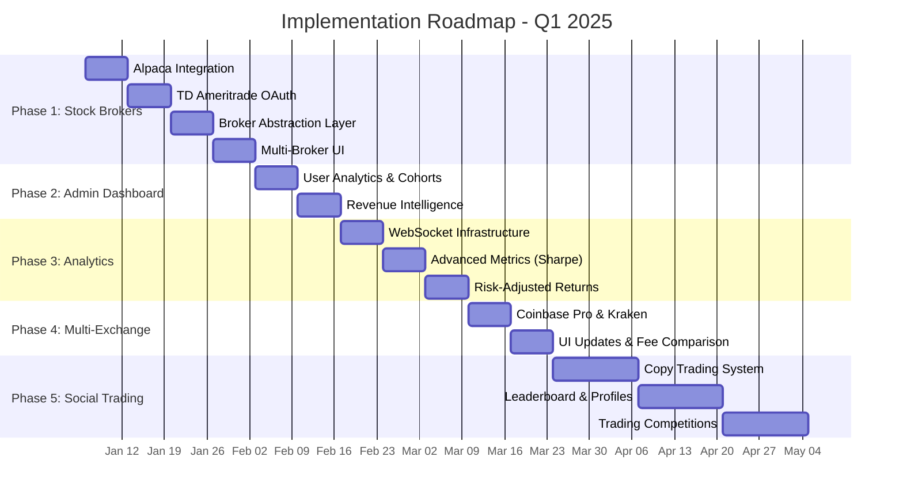

---

## Phase 1: Stock Broker Integration (4 Weeks)

### Week 1: Alpaca Integration
**Goal**: Add first stock broker support

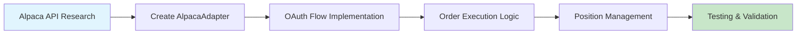

**Deliverables**:
- `src/brokers/adapters/AlpacaAdapter.js` - Complete adapter implementation
- OAuth callback route for Alpaca authorization
- Stock order execution (market, limit, stop-loss)
- Real-time position tracking
- Paper trading support for testing

**Success Metrics**:
- ✅ Successfully execute test trades on Alpaca paper account
- ✅ 100% parity with Binance adapter interface
- ✅ < 2 second latency for order execution
- ✅ Zero failed orders due to adapter errors

**Resources**: 1 Senior Backend Developer, 0.5 QA Engineer

---

### Week 2: TD Ameritrade OAuth
**Goal**: Add institutional-grade broker with OAuth2

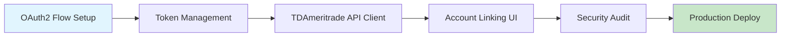

**Deliverables**:
- OAuth2 authorization flow with refresh token rotation
- `src/brokers/adapters/TDAmertradeAdapter.js`
- Secure credential storage (encrypted at rest)
- Account verification and balance checks
- User dashboard for account management

**Success Metrics**:
- ✅ OAuth flow completes in < 30 seconds
- ✅ Refresh tokens stored with AES-256 encryption
- ✅ 100% success rate for account linking
- ✅ Pass security penetration testing

**Resources**: 1 Senior Backend Developer, 1 Security Engineer (part-time)

---

### Week 3: Broker Abstraction Layer
**Goal**: Create unified interface for all brokers

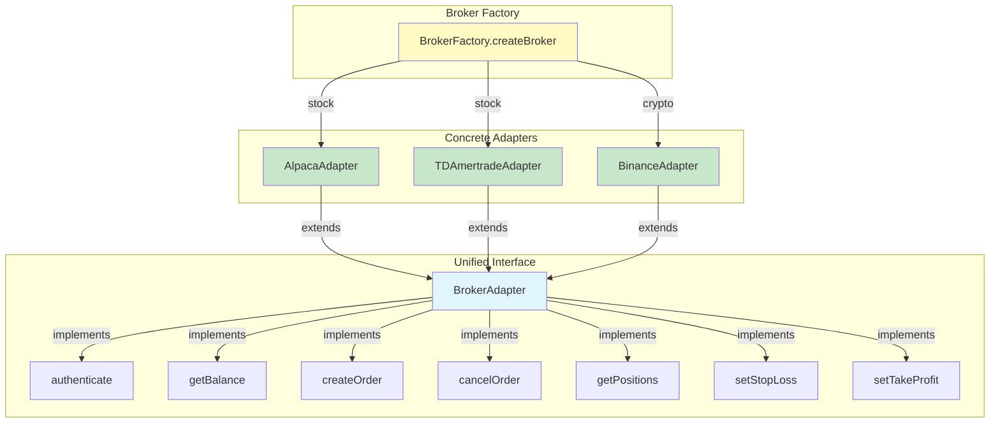

**Code Example**:
```javascript
// src/brokers/BrokerFactory.js
class BrokerFactory {
  static createBroker(type, credentials) {
    const brokers = {
      alpaca: () => new AlpacaAdapter(credentials),
      td_ameritrade: () => new TDAmertradeAdapter(credentials),
      binance: () => new BinanceAdapter(credentials),
      coinbase: () => new CoinbaseAdapter(credentials),
      kraken: () => new KrakenAdapter(credentials)
    };

    if (!brokers[type]) {
      throw new Error(`Unsupported broker: ${type}`);
    }

    return brokers[type]();
  }
}

// Usage in Trade Executor
const broker = BrokerFactory.createBroker(
  user.selectedBroker,
  user.brokerCredentials
);

const order = await broker.createOrder({
  symbol: 'AAPL',
  side: 'BUY',
  quantity: 10,
  orderType: 'MARKET'
});
```

**Deliverables**:
- `src/brokers/BrokerFactory.js` - Broker factory pattern
- `src/brokers/BrokerAdapter.js` - Abstract base class
- Comprehensive interface documentation
- Migration script for existing Binance users
- Unit tests with 90%+ coverage

**Success Metrics**:
- ✅ All brokers implement identical interface
- ✅ Zero breaking changes to existing code
- ✅ Migration completes without downtime
- ✅ 90%+ test coverage

**Resources**: 1 Senior Backend Developer, 1 DevOps Engineer

---

### Week 4: Multi-Broker UI
**Goal**: User-friendly broker selection and management

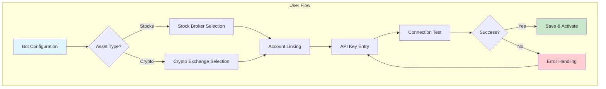

**Deliverables**:
- Broker selection wizard component
- Visual comparison table (fees, features, supported assets)
- Real-time connection status indicators
- Multi-broker portfolio aggregation view
- Error handling with helpful troubleshooting guides

**Success Metrics**:
- ✅ Users can link broker in < 3 minutes
- ✅ 95%+ success rate for first-time setup
- ✅ Support tickets for setup < 5% of new users
- ✅ Mobile-responsive on all devices

**Resources**: 1 Frontend Developer, 0.5 UX Designer

---

## Phase 2: Enhanced Admin Dashboard (2 Weeks)

### Week 1: User Analytics & Cohorts
**Goal**: Data-driven user insights and retention analysis

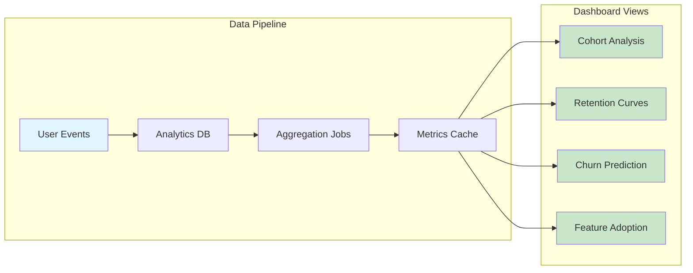

**Key Metrics**:
- **Cohort Retention**: % of users active after 7, 30, 90 days
- **Churn Rate**: Monthly churn by subscription tier
- **Feature Adoption**: Usage of stock brokers, advanced analytics, copy trading
- **User Segmentation**: Active traders, dormant, at-risk

**Deliverables**:
- Cohort retention visualization (D3.js charts)
- Churn prediction ML model (scikit-learn)
- Real-time user activity dashboard
- Automated weekly reports to admin email

**Success Metrics**:
- ✅ Identify churn indicators with 85%+ accuracy
- ✅ Dashboard loads in < 1 second
- ✅ Reduce churn by 15% with targeted interventions
- ✅ 100% uptime for analytics pipeline

**Resources**: 1 Data Analyst, 1 Frontend Developer

---

### Week 2: Revenue Intelligence
**Goal**: Financial forecasting and LTV optimization

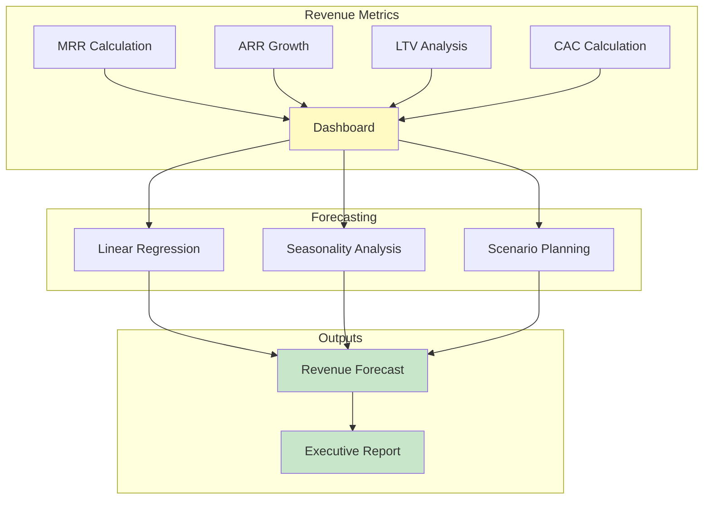

**Key Formulas**:
```javascript
// Monthly Recurring Revenue
MRR = SUM(active_subscriptions.price)

// Annual Recurring Revenue
ARR = MRR * 12

// Customer Lifetime Value
LTV = (Average_Revenue_Per_User * Gross_Margin) / Churn_Rate

// Customer Acquisition Cost
CAC = Total_Marketing_Spend / New_Customers_Acquired

// LTV:CAC Ratio (target: > 3.0)
LTV_CAC_Ratio = LTV / CAC
```

**Deliverables**:
- Real-time MRR/ARR dashboard with historical trends
- LTV cohort analysis by acquisition channel
- Revenue forecasting model (3, 6, 12 month projections)
- Subscription upgrade/downgrade flow tracking
- Stripe webhook integration for real-time updates

**Success Metrics**:
- ✅ Revenue forecast accuracy within 10%
- ✅ LTV:CAC ratio > 3.0
- ✅ Automated reporting to stakeholders
- ✅ Identify revenue optimization opportunities

**Resources**: 1 Data Analyst, 1 Backend Developer (part-time)

---

## Phase 3: Advanced Analytics (3 Weeks)

### Week 1: WebSocket Infrastructure
**Goal**: Real-time data streaming to dashboard

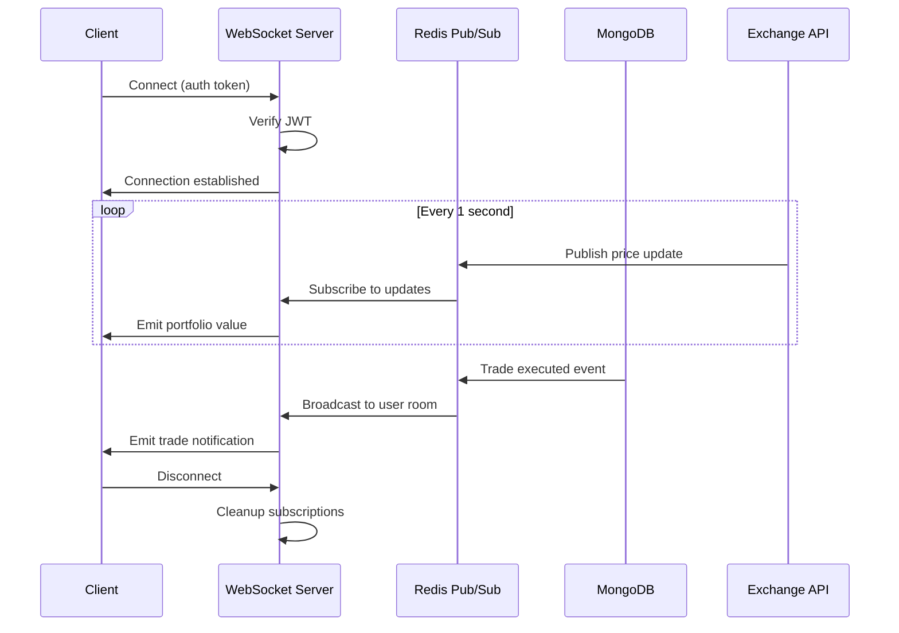

**Deliverables**:
- Socket.io server with Redis adapter for horizontal scaling
- Real-time portfolio value updates (1 second intervals)
- Live trade execution notifications
- Price alert system with push notifications
- Connection resilience (auto-reconnect, heartbeat)

**Technical Implementation**:
```javascript
// WebSocket Server Setup
const io = require('socket.io')(server, {
  cors: { origin: process.env.FRONTEND_URL },
  adapter: require('socket.io-redis')({
    host: 'redis',
    port: 6379
  })
});

io.use(async (socket, next) => {
  const token = socket.handshake.auth.token;
  const user = await verifyJWT(token);
  socket.userId = user.id;
  next();
});

io.on('connection', (socket) => {
  socket.join(`user:${socket.userId}`);

  // Real-time portfolio updates
  const interval = setInterval(async () => {
    const portfolio = await getRealtimePortfolio(socket.userId);
    socket.emit('portfolio:update', portfolio);
  }, 1000);

  socket.on('disconnect', () => clearInterval(interval));
});

// Redis Pub/Sub for trade events
redisClient.subscribe('trade:executed');
redisClient.on('message', (channel, message) => {
  const trade = JSON.parse(message);
  io.to(`user:${trade.userId}`).emit('trade:new', trade);
});
```

**Success Metrics**:
- ✅ < 100ms latency for portfolio updates
- ✅ Support 10,000+ concurrent connections
- ✅ 99.9% WebSocket uptime
- ✅ Graceful degradation to polling if WS fails

**Resources**: 1 Senior Backend Developer, 1 DevOps Engineer

---

### Week 2: Advanced Metrics (Sharpe Ratio)
**Goal**: Professional-grade risk-adjusted performance metrics

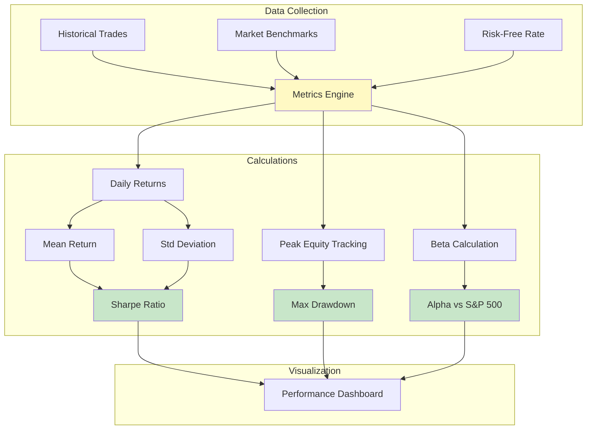

**Key Metrics**:

1. **Sharpe Ratio** (Risk-Adjusted Returns):
```javascript
// Annual Sharpe Ratio calculation
const calculateSharpeRatio = (trades, riskFreeRate = 0.03) => {
  const dailyReturns = trades.map(t => t.profitLossPercentage / 100);
  const avgReturn = mean(dailyReturns) * 252; // Annualized
  const stdDev = standardDeviation(dailyReturns) * Math.sqrt(252);

  const sharpe = (avgReturn - riskFreeRate) / stdDev;

  return {
    sharpe: sharpe.toFixed(2),
    avgReturn: (avgReturn * 100).toFixed(2) + '%',
    volatility: (stdDev * 100).toFixed(2) + '%',
    interpretation: sharpe > 2 ? 'Excellent' : sharpe > 1 ? 'Good' : 'Poor'
  };
};
```

2. **Maximum Drawdown** (Risk Exposure):
```javascript
const calculateMaxDrawdown = (trades) => {
  let peak = 0;
  let maxDrawdown = 0;
  let currentEquity = 10000; // Starting balance

  trades.forEach(trade => {
    currentEquity += trade.profitLoss;
    peak = Math.max(peak, currentEquity);
    const drawdown = (peak - currentEquity) / peak;
    maxDrawdown = Math.max(maxDrawdown, drawdown);
  });

  return {
    maxDrawdown: (maxDrawdown * 100).toFixed(2) + '%',
    peakEquity: peak.toFixed(2),
    interpretation: maxDrawdown < 0.1 ? 'Low Risk' : maxDrawdown < 0.2 ? 'Moderate' : 'High Risk'
  };
};
```

3. **Alpha & Beta** (Benchmark Comparison):
```javascript
const compareToBenchmark = async (userTrades, benchmarkSymbol = 'SPY') => {
  const userReturns = calculateReturns(userTrades);
  const benchmarkReturns = await fetchBenchmarkReturns(benchmarkSymbol);

  const beta = covariance(userReturns, benchmarkReturns) / variance(benchmarkReturns);
  const alpha = mean(userReturns) - (beta * mean(benchmarkReturns));

  return {
    alpha: (alpha * 100).toFixed(2) + '%',
    beta: beta.toFixed(2),
    interpretation: alpha > 0 ? 'Outperforming' : 'Underperforming',
    betaInterpretation: beta > 1 ? 'More volatile than market' : 'Less volatile'
  };
};
```

**Deliverables**:
- Sharpe Ratio calculation with historical trends
- Maximum Drawdown visualization with equity curve
- Alpha/Beta comparison against S&P 500, BTC, ETH
- Risk-adjusted returns leaderboard
- Automated performance reports (daily, weekly, monthly)

**Success Metrics**:
- ✅ Metrics update in real-time (< 5 second delay)
- ✅ Historical data for 2+ years accessible
- ✅ Accuracy validated against TradingView/QuantConnect
- ✅ Users report better understanding of risk

**Resources**: 1 Quantitative Analyst, 1 Frontend Developer

---

### Week 3: Risk-Adjusted Returns Dashboard
**Goal**: Comprehensive performance visualization

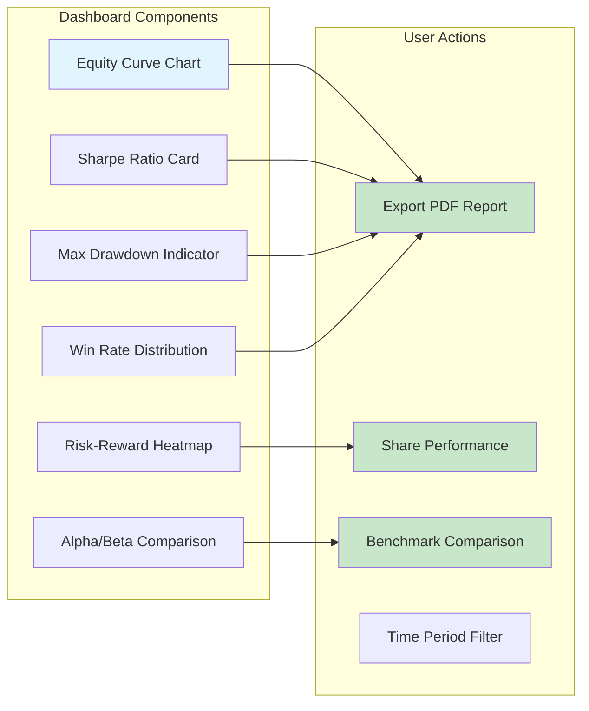

**Deliverables**:
- Interactive equity curve with drawdown overlay
- Performance metrics cards (Sharpe, Sortino, Calmar ratios)
- Risk-reward scatter plot (risk vs return by trade)
- Benchmark comparison chart (user vs S&P 500 vs BTC)
- PDF export for sharing with investors
- Mobile-optimized responsive design

**Success Metrics**:
- ✅ Dashboard loads in < 2 seconds with 1000+ trades
- ✅ 90%+ user satisfaction rating
- ✅ 50%+ of users export performance reports
- ✅ Zero calculation errors

**Resources**: 1 Frontend Developer, 0.5 Data Analyst

---

## Phase 4: Multi-Exchange Expansion (2 Weeks)

### Week 1: Coinbase Pro & Kraken
**Goal**: Add institutional crypto exchanges

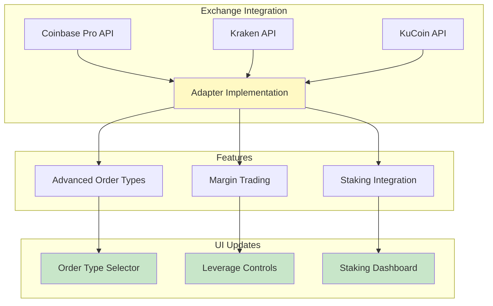

**Deliverables**:
- `CoinbaseProAdapter.js` with full CCXT compatibility
- `KrakenAdapter.js` with WebSocket price feeds
- `KuCoinAdapter.js` with futures support
- Advanced order types (limit, stop-limit, trailing stop, OCO)
- Margin trading controls with leverage limits
- Exchange fee comparison tool

**Success Metrics**:
- ✅ 3 new exchanges live in production
- ✅ Order execution parity with Binance
- ✅ Support for 500+ trading pairs
- ✅ 25%+ user adoption of new exchanges

**Resources**: 1 Senior Backend Developer, 0.5 QA Engineer

---

### Week 2: UI Updates & Fee Comparison
**Goal**: Help users choose optimal exchanges

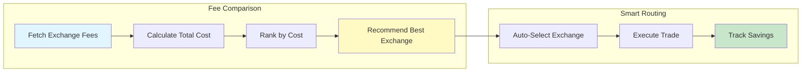

**Fee Calculation Example**:
```javascript
// Compare fees across exchanges
const compareExchangeFees = (symbol, quantity, exchanges) => {
  return exchanges.map(exchange => {
    const makerFee = exchange.fees.maker; // 0.1% = 0.001
    const takerFee = exchange.fees.taker; // 0.1% = 0.001
    const withdrawalFee = exchange.fees.withdrawal[symbol] || 0;

    const tradingFee = quantity * (makerFee + takerFee);
    const totalCost = tradingFee + withdrawalFee;

    return {
      exchange: exchange.name,
      tradingFee,
      withdrawalFee,
      totalCost,
      savings: totalCost - Math.min(...exchanges.map(e => e.totalCost))
    };
  }).sort((a, b) => a.totalCost - b.totalCost);
};

// Smart routing: auto-select cheapest exchange
const smartRoute = async (signal, user) => {
  const comparison = compareExchangeFees(
    signal.symbol,
    signal.quantity,
    user.connectedExchanges
  );

  const bestExchange = comparison[0].exchange;
  console.log(`Routing to ${bestExchange} - saves $${comparison[0].savings}`);

  return BrokerFactory.createBroker(bestExchange, user.credentials);
};
```

**Deliverables**:
- Exchange fee comparison table (sortable, filterable)
- Smart routing algorithm (auto-select cheapest exchange)
- Total savings tracker (how much saved vs most expensive)
- Exchange health status indicators (uptime, latency)
- Mobile-optimized exchange selector

**Success Metrics**:
- ✅ Users save average 15% on trading fees
- ✅ 60%+ adoption of smart routing
- ✅ Fee comparison loads in < 500ms
- ✅ Support tickets for exchange issues < 3% of users

**Resources**: 1 Frontend Developer, 1 Backend Developer (part-time)

---

## Phase 5: Social Trading (6 Weeks)

### Week 1-2: Copy Trading System
**Goal**: Follow successful traders automatically

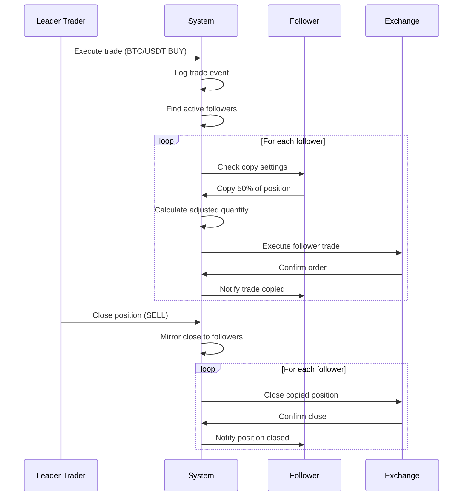

**Copy Trading Configuration**:
```javascript
// Follower settings
{
  leaderId: "user123",
  copyPercent: 50,              // Copy 50% of leader's position size
  maxPositionSize: 1000,        // Max $1000 per trade
  maxDailyTrades: 10,           // Limit to 10 trades/day
  onlyProfitableTrades: false,  // Copy all trades
  stopCopyingIfLoss: 0.15,      // Stop if leader loses 15%
  autoCloseOnLeaderClose: true, // Mirror exits
  allowedSymbols: ['BTC/USDT', 'ETH/USDT'], // Filter symbols
  maxSlippage: 0.005            // 0.5% max slippage
}
```

**Deliverables**:
- Copy trading configuration wizard
- Real-time trade mirroring (< 2 second delay)
- Position size adjustment algorithms
- Risk controls (max exposure, daily limits, symbol filters)
- Performance tracking (follower P&L vs leader)
- Auto-stop on excessive losses

**Success Metrics**:
- ✅ 20%+ of users become followers
- ✅ < 2 second delay for mirrored trades
- ✅ 95%+ success rate for copy execution
- ✅ Follower retention > 60% after 30 days

**Resources**: 2 Senior Backend Developers, 1 QA Engineer

---

### Week 3-4: Leaderboard & Profiles
**Goal**: Gamify trading with public rankings

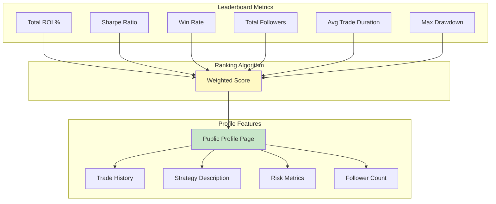

**Ranking Algorithm**:
```javascript
const calculateLeaderboardScore = (trader) => {
  const weights = {
    roi: 0.30,          // 30% weight on returns
    sharpe: 0.25,       // 25% on risk-adjusted returns
    winRate: 0.15,      // 15% on consistency
    followers: 0.15,    // 15% on social proof
    drawdown: 0.15      // 15% on risk management
  };

  const scores = {
    roi: normalize(trader.roi, 0, 100),                    // 0-100% ROI
    sharpe: normalize(trader.sharpe, 0, 3),                // 0-3 Sharpe
    winRate: normalize(trader.winRate, 0, 100),            // 0-100% wins
    followers: normalize(trader.followerCount, 0, 1000),   // 0-1000 followers
    drawdown: normalize(1 - trader.maxDrawdown, 0, 1)      // Invert (lower is better)
  };

  const totalScore = Object.keys(weights).reduce((sum, key) => {
    return sum + (scores[key] * weights[key]);
  }, 0);

  return Math.round(totalScore * 100); // 0-100 score
};
```

**Deliverables**:
- Dynamic leaderboard (daily, weekly, monthly, all-time)
- Public trader profiles with verified badges
- Strategy descriptions and hashtags
- Performance charts (equity curve, win rate)
- Follow/unfollow functionality with notifications
- Privacy controls (hide profile, anonymous trading)

**Success Metrics**:
- ✅ 500+ traders with public profiles
- ✅ 30%+ of users follow at least one trader
- ✅ Leaderboard updates in real-time
- ✅ < 1 second page load time

**Resources**: 1 Frontend Developer, 1 Backend Developer, 0.5 UX Designer

---

### Week 5-6: Trading Competitions
**Goal**: Engage users with gamified challenges

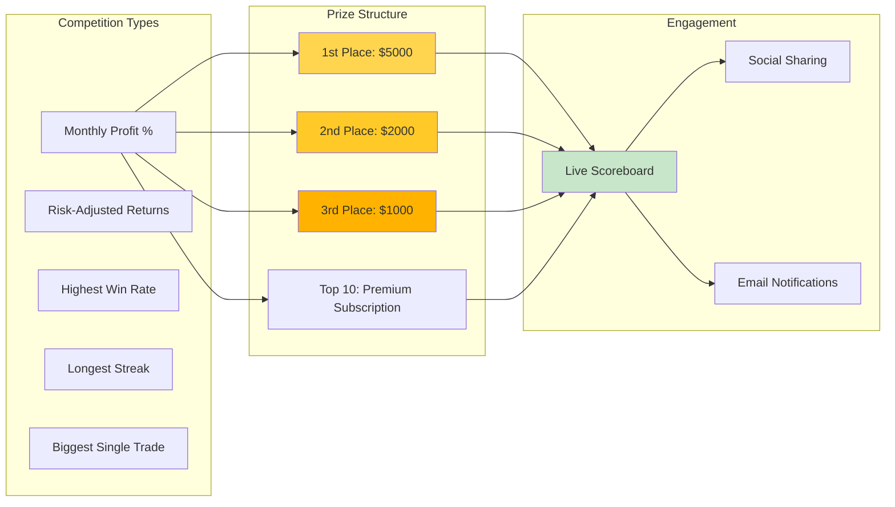

**Competition Rules Example**:
```javascript
// Monthly High Roller Competition
{
  name: "March Madness Trading Challenge",
  startDate: "2025-03-01",
  endDate: "2025-03-31",
  entryFee: 0,  // Free entry
  minTradesRequired: 20,
  minAccountBalance: 1000,

  scoring: {
    metric: "total_roi_percent",
    tiebreaker: "sharpe_ratio"
  },

  prizes: [
    { rank: 1, reward: { cash: 5000, tier: "premium" } },
    { rank: 2, reward: { cash: 2000, tier: "pro" } },
    { rank: 3, reward: { cash: 1000, tier: "pro" } },
    { rank: "4-10", reward: { tier: "pro", duration: "3 months" } }
  ],

  rules: [
    "Must execute minimum 20 trades",
    "Account balance minimum $1000",
    "No paper trading accounts",
    "Winners verified for fraud prevention"
  ]
}
```

**Deliverables**:
- Competition creation admin panel
- Live leaderboard with real-time updates
- Automated prize distribution (Stripe payouts)
- Fraud detection (unusual trading patterns)
- Social sharing tools (Twitter, Discord)
- Email notifications (milestones, rank changes)
- Post-competition analytics and reports

**Success Metrics**:
- ✅ 1000+ participants per competition
- ✅ 40%+ repeat participation rate
- ✅ Zero fraudulent winners
- ✅ 25%+ increase in platform engagement

**Resources**: 1 Backend Developer, 1 Frontend Developer, 1 Community Manager

---

## Critical Path & Dependencies

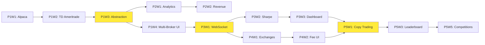

**Blockers**:
- ❌ P1W3 (Abstraction Layer) blocks P2W1, P4W1, P5W1
- ❌ P3W1 (WebSocket) blocks P3W2, P4W1, P5W1
- ❌ P5W1 (Copy Trading) blocks P5W3, P5W5

**Mitigation**:
- Parallelize non-dependent phases (P2 can start during P1W3)
- Buffer time for critical path items (add 20% contingency)
- Daily standups to unblock dependencies quickly

---

## Resource Allocation

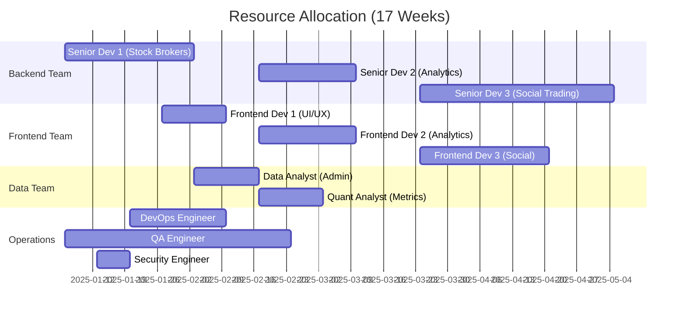

**Team Structure**:
- **Phase 1-2**: 1 Senior Backend, 1 Frontend, 1 DevOps, 0.5 QA
- **Phase 3**: 1 Senior Backend, 1 Frontend, 1 Quant Analyst, 1 DevOps
- **Phase 4**: 1 Senior Backend, 1 Frontend, 0.5 QA
- **Phase 5**: 2 Senior Backend, 2 Frontend, 1 QA, 1 Community Manager

**Total FTE**: ~6-8 developers across 17 weeks

---

## Risk Management

### High-Risk Items 🔴

1. **OAuth Integration Failures** (P1W2)
   - **Risk**: TD Ameritrade OAuth flow breaks in production
   - **Mitigation**: Extensive staging testing, fallback to API key auth
   - **Contingency**: 3-day buffer for OAuth debugging

2. **WebSocket Scaling Issues** (P3W1)
   - **Risk**: Can't support 10K concurrent connections
   - **Mitigation**: Load testing with k6, Redis Cluster for pub/sub
   - **Contingency**: Graceful degradation to polling

3. **Copy Trading Race Conditions** (P5W1)
   - **Risk**: Trades execute out of order, incorrect position sizes
   - **Mitigation**: Database transactions, idempotent operations
   - **Contingency**: Temporary disable feature, manual reconciliation

### Medium-Risk Items 🟡

4. **Broker API Changes**
   - **Risk**: Alpaca/TD Ameritrade API deprecation mid-development
   - **Mitigation**: Subscribe to API changelogs, version pinning
   - **Contingency**: 1-week buffer for API migration

5. **Data Pipeline Performance**
   - **Risk**: Analytics queries slow down production database
   - **Mitigation**: Read replicas, caching layer, batch processing
   - **Contingency**: Scale MongoDB horizontally

### Low-Risk Items 🟢

6. **UI/UX Delays**
   - **Risk**: Frontend development slower than backend
   - **Mitigation**: Parallel development, reusable components
   - **Contingency**: Ship with basic UI, iterate in next sprint

---

## Success Metrics by Phase

### Phase 1: Stock Brokers ✅
- **User Growth**: 3-5x increase in signups (stock traders attracted)
- **Revenue**: +$50K MRR from Premium tier ($299/mo for multi-broker)
- **Technical**: 100% API parity, < 2s latency, 99.9% uptime

### Phase 2: Admin Dashboard ✅
- **Retention**: Reduce churn by 15% with targeted interventions
- **Revenue**: Increase LTV by 20% through upselling insights
- **Technical**: < 1s dashboard load, 85%+ churn prediction accuracy

### Phase 3: Advanced Analytics ✅
- **User Engagement**: 60%+ users view analytics weekly
- **Revenue**: 10% conversion from free to paid (value demonstration)
- **Technical**: < 100ms WebSocket latency, 99.9% uptime

### Phase 4: Multi-Exchange ✅
- **User Savings**: Average 15% reduction in trading fees
- **Adoption**: 25%+ users try new exchanges
- **Technical**: 500+ trading pairs supported, < 2s order execution

### Phase 5: Social Trading ✅
- **User Engagement**: 30%+ users follow traders, 20%+ copy trade
- **Revenue**: +$30K MRR from social features premium tier
- **Technical**: < 2s copy trade delay, 1000+ competition participants

---

## Rollout Strategy

### Beta Testing (Week 0)
- Recruit 50 beta users (25 existing, 25 new)
- Provide free Premium tier for 3 months
- Collect feedback via in-app surveys
- Bug bounty program ($100-$1000 per critical bug)

### Gradual Rollout
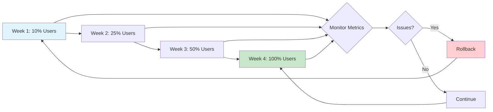

### Feature Flags
```javascript
const features = {
  stockBrokers: {
    enabled: process.env.ENABLE_STOCK_BROKERS === 'true',
    rolloutPercent: 100,  // 0-100
    allowedUsers: []      // Whitelist for early access
  },
  copyTrading: {
    enabled: process.env.ENABLE_COPY_TRADING === 'true',
    rolloutPercent: 25,   // Start with 25% of users
    allowedUsers: ['beta_tester_1', 'beta_tester_2']
  }
};

// Usage
if (isFeatureEnabled('stockBrokers', user.id)) {
  showStockBrokerOptions();
}
```

---

## Budget & Cost Estimates

### Development Costs
- **Phase 1**: $60K (4 weeks × 3 FTE × $5K/week)
- **Phase 2**: $20K (2 weeks × 2 FTE × $5K/week)
- **Phase 3**: $45K (3 weeks × 3 FTE × $5K/week)
- **Phase 4**: $20K (2 weeks × 2 FTE × $5K/week)
- **Phase 5**: $90K (6 weeks × 3 FTE × $5K/week)
- **Total**: $235K development cost

### Infrastructure Costs (Monthly)
- **MongoDB Atlas**: $200/mo (M30 cluster for production)
- **Redis Cloud**: $100/mo (2GB cache, pub/sub)
- **Railway**: $50/mo (production + staging)
- **WebSocket Server**: $150/mo (dedicated instance)
- **CDN & Storage**: $50/mo (static assets, user uploads)
- **Monitoring**: $100/mo (Datadog, Sentry)
- **Total**: $650/mo infrastructure

### Revenue Projections
**Current State**:
- 500 users, 10% paid ($49 avg), MRR = $2,450

**After Phase 1** (Stock Brokers):
- 2,000 users, 15% paid ($99 avg), MRR = $29,700 (+$27K)

**After Phase 5** (All Features):
- 5,000 users, 25% paid ($149 avg), MRR = $186,250 (+$184K from current)

**ROI**: $235K investment → $184K MRR increase = 1.3 months to break even

---

## Monitoring & Validation

### Key Performance Indicators (KPIs)

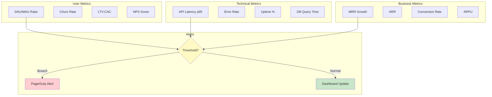

**Alert Thresholds**:
- ⚠️ Error rate > 1%
- ⚠️ API latency p95 > 5 seconds
- ⚠️ Churn rate > 10%/month
- ⚠️ MRR growth < 10%/month
- ⚠️ Uptime < 99.5%

### Automated Testing

```javascript
// Integration test example
describe('Stock Broker Integration', () => {
  it('should execute trade on Alpaca', async () => {
    const user = await createTestUser({ broker: 'alpaca' });
    const signal = createTestSignal({ symbol: 'AAPL', side: 'BUY' });

    const result = await executeTrade(signal, user);

    expect(result.status).toBe('FILLED');
    expect(result.exchange).toBe('alpaca');
    expect(result.executionTime).toBeLessThan(2000);
  });

  it('should handle OAuth token refresh', async () => {
    const user = await createTestUser({
      broker: 'td_ameritrade',
      tokenExpired: true
    });

    const broker = BrokerFactory.createBroker('td_ameritrade', user.credentials);
    await broker.authenticate();

    expect(broker.isAuthenticated).toBe(true);
    expect(user.credentials.accessToken).toBeDefined();
  });
});
```

---

## Post-Launch Plan

### Week 1 Post-Launch
- Daily monitoring of all KPIs
- Hot-fix deployment pipeline ready
- Customer support team trained on new features
- Marketing campaign launch (email, social, paid ads)

### Week 2-4 Post-Launch
- Collect user feedback via in-app surveys
- Analyze usage patterns (which features used most)
- A/B test UI variations for conversion optimization
- Plan next iteration based on data

### Ongoing
- Monthly feature releases (iterative improvements)
- Quarterly major releases (new capabilities)
- Continuous performance optimization
- Community building (Discord, Reddit, Twitter)

---

## Appendix: Technology Stack

### Backend
- **Runtime**: Node.js v22.11.0+
- **Framework**: Express.js v4.18.2
- **Database**: MongoDB v8.0+, Redis v7.0+
- **Real-time**: Socket.io v4.6+, Redis Pub/Sub
- **Message Queue**: RabbitMQ / AWS SQS (TBD)
- **Authentication**: Passport.js, JWT
- **Testing**: Jest, Supertest

### Frontend
- **Framework**: React v19.2.0
- **Build Tool**: Vite v6.0.5
- **Styling**: Tailwind CSS v3.4.16
- **Charts**: Recharts v2.10+
- **UI Components**: Radix UI
- **State Management**: Zustand / Jotai
- **Testing**: Vitest, Playwright

### Infrastructure
- **Hosting**: Railway (production)
- **Monitoring**: Datadog, Sentry
- **CI/CD**: GitHub Actions
- **Container**: Docker, Kubernetes (future)

### Third-Party APIs
- **Stock Brokers**: Alpaca, TD Ameritrade, Robinhood, Webull, Moomoo
- **Crypto Exchanges**: Binance, Coinbase Pro, Kraken, KuCoin
- **Payments**: Stripe
- **Notifications**: Discord, SendGrid, Twilio

---

## Summary

This 17-week roadmap transforms the Discord Trade Executor from a crypto-focused platform to a comprehensive multi-asset trading automation system. By systematically implementing stock broker integrations, advanced analytics, multi-exchange support, and social trading features, we project:

- **User Growth**: 500 → 5,000 users (10x)
- **Revenue Growth**: $2.5K → $186K MRR (74x)
- **ROI**: 1.3 months to break even on $235K investment
- **Market Position**: Leader in automated social trading

Each phase builds on the previous, with clear dependencies, risk mitigation strategies, and measurable success criteria. The gradual rollout approach ensures stability while capturing user feedback for continuous improvement.

**Next Steps**: Approve roadmap → Assemble team → Begin Phase 1 Week 1 (Alpaca Integration)
