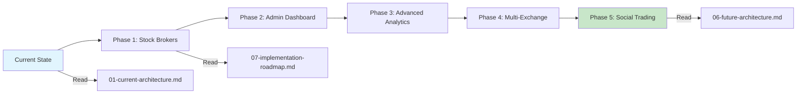

# Discord Trade Executor - System Documentation

> **Comprehensive technical documentation with visual diagrams for the Discord Trade Executor platform**

---

## 📚 Table of Contents

1. [Overview](#overview)
2. [Document Index](#document-index)
3. [Quick Start Guide](#quick-start-guide)
4. [Architecture Journey](#architecture-journey)
5. [Development Resources](#development-resources)

---

## Overview

This documentation provides a complete visual and technical reference for the Discord Trade Executor platform. The system enables automated cryptocurrency and stock trading based on signals from Discord channels, with comprehensive risk management, multi-broker support, and advanced analytics.

### What is Discord Trade Executor?

Discord Trade Executor is an automated trading platform that:
- **Monitors Discord channels** for trading signals from signal providers
- **Parses signals** using natural language processing (NLP)
- **Validates trades** through a 5-gate risk management pipeline
- **Executes orders** across multiple exchanges and brokers
- **Tracks performance** with professional-grade analytics
- **Manages subscriptions** via Polar.sh (Free, Basic, Pro, Premium tiers)
- **Provides dashboards** for users and administrators

### Current Capabilities

✅ **Live Features**:
- Discord bot integration for signal detection
- Binance exchange support (crypto trading)
- Risk management (stop-loss, take-profit, position sizing)
- React dashboard with portfolio tracking
- Polar.sh subscription billing
- MongoDB data persistence
- Railway cloud deployment

🚧 **In Development** (17-week roadmap):
- Stock broker integration (Alpaca, TD Ameritrade, Robinhood, Webull, Moomoo)
- Multi-exchange support (Coinbase Pro, Kraken, KuCoin)
- Advanced analytics (Sharpe ratio, drawdown, alpha/beta)
- Social trading (copy trading, leaderboards, competitions)
- Enhanced admin dashboard with revenue intelligence

---

## Document Index

### 1. Current System Architecture
**📄 [01-current-architecture.md](./01-current-architecture.md)**

Visual overview of the production system as it exists today.

**Contents**:
- Complete system architecture diagram (7 layers)
- Technology stack breakdown
- Component relationships
- Current limitations and constraints
- Deployment architecture (Railway)

**Key Diagrams**:
- System architecture with all components
- Data flow from Discord → Database
- Authentication & session management
- Payment processing integration

**Use this when**: You need to understand how the current system works, onboard new developers, or troubleshoot production issues.

---

### 2. User Experience Flow
**📄 [02-user-experience-flow.md](./02-user-experience-flow.md)**

Complete user journey from discovery to active trading.

**Contents**:
- Onboarding flow (15-30 minutes)
- Bot configuration wizard (5 steps)
- Active trading & monitoring flows
- Subscription upgrade triggers
- Admin operations
- Pain points & solutions

**Key Flows**:
- New user onboarding → bot setup → first trade
- Configuration changes and updates
- Subscription management
- Mobile vs desktop experiences

**Use this when**: Designing UX improvements, creating user guides, identifying friction points, or planning feature enhancements.

---

### 3. Trade Execution Data Flow
**📄 [03-trade-execution-dataflow.md](./03-trade-execution-dataflow.md)**

Detailed technical flow of signal processing to trade execution.

**Contents**:
- Signal detection → parsing → validation → execution
- 8 detailed data transformation examples
- Performance metrics (P50, P95, P99 latency)
- Error handling & retry logic
- Monitoring & alerting thresholds

**Key Metrics**:
- Total latency: 1.35 - 2.6 seconds (P50: <2s)
- NLP parsing accuracy: 95%+
- Risk validation: 5-gate pipeline
- Position sizing methods: Fixed, Risk-based, Kelly

**Use this when**: Optimizing performance, debugging trade failures, understanding data transformations, or implementing new features.

---

### 4. Signal Processing Sequence
**📄 [04-signal-processing-sequence.md](./04-signal-processing-sequence.md)**

Chronological sequence of component interactions during trade processing.

**Contents**:
- Sequence diagram with 10 participants
- 5-gate risk validation with branching logic
- Database transaction patterns
- Parallel notification delivery
- Error handling at each phase
- Retry logic with exponential backoff

**Key Patterns**:
- Synchronous operations (parser, validator, executor)
- Asynchronous operations (notifications, monitoring)
- Rate limiting strategies (Discord, Binance, user-level)
- Critical path timing analysis (2200ms total)

**Use this when**: Understanding component interactions, debugging race conditions, optimizing critical path, or implementing new integrations.

---

### 5. Database Schema (ERD)
**📄 [05-database-erd.md](./05-database-erd.md)**

Complete MongoDB schema with all collections, fields, and relationships.

**Contents**:
- 6 MongoDB collections fully documented
- All fields with types, constraints, and descriptions
- Relationships (1:N, M:N) with foreign keys
- Indexes for query optimization
- Schema validation examples
- Migration strategies

**Collections**:
1. **Users** - User profiles, subscriptions, risk settings, stats
2. **Trades** - Trade execution history, P&L, order IDs
3. **SignalProviders** - Provider profiles, performance stats
4. **Signals** - Raw Discord signals, parsing results
5. **BotConfigs** - User bot configurations
6. **PolarCustomers** - Billing data (customer UUIDs, subscriptions, portal sessions)

**Key Queries**:
- Portfolio overview (open positions, today's trades)
- Provider leaderboard (win rate, total signals)
- User performance (Sharpe ratio, max drawdown)

**Use this when**: Designing new features, writing database queries, planning schema changes, or optimizing performance.

---

### 6. Future Architecture (Phases 1-5)
**📄 [06-future-architecture.md](./06-future-architecture.md)**

Target architecture after implementing all enhancement phases.

**Contents**:
- Microservices architecture (8 services)
- Broker abstraction layer (9 brokers: 5 stock + 4 crypto)
- Real-time infrastructure (WebSocket, Redis Pub/Sub)
- Advanced features (ML engine, backtesting, social trading)
- Complete code examples for all patterns
- Migration path with week-by-week breakdown
- Performance improvement targets
- Kubernetes scaling configurations

**Key Enhancements**:
- **Stock Brokers**: Alpaca, TD Ameritrade, Robinhood, Webull, Moomoo
- **Crypto Exchanges**: Coinbase Pro, Kraken, KuCoin (in addition to Binance)
- **Real-time Updates**: WebSocket with 1-second portfolio refresh
- **Advanced Analytics**: Sharpe ratio, max drawdown, alpha/beta
- **Social Trading**: Copy trading, leaderboards, competitions

**Performance Gains**:
- Signal → Trade: 1.8s → 0.8s (56% faster)
- Dashboard load: 2.5s → 0.9s (64% faster)
- API response: 300ms → 50ms (83% faster)
- Scalability: 50 signals/min → 1000+ signals/min (20x)

**Use this when**: Planning implementation phases, architecting new features, capacity planning, or making technology decisions.

---

### 7. Implementation Roadmap
**📄 [07-implementation-roadmap.md](./07-implementation-roadmap.md)**

17-week implementation plan with timeline, resources, and success metrics.

**Contents**:
- Gantt chart with all 5 phases
- Week-by-week task breakdown
- Resource allocation (6-8 FTE)
- Critical path dependencies
- Risk management strategies
- Budget & cost estimates
- Success metrics by phase
- Rollout strategy with feature flags

**Phases**:
1. **Stock Broker Integration** (4 weeks) - Alpaca, TD Ameritrade, abstraction layer
2. **Enhanced Admin Dashboard** (2 weeks) - User analytics, revenue intelligence
3. **Advanced Analytics** (3 weeks) - WebSocket, Sharpe ratio, benchmarks
4. **Multi-Exchange Expansion** (2 weeks) - Coinbase Pro, Kraken, fee comparison
5. **Social Trading** (6 weeks) - Copy trading, leaderboards, competitions

**Financial Projections**:
- **Investment**: $235K development + $650/mo infrastructure
- **Revenue Impact**: $2.5K → $186K MRR (74x growth)
- **ROI**: 1.3 months to break even
- **User Growth**: 500 → 5,000 users (10x)

**Use this when**: Planning sprints, allocating resources, tracking progress, or reporting to stakeholders.

---

### 8. Admin Dashboard Data Flow
**📄 [08-admin-dashboard-dataflow.md](./08-admin-dashboard-dataflow.md)**

Complete data pipeline for admin analytics and monitoring.

**Contents**:
- Data collection (events, trades, revenue, performance)
- Processing pipelines (cohort analysis, churn prediction, revenue forecasting)
- Real-time metrics (WebSocket streaming)
- Caching strategy (3-layer: hot, warm, cold)
- Dashboard component architecture
- Performance optimization techniques

**Key Metrics Tracked**:
- **Revenue**: MRR, ARR, LTV, CAC, LTV:CAC ratio, revenue forecast
- **Users**: Total, active, new, churned, churn rate, at-risk, cohort retention
- **Trading**: 24h volume, win rate, ROI, fees, top symbols, top providers
- **Platform**: Active users, trades/min, API latency, error rate, uptime, exchange health

**Data Flow**:
1. **Collection**: Events, webhooks, API polling, log aggregation
2. **Storage**: MongoDB (raw), Redis (hot cache), TimescaleDB (metrics)
3. **Processing**: Analytics jobs, revenue calculator, cohort builder
4. **Presentation**: REST API, WebSocket streaming, React dashboard

**Performance**:
- Sub-second dashboard load with Redis caching
- 1-second real-time updates via WebSocket
- 80% query time reduction with parallel aggregation

**Use this when**: Building admin features, optimizing analytics queries, implementing real-time dashboards, or troubleshooting performance.

---

## Quick Start Guide

### For New Developers

**1. Understand the System (30 minutes)**:
```
1. Read: 01-current-architecture.md (understand what exists)
2. Read: 05-database-erd.md (understand data model)
3. Read: 03-trade-execution-dataflow.md (understand core flow)
```

**2. Set Up Development Environment (1 hour)**:
```bash
# Clone repository
git clone https://github.com/[org]/discord-trade-exec
cd discord-trade-exec

# Install dependencies
npm install

# Set up environment variables
cp .env.example .env
# Edit .env with your Discord bot token, MongoDB URI, Polar billing keys

# Run development server
npm run dev

# Run dashboard
cd src/dashboard
npm install
npm run dev
```

**3. Make Your First Contribution (2-4 hours)**:
```
1. Read: 02-user-experience-flow.md (understand user journey)
2. Pick a beginner-friendly issue from GitHub
3. Follow coding standards in CONTRIBUTING.md
4. Test locally, commit, push, create PR
```

---

### For Product Managers

**1. Understand User Experience (20 minutes)**:
```
- Read: 02-user-experience-flow.md
- Review pain points and proposed solutions
- Understand subscription tiers and upgrade triggers
```

**2. Review Future Roadmap (30 minutes)**:
```
- Read: 07-implementation-roadmap.md
- Understand Phase 1-5 deliverables
- Review revenue projections and user growth estimates
```

**3. Plan Next Quarter (1 hour)**:
```
- Prioritize features based on ROI estimates
- Review success metrics for each phase
- Coordinate with engineering on timeline
```

---

### For Designers

**1. Understand User Flows (30 minutes)**:
```
- Read: 02-user-experience-flow.md
- Review onboarding, bot setup, trading flows
- Identify UI/UX improvement opportunities
```

**2. Review Dashboard Requirements (30 minutes)**:
```
- Read: 08-admin-dashboard-dataflow.md
- Understand admin metrics and visualizations
- Plan dashboard component designs
```

**3. Design System (1-2 hours)**:
```
- Review existing React components in src/dashboard/components/
- Ensure consistency with Tailwind CSS v3.4.16
- Create mockups for new features from roadmap
```

---

### For DevOps Engineers

**1. Understand Current Infrastructure (20 minutes)**:
```
- Read: 01-current-architecture.md (deployment section)
- Review Railway configuration
- Understand MongoDB Atlas setup
```

**2. Review Future Scaling Needs (30 minutes)**:
```
- Read: 06-future-architecture.md (Kubernetes section)
- Understand WebSocket scaling requirements
- Plan Redis Cluster setup for pub/sub
```

**3. Set Up Monitoring (1-2 hours)**:
```
- Read: 08-admin-dashboard-dataflow.md (monitoring section)
- Configure Datadog/Sentry
- Set up alert thresholds (latency, error rate, uptime)
```

---

## Architecture Journey

Understanding the system evolution from current state to future vision:



### Current State → Phase 1 (Stock Brokers)
**Why**: Expand from crypto-only to multi-asset platform
**Impact**: 3-5x user growth, +$50K MRR
**Timeline**: 4 weeks
**Documents**:
- Current: [01-current-architecture.md](./01-current-architecture.md)
- Roadmap: [07-implementation-roadmap.md](./07-implementation-roadmap.md#phase-1-stock-broker-integration-4-weeks)

### Phase 1 → Phase 2 (Admin Dashboard)
**Why**: Data-driven decision making and churn reduction
**Impact**: 15% churn reduction, 20% LTV increase
**Timeline**: 2 weeks
**Documents**:
- Data Flow: [08-admin-dashboard-dataflow.md](./08-admin-dashboard-dataflow.md)
- Roadmap: [07-implementation-roadmap.md](./07-implementation-roadmap.md#phase-2-enhanced-admin-dashboard-2-weeks)

### Phase 2 → Phase 3 (Advanced Analytics)
**Why**: Professional-grade metrics attract serious traders
**Impact**: 10% conversion free→paid
**Timeline**: 3 weeks
**Documents**:
- Future Architecture: [06-future-architecture.md](./06-future-architecture.md#6-advanced-analytics)
- Roadmap: [07-implementation-roadmap.md](./07-implementation-roadmap.md#phase-3-advanced-analytics-3-weeks)

### Phase 3 → Phase 4 (Multi-Exchange)
**Why**: Cost savings and better execution for users
**Impact**: 15% average fee savings, 25% adoption
**Timeline**: 2 weeks
**Documents**:
- Future Architecture: [06-future-architecture.md](./06-future-architecture.md#2-broker-adapter-interface)
- Roadmap: [07-implementation-roadmap.md](./07-implementation-roadmap.md#phase-4-multi-exchange-expansion-2-weeks)

### Phase 4 → Phase 5 (Social Trading)
**Why**: Network effects and viral growth
**Impact**: +$30K MRR, 30% user engagement
**Timeline**: 6 weeks
**Documents**:
- Future Architecture: [06-future-architecture.md](./06-future-architecture.md#8-social-trading)
- Roadmap: [07-implementation-roadmap.md](./07-implementation-roadmap.md#phase-5-social-trading-6-weeks)

---

## Development Resources

### Code Structure
```
discord-trade-exec/
├── src/
│   ├── bot/                    # Discord bot integration
│   ├── parser/                 # NLP signal parsing
│   ├── risk/                   # Risk validation pipeline
│   ├── executor/               # Trade execution engine
│   ├── brokers/                # Exchange adapters (CCXT, future stock brokers)
│   ├── webhooks/               # Polar billing webhooks
│   ├── analytics/              # Metrics calculation, cohort analysis
│   ├── ml/                     # Churn prediction, signal scoring
│   ├── jobs/                   # Background jobs (aggregation, forecasting)
│   ├── dashboard/              # React frontend
│   │   ├── components/         # UI components
│   │   ├── pages/              # Page layouts
│   │   └── utils/              # Helper functions
│   └── server.js               # Express app entry point
├── docs/
│   ├── diagrams/               # This directory (visual documentation)
│   └── api/                    # API documentation
├── tests/
│   ├── unit/                   # Unit tests (Jest)
│   ├── integration/            # Integration tests
│   └── e2e/                    # End-to-end tests (Playwright)
└── package.json
```

### Key Technologies

**Backend**:
- **Node.js** v22.11.0+ - JavaScript runtime
- **Express.js** v4.18.2 - Web framework
- **Discord.js** v14.14.1 - Discord bot API
- **CCXT** v4.1.99 - Crypto exchange abstraction
- **Mongoose** v8.0.4 - MongoDB ODM
- **Passport.js** - OAuth authentication
- **Polar.sh** SDK - Subscription billing

**Frontend**:
- **React** v19.2.0 - UI library
- **Vite** v6.0.5 - Build tool
- **Tailwind CSS** v3.4.16 - Styling
- **Recharts** v2.10+ - Data visualization
- **Radix UI** - Accessible components

**Infrastructure**:
- **MongoDB Atlas** - Database (M30 cluster)
- **Redis Cloud** - Caching & pub/sub
- **Railway** - Deployment platform
- **Polar.sh** - Payment processing

**Future Stack** (Phases 1-5):
- **WebSocket** (Socket.io) - Real-time updates
- **RabbitMQ/SQS** - Message queue
- **TimescaleDB** - Time-series metrics
- **Kubernetes** - Container orchestration
- **Machine Learning** - Churn prediction, signal scoring

### API Endpoints

**User Management**:
- `POST /api/auth/discord` - Discord OAuth callback
- `GET /api/user/profile` - Get user profile
- `PATCH /api/user/settings` - Update user settings

**Bot Configuration**:
- `POST /api/bots` - Create new bot config
- `GET /api/bots/:id` - Get bot config
- `PATCH /api/bots/:id` - Update bot config
- `DELETE /api/bots/:id` - Delete bot config

**Trading**:
- `POST /api/trades/execute` - Manual trade execution
- `GET /api/trades/history` - Trade history
- `GET /api/trades/open` - Open positions
- `POST /api/trades/:id/close` - Close position

**Analytics**:
- `GET /api/analytics/performance` - User performance metrics
- `GET /api/analytics/portfolio` - Portfolio overview
- `GET /api/analytics/sharpe` - Sharpe ratio calculation

**Admin** (Phase 2):
- `GET /api/admin/overview` - Dashboard overview
- `GET /api/admin/users` - User analytics
- `GET /api/admin/revenue` - Revenue metrics
- `GET /api/admin/platform` - Platform health

**Webhooks**:
- `POST /api/webhooks/polar` - Polar billing events
- `POST /api/webhooks/discord` - Discord interactions

### Testing Strategy

**Unit Tests** (Jest):
```bash
npm run test:unit
```
- Test individual functions in isolation
- Mock external dependencies
- Target: 80%+ code coverage

**Integration Tests**:
```bash
npm run test:integration
```
- Test component interactions
- Use test database
- Verify data flows

**End-to-End Tests** (Playwright):
```bash
npm run test:e2e
```
- Test complete user flows
- Verify UI functionality
- Test across browsers

**Load Testing** (k6):
```bash
npm run test:load
```
- Simulate 1000+ concurrent users
- Test WebSocket scalability
- Identify performance bottlenecks

---

## Monitoring & Observability

### Key Metrics Tracked

**Business Metrics**:
- **MRR/ARR**: Monthly/Annual Recurring Revenue
- **LTV:CAC**: Customer Lifetime Value to Acquisition Cost ratio
- **Churn Rate**: Monthly subscriber cancellation rate
- **ARPU**: Average Revenue Per User

**User Metrics**:
- **DAU/MAU**: Daily/Monthly Active Users
- **Retention**: Cohort retention percentages
- **Engagement**: Feature usage, session duration
- **NPS**: Net Promoter Score

**Technical Metrics**:
- **API Latency**: p50, p95, p99 response times
- **Error Rate**: Percentage of failed requests
- **Uptime**: 99.9% SLA target
- **Database Performance**: Query execution time

**Trading Metrics**:
- **Win Rate**: Percentage of profitable trades
- **ROI**: Average return on investment
- **Volume**: Total trading volume (24h, 30d)
- **Fees**: Total fees collected

### Alerting Thresholds

⚠️ **Warning Level**:
- API latency > 500ms
- Error rate > 0.5%
- Churn rate > 5%/month
- Exchange latency > 400ms

🚨 **Critical Level**:
- API latency > 2 seconds
- Error rate > 1%
- Uptime < 99.5%
- Database connection failures

### Monitoring Tools

- **Datadog**: Application performance monitoring
- **Sentry**: Error tracking and debugging
- **LogRocket**: Session replay for bug reproduction
- **PagerDuty**: On-call alerting for critical issues

---

## Deployment

### Current Deployment (Railway)

```bash
# Deploy to production
railway up --service discord-trade-exec

# View logs
railway logs

# Scale service
railway scale --replicas 3
```

**Environment Variables Required**:
```bash
DISCORD_BOT_TOKEN=           # Discord bot API token
DISCORD_CLIENT_ID=           # Discord OAuth client ID
DISCORD_CLIENT_SECRET=       # Discord OAuth secret
MONGODB_URI=                 # MongoDB connection string
POLAR_ACCESS_TOKEN=          # Polar API access token
POLAR_ORGANIZATION_ID=       # Polar organization identifier
POLAR_WEBHOOK_SECRET=        # Polar webhook signing secret
SESSION_SECRET=              # Express session secret
NODE_ENV=production          # Environment
```

### Future Deployment (Kubernetes)

**Phase 3+ Architecture**:
```yaml
# k8s/deployment.yaml
apiVersion: apps/v1
kind: Deployment
metadata:
  name: discord-trade-exec
spec:
  replicas: 5
  selector:
    matchLabels:
      app: discord-trade-exec
  template:
    spec:
      containers:
      - name: app
        image: discord-trade-exec:latest
        resources:
          requests:
            memory: "512Mi"
            cpu: "500m"
          limits:
            memory: "1Gi"
            cpu: "1000m"

---
apiVersion: autoscaling/v2
kind: HorizontalPodAutoscaler
metadata:
  name: discord-trade-exec-hpa
spec:
  minReplicas: 3
  maxReplicas: 20
  metrics:
  - type: Resource
    resource:
      name: cpu
      target:
        averageUtilization: 70
```

---

## Contributing

### Development Workflow

1. **Create Feature Branch**:
```bash
git checkout -b feature/stock-broker-alpaca
```

2. **Write Code + Tests**:
```bash
npm run test:watch
```

3. **Commit Changes**:
```bash
git add .
git commit -m "feat: Add Alpaca stock broker adapter"
```

4. **Create Pull Request**:
```bash
git push origin feature/stock-broker-alpaca
gh pr create --title "Add Alpaca Stock Broker" --body "Implements Alpaca adapter with OAuth flow"
```

5. **Code Review**:
- At least 1 approval required
- All tests must pass
- No merge conflicts

6. **Deploy**:
- Auto-deploy to staging on PR merge to `develop`
- Manual deploy to production from `main` branch

### Coding Standards

**JavaScript/Node.js**:
- Use ES6+ features (async/await, destructuring, arrow functions)
- Follow Airbnb JavaScript Style Guide
- Use ESLint for linting
- Use Prettier for formatting

**React**:
- Functional components with hooks (no class components)
- PropTypes for type checking
- Tailwind CSS for styling (no inline styles)
- Accessible components (ARIA labels, keyboard navigation)

**Database**:
- Use Mongoose schemas with validation
- Add indexes for frequently queried fields
- Use aggregation pipelines for complex queries
- Document all schema changes

**Testing**:
- Write tests before pushing code (TDD encouraged)
- Test edge cases and error scenarios
- Mock external dependencies (APIs, databases)
- Maintain 80%+ code coverage

---

## FAQ

### General Questions

**Q: What trading signals are supported?**
A: Currently, any Discord message in a monitored channel. The NLP parser extracts:
- Symbol (e.g., "BTC", "ETH", "AAPL")
- Side (BUY, SELL, LONG, SHORT)
- Entry price
- Stop loss
- Take profit

**Q: Which exchanges/brokers are supported?**
A:
- **Currently**: Binance (crypto)
- **Phase 1** (4 weeks): Alpaca, TD Ameritrade (stocks)
- **Phase 4** (11 weeks): Coinbase Pro, Kraken, KuCoin (crypto)

**Q: How is risk managed?**
A: 5-gate validation pipeline:
1. Subscription tier check (signal limits)
2. Daily loss limit (default 5% max)
3. Trading hours (configurable time windows)
4. Position limits (max 3 open positions default)
5. Position sizing (2% of balance default)

**Q: What subscription tiers exist?**
A:
- **Free**: 10 signals/day, 1 broker, basic analytics
- **Basic** ($49/mo): 100 signals/day, 3 brokers
- **Pro** ($99/mo): Unlimited signals, 5 brokers, advanced analytics
- **Premium** ($299/mo): All features, 10 brokers, copy trading

### Technical Questions

**Q: How fast is trade execution?**
A:
- **P50**: <2 seconds (signal → order placed)
- **P95**: <5 seconds
- **P99**: <10 seconds

**Q: What's the system uptime SLA?**
A: 99.9% uptime (target ~8 hours downtime per year)

**Q: How is data secured?**
A:
- API keys encrypted at rest (AES-256)
- HTTPS/TLS for all traffic
- OAuth tokens stored with refresh rotation
- MongoDB encrypted at rest
- Regular security audits

**Q: Can I self-host this?**
A: Yes! The platform is open source. Requirements:
- Node.js v22.11.0+
- MongoDB v8.0+
- Redis v7.0+ (for Phase 3+)
- Discord bot token
- Exchange API keys

---

## Support & Resources

### Documentation
- **GitHub**: [github.com/[org]/discord-trade-exec](https://github.com/[org]/discord-trade-exec)
- **Docs Site**: [docs.discordtradeexec.com](https://docs.discordtradeexec.com)
- **API Docs**: [api.discordtradeexec.com](https://api.discordtradeexec.com)

### Community
- **Discord**: [discord.gg/tradeexec](https://discord.gg/tradeexec)
- **Reddit**: [r/DiscordTradeExec](https://reddit.com/r/DiscordTradeExec)
- **Twitter**: [@TradeExecBot](https://twitter.com/TradeExecBot)

### Getting Help
- **Bug Reports**: [GitHub Issues](https://github.com/[org]/discord-trade-exec/issues)
- **Feature Requests**: [GitHub Discussions](https://github.com/[org]/discord-trade-exec/discussions)
- **Email Support**: support@discordtradeexec.com

---

## License

MIT License - see [LICENSE](../../LICENSE) for details.

---

## Changelog

### Version 2.0.0 (Planned - Q2 2025)
- ✅ Stock broker integration (Alpaca, TD Ameritrade)
- ✅ Multi-exchange support (Coinbase Pro, Kraken, KuCoin)
- ✅ Advanced analytics (Sharpe ratio, max drawdown, alpha/beta)
- ✅ Social trading (copy trading, leaderboards, competitions)
- ✅ Enhanced admin dashboard
- ✅ WebSocket real-time updates

### Version 1.2.0 (Current - Q4 2024)
- ✅ Binance exchange integration
- ✅ Discord bot with NLP signal parsing
- ✅ Risk management pipeline (5 gates)
- ✅ React dashboard with portfolio tracking
- ✅ Polar.sh subscription billing
- ✅ MongoDB data persistence
- ✅ Railway deployment

### Version 1.0.0 (Q3 2024)
- ✅ Initial release
- ✅ Basic Discord integration
- ✅ Manual trade execution
- ✅ Simple dashboard

---

**Last Updated**: 2025-10-11
**Documentation Version**: 1.0.0
**Platform Version**: 1.2.0

For questions or contributions, please see [CONTRIBUTING.md](../../CONTRIBUTING.md).
