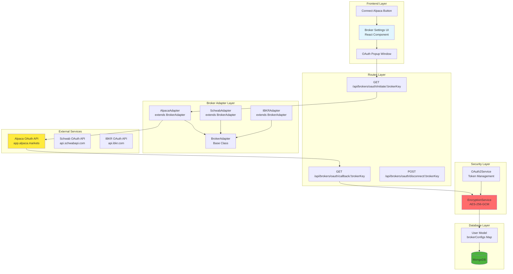
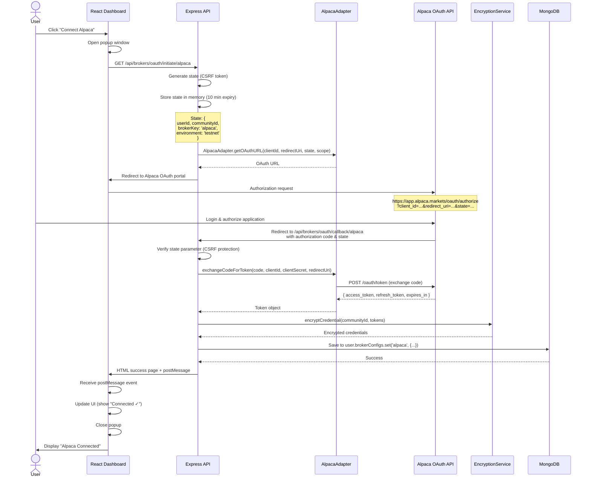

# Broker OAuth2 Integration Guide
## Trading Platform Authentication & API Key Management

**Version:** 1.0.0
**Last Updated:** 2025-10-20
**Status:** ✅ PRODUCTION

---

## Table of Contents

1. [Overview](#overview)
2. [Broker Adapter Pattern](#broker-adapter-pattern)
3. [OAuth2 Flow](#oauth2-flow)
4. [Supported Brokers](#supported-brokers)
5. [API Key Encryption](#api-key-encryption)
6. [Token Refresh Strategy](#token-refresh-strategy)
7. [Implementation Guide](#implementation-guide)
8. [Frontend Integration](#frontend-integration)
9. [Troubleshooting](#troubleshooting)

---

## Overview

This application integrates with trading platforms (brokers) using **OAuth2 authorization** for secure API access. Unlike Discord OAuth2 (which handles user authentication), broker OAuth2 enables:

- **Trading API Access**: Execute trades, fetch positions, manage orders
- **Account Data Access**: Retrieve balances, transaction history, account info
- **Real-time Market Data**: Subscribe to quotes, order book updates

**Key Differences from Discord OAuth2:**

| Aspect | Discord OAuth2 | Broker OAuth2 |
|--------|----------------|---------------|
| **Purpose** | User login/signup | Trading API access |
| **Token Storage** | Session (connect-mongo) | User model (encrypted in MongoDB) |
| **Token Lifetime** | 7 days (session expiry) | Varies by broker (7 days to 24 hours) |
| **Refresh Required** | No (session-based) | Yes (access token expiry) |
| **Security** | httpOnly cookie | AES-256-GCM encryption |
| **User Experience** | Automatic via middleware | Explicit "Connect Broker" flow |

---

## Broker Adapter Pattern

### Architecture



---

### Base Adapter Interface

**File:** `src/brokers/BrokerAdapter.js`

All broker adapters extend this base class:

```javascript
class BrokerAdapter {
  constructor(credentials = {}, options = {}) {
    this.brokerName = ''; // Overridden by child class
    this.brokerType = ''; // 'stock', 'crypto', 'forex'
    this.isTestnet = options.testnet || false;
    this.isAuthenticated = false;
  }

  // Abstract methods (must be implemented by child)
  async authenticate() { throw new Error('authenticate() not implemented'); }
  async testConnection() { throw new Error('testConnection() not implemented'); }
  async getBalance(currency = 'USD') { throw new Error('getBalance() not implemented'); }
  async createOrder(order) { throw new Error('createOrder() not implemented'); }
  async getPositions() { throw new Error('getPositions() not implemented'); }
  async getOrders(status = 'open') { throw new Error('getOrders() not implemented'); }
  async cancelOrder(orderId) { throw new Error('cancelOrder() not implemented'); }

  // Utility methods
  normalizeSymbol(symbol) { return symbol.toUpperCase(); }
  mapOrderType(type) { /* Normalize order types across brokers */ }
  formatPrice(price, decimals = 2) { return parseFloat(price).toFixed(decimals); }

  // OAuth2 static methods (implemented by brokers supporting OAuth)
  static getOAuthURL(clientId, redirectUri, state, scope) {
    throw new Error('OAuth not supported by this broker');
  }

  static async exchangeCodeForToken(code, clientId, clientSecret, redirectUri) {
    throw new Error('OAuth not supported by this broker');
  }

  static async refreshAccessToken(refreshToken, clientId, clientSecret) {
    throw new Error('OAuth not supported by this broker');
  }
}

module.exports = BrokerAdapter;
```

---

### Alpaca Implementation Example

**File:** `src/brokers/adapters/AlpacaAdapter.js`

**OAuth URL Generation:**
```javascript
static getOAuthURL(clientId, redirectUri, state, scope = 'account:write trading') {
  const authUrl = new URL('https://app.alpaca.markets/oauth/authorize');
  authUrl.searchParams.set('response_type', 'code');
  authUrl.searchParams.set('client_id', clientId);
  authUrl.searchParams.set('redirect_uri', redirectUri);
  authUrl.searchParams.set('state', state);
  authUrl.searchParams.set('scope', scope);

  return authUrl.toString();
  // Example: https://app.alpaca.markets/oauth/authorize?response_type=code&client_id=...&redirect_uri=...&state=...&scope=account:write+trading
}
```

**Token Exchange:**
```javascript
static async exchangeCodeForToken(code, clientId, clientSecret, redirectUri) {
  const tokenUrl = 'https://api.alpaca.markets/oauth/token';

  const response = await fetch(tokenUrl, {
    method: 'POST',
    headers: {
      'Content-Type': 'application/x-www-form-urlencoded'
    },
    body: new URLSearchParams({
      grant_type: 'authorization_code',
      code: code,
      client_id: clientId,
      client_secret: clientSecret,
      redirect_uri: redirectUri
    })
  });

  if (!response.ok) {
    const error = await response.text();
    throw new Error(`Alpaca token exchange failed: ${error}`);
  }

  const tokens = await response.json();
  // { access_token, refresh_token, token_type: "Bearer", expires_in: 604800, scope: "account:write trading" }

  return {
    accessToken: tokens.access_token,
    refreshToken: tokens.refresh_token,
    tokenType: tokens.token_type,
    expiresIn: tokens.expires_in,
    scope: tokens.scope
  };
}
```

**Token Refresh:**
```javascript
static async refreshAccessToken(refreshToken, clientId, clientSecret) {
  const tokenUrl = 'https://api.alpaca.markets/oauth/token';

  const response = await fetch(tokenUrl, {
    method: 'POST',
    headers: {
      'Content-Type': 'application/x-www-form-urlencoded'
    },
    body: new URLSearchParams({
      grant_type: 'refresh_token',
      refresh_token: refreshToken,
      client_id: clientId,
      client_secret: clientSecret
    })
  });

  if (!response.ok) {
    throw new Error('Alpaca token refresh failed');
  }

  const tokens = await response.json();

  return {
    accessToken: tokens.access_token,
    refreshToken: tokens.refresh_token || refreshToken, // Alpaca rotates refresh tokens
    tokenType: tokens.token_type,
    expiresIn: tokens.expires_in,
    scope: tokens.scope
  };
}
```

**Authentication (Using OAuth Tokens):**
```javascript
async authenticate() {
  try {
    let accessToken = null;

    // Retrieve OAuth tokens from User model
    if (this.userId) {
      const user = await User.findById(this.userId);

      if (user && user.brokerConfigs && user.brokerConfigs.has('alpaca')) {
        const brokerConfig = user.brokerConfigs.get('alpaca');
        const decryptedCreds = await encryptionService.decryptCredential(
          user.communityId,
          brokerConfig.credentials
        );

        accessToken = decryptedCreds.accessToken;

        // Check if token expired
        const tokenAge = Date.now() - brokerConfig.configuredAt.getTime();
        const expiresInMs = decryptedCreds.expiresIn * 1000;

        if (tokenAge > expiresInMs) {
          console.log('[AlpacaAdapter] Access token expired, refreshing...');
          const newTokens = await AlpacaAdapter.refreshAccessToken(
            decryptedCreds.refreshToken,
            process.env.ALPACA_CLIENT_ID,
            process.env.ALPACA_CLIENT_SECRET
          );

          // Save new tokens
          const encryptedNewCreds = await encryptionService.encryptCredential(
            user.communityId,
            newTokens
          );

          brokerConfig.credentials = encryptedNewCreds;
          brokerConfig.lastVerified = new Date();
          await user.save();

          accessToken = newTokens.accessToken;
        }
      }
    }

    // Initialize Alpaca SDK client
    this.alpacaClient = new Alpaca({
      keyId: 'oauth',
      secretKey: accessToken,
      paper: this.isTestnet,
      oauth: accessToken
    });

    // Verify authentication
    const account = await this.alpacaClient.getAccount();
    this.isAuthenticated = !!account;

    return this.isAuthenticated;
  } catch (error) {
    console.error('[AlpacaAdapter] Authentication failed:', error.message);
    this.isAuthenticated = false;
    throw new Error(`Alpaca authentication failed: ${error.message}`);
  }
}
```

---

## OAuth2 Flow

### Sequence Diagram



---

### Flow Steps Breakdown

#### Step 1: Initiate OAuth Flow

**Route:** `GET /api/brokers/oauth/initiate/:brokerKey`

**Frontend Trigger:**
```javascript
const handleConnectBroker = (brokerKey) => {
  const width = 600;
  const height = 700;
  const left = (window.screen.width / 2) - (width / 2);
  const top = (window.screen.height / 2) - (height / 2);

  const popup = window.open(
    `/api/brokers/oauth/initiate/${brokerKey}?environment=testnet`,
    'OAuth Popup',
    `width=${width},height=${height},left=${left},top=${top}`
  );

  // Listen for postMessage from popup
  window.addEventListener('message', (event) => {
    if (event.data.type === 'oauth-success' && event.data.broker === brokerKey) {
      console.log('✅ Broker connected:', brokerKey);
      fetchBrokerStatus(); // Refresh UI
    } else if (event.data.type === 'oauth-error') {
      console.error('❌ OAuth error:', event.data.error);
      setError(event.data.errorDescription || event.data.error);
    }
  });
};
```

**Backend Handler:** `src/routes/api/broker-oauth.js:34-111`

```javascript
router.get('/initiate/:brokerKey', async (req, res) => {
  const { brokerKey } = req.params;
  const { environment = 'testnet' } = req.query;

  // Check authentication
  if (!req.user) {
    return sendError(res, 'Authentication required', 401);
  }

  // Generate CSRF state (512-bit)
  const state = crypto.randomBytes(64).toString('hex');

  // Store state with user info (expires in 10 minutes)
  oauthStates.set(state, {
    userId: req.user._id.toString(),
    communityId: req.user.communityId.toString(),
    brokerKey,
    environment,
    createdAt: Date.now()
  });

  // Auto-cleanup after 10 minutes
  setTimeout(() => oauthStates.delete(state), 10 * 60 * 1000);

  // Build redirect URI
  const redirectUri = `${req.protocol}://${req.get('host')}/api/brokers/oauth/callback/${brokerKey}`;

  // Get OAuth URL from adapter
  let authUrl;
  switch (brokerKey) {
    case 'alpaca':
      authUrl = AlpacaAdapter.getOAuthURL(
        process.env.ALPACA_CLIENT_ID,
        redirectUri,
        state,
        'account:write trading'
      );
      break;
    case 'schwab':
      authUrl = SchwabAdapter.getOAuthURL(
        process.env.SCHWAB_CLIENT_ID,
        redirectUri,
        state
      );
      break;
    default:
      return sendError(res, `OAuth not supported for broker: ${brokerKey}`, 400);
  }

  // Redirect to broker OAuth portal
  res.redirect(authUrl);
});
```

---

#### Step 2: Authorization & Callback

**Route:** `GET /api/brokers/oauth/callback/:brokerKey`

**Backend Handler:** `src/routes/api/broker-oauth.js:118-379`

```javascript
router.get('/callback/:brokerKey', oauthCallbackLimiter, async (req, res) => {
  try {
    const { brokerKey } = req.params;
    const { code, state, error, error_description } = req.query;

    // Check for broker errors
    if (error) {
      return res.send(/* Error HTML page */);
    }

    // Verify CSRF state
    if (!state || !oauthStates.has(state)) {
      return res.send(/* Invalid state HTML page */);
    }

    const stateData = oauthStates.get(state);
    oauthStates.delete(state); // Clean up

    // Verify broker matches
    if (stateData.brokerKey !== brokerKey) {
      return res.send(/* Broker mismatch HTML page */);
    }

    // Exchange code for tokens
    const redirectUri = `${req.protocol}://${req.get('host')}/api/brokers/oauth/callback/${brokerKey}`;
    let tokens;

    switch (brokerKey) {
      case 'alpaca':
        tokens = await AlpacaAdapter.exchangeCodeForToken(
          code,
          process.env.ALPACA_CLIENT_ID,
          process.env.ALPACA_CLIENT_SECRET,
          redirectUri
        );
        break;
      case 'schwab':
        tokens = await SchwabAdapter.exchangeCodeForToken(
          code,
          process.env.SCHWAB_CLIENT_ID,
          process.env.SCHWAB_CLIENT_SECRET,
          redirectUri
        );
        break;
    }

    // Load user
    const user = await User.findById(stateData.userId);

    // Encrypt tokens
    const credentials = {
      accessToken: tokens.accessToken,
      refreshToken: tokens.refreshToken,
      tokenType: tokens.tokenType,
      expiresIn: tokens.expiresIn,
      scope: tokens.scope
    };

    const encryptedCredentials = await encryptionService.encryptCredential(
      stateData.communityId,
      credentials
    );

    // Save to user model
    if (!user.brokerConfigs) {
      user.brokerConfigs = new Map();
    }

    user.brokerConfigs.set(brokerKey, {
      brokerKey,
      brokerType: 'stock',
      authMethod: 'oauth',
      credentials: encryptedCredentials,
      environment: stateData.environment,
      configuredAt: new Date(),
      lastVerified: new Date()
    });

    await user.save();

    // Return success HTML page (closes popup, notifies parent)
    res.send(`
      <!DOCTYPE html>
      <html>
        <body>
          <h1>Connected Successfully!</h1>
          <script>
            if (window.opener) {
              window.opener.postMessage({
                type: 'oauth-success',
                broker: '${brokerKey}',
                success: true
              }, '*');
              setTimeout(() => window.close(), 2000);
            }
          </script>
        </body>
      </html>
    `);
  } catch (error) {
    console.error('[OAuth Callback] Error:', error);
    // Return error HTML page
  }
});
```

---

## Supported Brokers

### Broker Configuration Matrix

| Broker | Asset Types | OAuth Version | Token Expiry | Refresh Token Rotation | Scopes |
|--------|-------------|---------------|--------------|----------------------|--------|
| **Alpaca** | Stocks, ETFs | OAuth 2.0 | 7 days | Yes | `account:write` `trading` |
| **Schwab** | Stocks, Options, ETFs | OAuth 2.0 | 7 days (est.) | Yes | `account` `trading` |
| **IBKR** | Stocks, Options, Futures, Forex | OAuth 2.0 | 24 hours | No | `trading` `account` |
| **TD Ameritrade** | Stocks, Options, Futures | OAuth 2.0 | **30 minutes** | Yes | `PlaceTrades` `AccountAccess` |
| **E*TRADE** | Stocks, Options, ETFs | **OAuth 1.0a** | 2 hours | No (uses renewal endpoint) | `trading` `account` |

---

### Environment Variables Configuration

**`.env.example`:**
```bash
# Alpaca OAuth2 Configuration
ALPACA_CLIENT_ID=your_alpaca_client_id
ALPACA_CLIENT_SECRET=your_alpaca_client_secret

# Charles Schwab OAuth2 Configuration
SCHWAB_CLIENT_ID=your_schwab_app_key
SCHWAB_CLIENT_SECRET=your_schwab_app_secret

# Interactive Brokers OAuth2 Configuration
IBKR_CLIENT_ID=your_ibkr_oauth_client_id
IBKR_CLIENT_SECRET=your_ibkr_oauth_client_secret

# TD Ameritrade OAuth2 Configuration
TDAMERITRADE_CLIENT_ID=your_td_oauth_client_id
TDAMERITRADE_CLIENT_SECRET=your_td_oauth_client_secret

# E*TRADE OAuth 1.0a Configuration
ETRADE_CLIENT_ID=your_etrade_consumer_key
ETRADE_CLIENT_SECRET=your_etrade_consumer_secret
```

---

### Broker-Specific Notes

#### Alpaca
- **Sandbox Environment:** Paper trading available (`paper: true`)
- **Token Rotation:** Refresh tokens rotate on renewal
- **Best Practices:** Refresh tokens before 7-day expiry (recommend every 6 days)

#### TD Ameritrade
- ⚠️ **SHORT TOKEN LIFETIME:** Access tokens expire in **30 minutes**
- **Requires Frequent Refresh:** Implement background job to refresh every 25 minutes
- **Refresh Token Strategy:**
  ```javascript
  // Cron job (runs every 25 minutes)
  cron.schedule('*/25 * * * *', async () => {
    const users = await User.find({ 'brokerConfigs.tdameritrade': { $exists: true } });

    for (const user of users) {
      const config = user.brokerConfigs.get('tdameritrade');
      const decrypted = await encryptionService.decryptCredential(user.communityId, config.credentials);

      const newTokens = await TDAmeritradeAdapter.refreshAccessToken(
        decrypted.refreshToken,
        process.env.TDAMERITRADE_CLIENT_ID,
        process.env.TDAMERITRADE_CLIENT_SECRET
      );

      const encrypted = await encryptionService.encryptCredential(user.communityId, newTokens);
      config.credentials = encrypted;
      await user.save();
    }
  });
  ```

#### E*TRADE
- **OAuth 1.0a** (not OAuth 2.0)
- **Renewal Endpoint:** Uses `/oauth/renew_access_token` instead of refresh tokens
- **Token Lifetime:** 2 hours
- **Special Handling Required:** Different authentication flow (request token → authorization → access token)

---

## API Key Encryption

### Encryption Service

**File:** `src/services/encryption.js`

**Algorithm:** AES-256-GCM (Authenticated Encryption)

**Encryption Process:**
```javascript
async function encryptCredential(communityId, credential) {
  const encryptionKey = getEncryptionKey(communityId); // Derived from community + master secret

  // Generate random IV (Initialization Vector)
  const iv = crypto.randomBytes(16);

  // Create cipher
  const cipher = crypto.createCipheriv('aes-256-gcm', encryptionKey, iv);

  // Encrypt credential JSON
  const credentialString = JSON.stringify(credential);
  let encrypted = cipher.update(credentialString, 'utf8', 'hex');
  encrypted += cipher.final('hex');

  // Get authentication tag
  const authTag = cipher.getAuthTag();

  // Return encrypted data with IV and auth tag
  return {
    ciphertext: encrypted,
    iv: iv.toString('hex'),
    authTag: authTag.toString('hex'),
    algorithm: 'aes-256-gcm'
  };
}
```

**Decryption Process:**
```javascript
async function decryptCredential(communityId, encryptedData) {
  const encryptionKey = getEncryptionKey(communityId);

  // Create decipher
  const decipher = crypto.createDecipheriv(
    'aes-256-gcm',
    encryptionKey,
    Buffer.from(encryptedData.iv, 'hex')
  );

  // Set authentication tag
  decipher.setAuthTag(Buffer.from(encryptedData.authTag, 'hex'));

  // Decrypt
  let decrypted = decipher.update(encryptedData.ciphertext, 'hex', 'utf8');
  decrypted += decipher.final('utf8');

  // Parse JSON
  return JSON.parse(decrypted);
}
```

**Encryption Key Derivation:**
```javascript
function getEncryptionKey(communityId) {
  const masterSecret = process.env.ENCRYPTION_MASTER_SECRET; // 256-bit secret
  const salt = `community-${communityId}`;

  // Derive 256-bit key using PBKDF2
  return crypto.pbkdf2Sync(
    masterSecret,
    salt,
    100000, // Iterations
    32,     // Key length (256 bits)
    'sha256'
  );
}
```

**Security Properties:**
- **Authenticated Encryption:** GCM mode prevents tampering
- **Unique IV per Encryption:** Random IV prevents pattern analysis
- **Community-Specific Keys:** Each community's data encrypted with different key
- **Forward Secrecy:** Compromise of one community's data doesn't affect others

---

### Environment Variables

**Required:**
```bash
# 256-bit (64 hex characters) randomly generated secret
ENCRYPTION_MASTER_SECRET=$(openssl rand -hex 32)

# Example:
ENCRYPTION_MASTER_SECRET=a3f8c9d4e5b6a7c8d9e0f1a2b3c4d5e6f7a8b9c0d1e2f3a4b5c6d7e8f9a0b1c2
```

**Generation Command:**
```bash
# macOS/Linux
export ENCRYPTION_MASTER_SECRET=$(openssl rand -hex 32)

# Add to .env
echo "ENCRYPTION_MASTER_SECRET=$(openssl rand -hex 32)" >> .env
```

**Security Checklist:**
- [ ] Never commit `ENCRYPTION_MASTER_SECRET` to git
- [ ] Use different secrets for dev/staging/production
- [ ] Rotate secret annually with gradual migration
- [ ] Store in secure secrets manager (AWS Secrets Manager, HashiCorp Vault)

---

## Token Refresh Strategy

### Automatic Refresh System

**Background Job:** `src/jobs/refreshBrokerTokens.js`

```javascript
const cron = require('node-cron');
const User = require('../models/User');
const encryptionService = require('../services/encryption');
const { getProviderConfig } = require('../config/oauth2Providers');

// Run every hour
cron.schedule('0 * * * *', async () => {
  console.log('[Token Refresh] Starting hourly broker token refresh...');

  try {
    // Find users with broker OAuth configs
    const users = await User.find({
      'brokerConfigs': { $exists: true, $ne: {} }
    });

    for (const user of users) {
      for (const [brokerKey, config] of user.brokerConfigs) {
        if (config.authMethod !== 'oauth') continue;

        const providerConfig = getProviderConfig(brokerKey);
        if (!providerConfig) continue;

        // Decrypt current tokens
        const decrypted = await encryptionService.decryptCredential(
          user.communityId,
          config.credentials
        );

        // Check if token needs refresh
        const tokenAge = Date.now() - config.lastVerified.getTime();
        const expiresInMs = decrypted.expiresIn * 1000;
        const refreshThreshold = expiresInMs * 0.8; // Refresh at 80% of lifetime

        if (tokenAge > refreshThreshold) {
          console.log(`[Token Refresh] Refreshing ${brokerKey} for user ${user._id}`);

          // Dynamically load adapter
          const AdapterClass = require(`../brokers/adapters/${brokerKey}Adapter`);

          // Refresh token
          const newTokens = await AdapterClass.refreshAccessToken(
            decrypted.refreshToken,
            providerConfig.clientId,
            providerConfig.clientSecret
          );

          // Encrypt and save
          const encrypted = await encryptionService.encryptCredential(
            user.communityId,
            newTokens
          );

          config.credentials = encrypted;
          config.lastVerified = new Date();
          await user.save();

          console.log(`✅ [Token Refresh] ${brokerKey} refreshed for user ${user._id}`);
        }
      }
    }

    console.log('[Token Refresh] Hourly refresh complete');
  } catch (error) {
    console.error('[Token Refresh] Error:', error);
  }
});
```

**Refresh Triggers:**
1. **Scheduled Refresh:** Cron job every hour (refreshes at 80% of token lifetime)
2. **On-Demand Refresh:** Before executing trade (if token expired)
3. **Manual Refresh:** User clicks "Reconnect" button in UI

---

## Implementation Guide

### Adding a New Broker

**Step 1: Create Adapter Class**

Create `src/brokers/adapters/NewBrokerAdapter.js`:

```javascript
const BrokerAdapter = require('../BrokerAdapter');
const fetch = require('node-fetch');

class NewBrokerAdapter extends BrokerAdapter {
  constructor(credentials = {}, options = {}) {
    super(credentials, options);
    this.brokerName = 'newbroker';
    this.brokerType = 'stock'; // or 'crypto', 'forex'
  }

  // OAuth URL generation
  static getOAuthURL(clientId, redirectUri, state, scope = 'trading') {
    const authUrl = new URL('https://oauth.newbroker.com/authorize');
    authUrl.searchParams.set('response_type', 'code');
    authUrl.searchParams.set('client_id', clientId);
    authUrl.searchParams.set('redirect_uri', redirectUri);
    authUrl.searchParams.set('state', state);
    authUrl.searchParams.set('scope', scope);
    return authUrl.toString();
  }

  // Token exchange
  static async exchangeCodeForToken(code, clientId, clientSecret, redirectUri) {
    const response = await fetch('https://oauth.newbroker.com/token', {
      method: 'POST',
      headers: { 'Content-Type': 'application/x-www-form-urlencoded' },
      body: new URLSearchParams({
        grant_type: 'authorization_code',
        code,
        client_id: clientId,
        client_secret: clientSecret,
        redirect_uri: redirectUri
      })
    });

    if (!response.ok) throw new Error('Token exchange failed');

    const tokens = await response.json();
    return {
      accessToken: tokens.access_token,
      refreshToken: tokens.refresh_token,
      tokenType: tokens.token_type,
      expiresIn: tokens.expires_in,
      scope: tokens.scope
    };
  }

  // Token refresh
  static async refreshAccessToken(refreshToken, clientId, clientSecret) {
    const response = await fetch('https://oauth.newbroker.com/token', {
      method: 'POST',
      headers: { 'Content-Type': 'application/x-www-form-urlencoded' },
      body: new URLSearchParams({
        grant_type: 'refresh_token',
        refresh_token: refreshToken,
        client_id: clientId,
        client_secret: clientSecret
      })
    });

    if (!response.ok) throw new Error('Token refresh failed');

    const tokens = await response.json();
    return {
      accessToken: tokens.access_token,
      refreshToken: tokens.refresh_token || refreshToken,
      tokenType: tokens.token_type,
      expiresIn: tokens.expires_in,
      scope: tokens.scope
    };
  }

  // Implement required methods
  async authenticate() { /* ... */ }
  async testConnection() { /* ... */ }
  async getBalance() { /* ... */ }
  async createOrder(order) { /* ... */ }
  async getPositions() { /* ... */ }
  async getOrders(status) { /* ... */ }
  async cancelOrder(orderId) { /* ... */ }
}

module.exports = NewBrokerAdapter;
```

---

**Step 2: Register in oauth2Providers.js**

Edit `src/config/oauth2Providers.js`:

```javascript
const OAUTH2_PROVIDERS = {
  // ... existing providers

  newbroker: {
    authorizationURL: 'https://oauth.newbroker.com/authorize',
    tokenURL: 'https://oauth.newbroker.com/token',
    clientId: process.env.NEWBROKER_CLIENT_ID,
    clientSecret: process.env.NEWBROKER_CLIENT_SECRET,
    redirectUri: `${BASE_URL}${OAUTH2_CALLBACK_PATH}`,
    scopes: ['trading', 'account'],
    tokenExpiry: 7 * 24 * 60 * 60 * 1000, // 7 days
    supportsRefreshTokenRotation: true,
    enabled: validateProviderEnvVars('NewBroker', 'NEWBROKER_CLIENT_ID', 'NEWBROKER_CLIENT_SECRET')
  }
};
```

---

**Step 3: Add to broker-oauth.js Routes**

Edit `src/routes/api/broker-oauth.js`:

```javascript
// Import adapter
const NewBrokerAdapter = require('../../brokers/adapters/NewBrokerAdapter');

// In initiate route
case 'newbroker': {
  const clientId = process.env.NEWBROKER_CLIENT_ID;
  if (!clientId) {
    return sendError(res, 'NewBroker OAuth not configured', 500);
  }
  authUrl = NewBrokerAdapter.getOAuthURL(clientId, redirectUri, state, 'trading account');
  break;
}

// In callback route
case 'newbroker': {
  const clientId = process.env.NEWBROKER_CLIENT_ID;
  const clientSecret = process.env.NEWBROKER_CLIENT_SECRET;
  if (!clientId || !clientSecret) {
    throw new Error('NewBroker OAuth credentials not configured');
  }
  tokens = await NewBrokerAdapter.exchangeCodeForToken(code, clientId, clientSecret, redirectUri);
  break;
}
```

---

**Step 4: Update Environment Variables**

Add to `.env`:
```bash
NEWBROKER_CLIENT_ID=your_client_id
NEWBROKER_CLIENT_SECRET=your_client_secret
```

---

**Step 5: Test Integration**

```bash
# 1. Start development server
npm run dev

# 2. Visit dashboard
open http://localhost:3000/settings/brokers

# 3. Click "Connect NewBroker"
# 4. Authorize in popup
# 5. Verify tokens saved in MongoDB:
mongosh trade-executor
db.users.find({ 'brokerConfigs.newbroker': { $exists: true } }).pretty()
```

---

## Frontend Integration

### React Component Example

**File:** `src/dashboard/components/BrokerSettings.jsx`

```javascript
import React, { useState, useEffect } from 'react';

function BrokerSettings() {
  const [connectedBrokers, setConnectedBrokers] = useState([]);

  useEffect(() => {
    fetchBrokerStatus();
  }, []);

  const fetchBrokerStatus = async () => {
    const res = await fetch('/api/brokers/status', { credentials: 'include' });
    const data = await res.json();
    setConnectedBrokers(data.brokers || []);
  };

  const handleConnect = (brokerKey) => {
    const width = 600;
    const height = 700;
    const left = (window.screen.width / 2) - (width / 2);
    const top = (window.screen.height / 2) - (height / 2);

    const popup = window.open(
      `/api/brokers/oauth/initiate/${brokerKey}?environment=testnet`,
      'OAuth Popup',
      `width=${width},height=${height},left=${left},top=${top}`
    );

    // Listen for postMessage from popup
    const handleMessage = (event) => {
      if (event.data.type === 'oauth-success' && event.data.broker === brokerKey) {
        console.log('✅ Broker connected:', brokerKey);
        fetchBrokerStatus(); // Refresh UI
        window.removeEventListener('message', handleMessage);
      } else if (event.data.type === 'oauth-error') {
        console.error('❌ OAuth error:', event.data.error);
        alert(`Failed to connect: ${event.data.errorDescription || event.data.error}`);
        window.removeEventListener('message', handleMessage);
      }
    };

    window.addEventListener('message', handleMessage);
  };

  const handleDisconnect = async (brokerKey) => {
    if (!confirm(`Disconnect ${brokerKey}?`)) return;

    const res = await fetch(`/api/brokers/oauth/disconnect/${brokerKey}`, {
      method: 'POST',
      credentials: 'include'
    });

    if (res.ok) {
      fetchBrokerStatus();
    }
  };

  return (
    <div className="broker-settings">
      <h2>Connected Brokers</h2>
      <div className="broker-list">
        {['alpaca', 'schwab', 'ibkr'].map(brokerKey => {
          const isConnected = connectedBrokers.includes(brokerKey);

          return (
            <div key={brokerKey} className="broker-card">
              <h3>{brokerKey.toUpperCase()}</h3>
              {isConnected ? (
                <div>
                  <span className="status connected">✓ Connected</span>
                  <button onClick={() => handleDisconnect(brokerKey)}>
                    Disconnect
                  </button>
                </div>
              ) : (
                <button onClick={() => handleConnect(brokerKey)}>
                  Connect {brokerKey.toUpperCase()}
                </button>
              )}
            </div>
          );
        })}
      </div>
    </div>
  );
}

export default BrokerSettings;
```

---

## Troubleshooting

### Common Issues

#### Issue 1: "Invalid OAuth State" Error

**Cause:** State parameter expired (>10 minutes) or already used.

**Solution:**
- Close popup and retry
- Check server time synchronization
- Verify `oauthStates` Map is not being cleared prematurely

---

#### Issue 2: "Token Exchange Failed"

**Cause:** Invalid `client_secret` or `redirect_uri` mismatch.

**Diagnostics:**
```bash
# Check environment variables
echo $ALPACA_CLIENT_SECRET

# Verify redirect URI matches broker app settings
# Expected: https://yourdomain.com/api/brokers/oauth/callback/alpaca
# Actual in broker portal: ???
```

**Solution:**
- Verify `.env` credentials match broker developer portal
- Ensure `redirect_uri` exactly matches registered URL (no trailing slash!)

---

#### Issue 3: Tokens Not Saved to Database

**Cause:** Encryption service failure or MongoDB connection issue.

**Diagnostics:**
```bash
# Check encryption master secret
echo $ENCRYPTION_MASTER_SECRET

# Test MongoDB connection
mongosh $MONGODB_URI
db.users.findOne()
```

**Solution:**
- Verify `ENCRYPTION_MASTER_SECRET` is set (64 hex characters)
- Check MongoDB connection string
- Review encryption service logs

---

#### Issue 4: Popup Blocked by Browser

**Cause:** Browser popup blocker.

**Solution:**
```javascript
// Frontend: Notify user before opening popup
const handleConnect = (brokerKey) => {
  // Show modal explaining popup will open
  setShowPopupWarning(true);

  // User must click button to trigger popup (not automatic)
  // This bypasses popup blocker
};
```

---

## Related Documentation

- [OAuth2 Architecture](./OAUTH2_ARCHITECTURE.md) - Discord authentication flow
- [Security Hardening](./SECURITY_HARDENING.md) - Production security checklist
- [Troubleshooting Guide](./OAUTH2_TROUBLESHOOTING.md) - Comprehensive error solutions

---

**Last Updated:** 2025-10-20
**Maintainer:** Development Team
**Review Cycle:** Quarterly (Next Review: 2026-01-20)
