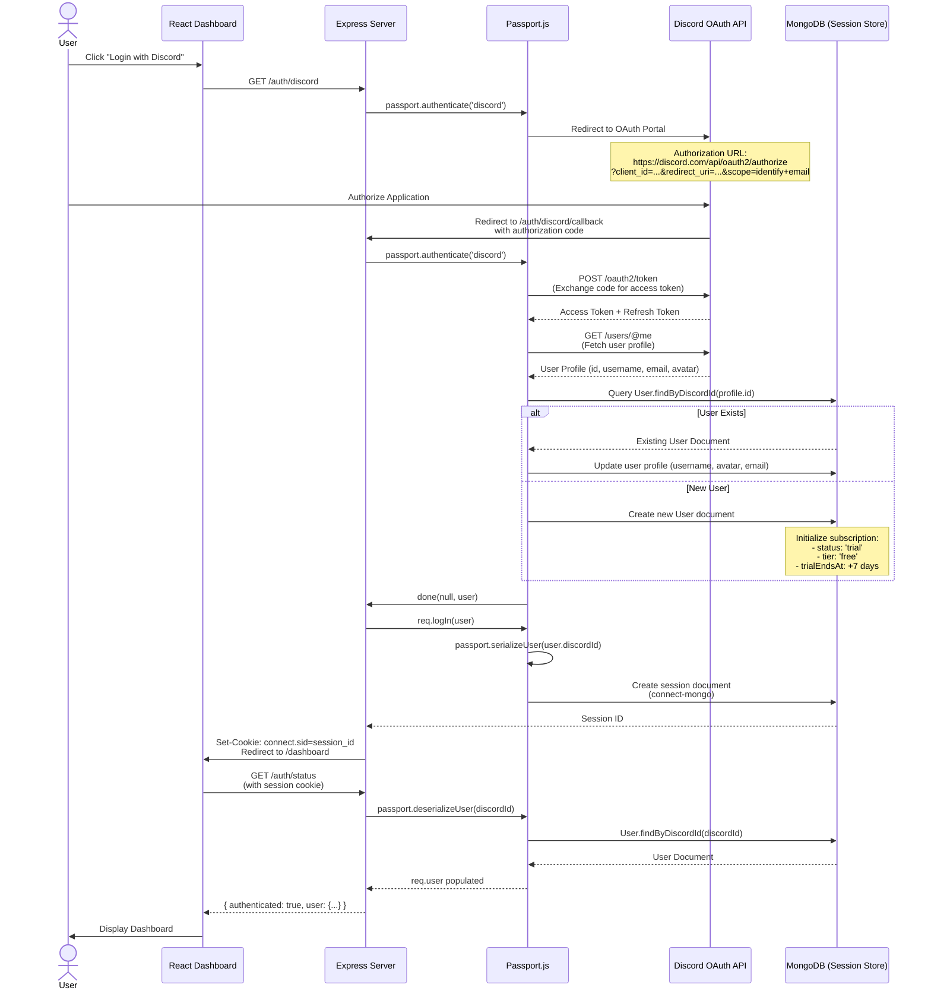

# OAuth2 Architecture Documentation
## Discord Authentication & Broker Integration

**Version:** 1.0.0
**Last Updated:** 2025-10-20
**Status:** ✅ PRODUCTION

---

## Table of Contents

1. [Overview](#overview)
2. [Discord OAuth2 Flow](#discord-oauth2-flow)
3. [Architecture Diagrams](#architecture-diagrams)
4. [Authentication Flow](#authentication-flow)
5. [Passport.js Integration](#passportjs-integration)
6. [Session Management](#session-management)
7. [Security Hardening](#security-hardening)
8. [File Locations](#file-locations)

---

## Overview

This application uses **OAuth2** for authentication with two distinct flows:

1. **Discord OAuth2** - User authentication (login/signup)
2. **Broker OAuth2** - Trading platform integration (Alpaca, TD Ameritrade, etc.)

**Key Technologies:**
- **Passport.js** with `passport-discord` strategy
- **express-session** with `connect-mongo` session store
- **MongoDB** for session persistence
- **Helmet** for security headers (CSP, HSTS)
- **CORS** with credentials support

---

## Discord OAuth2 Flow

### Sequence Diagram



---

### Component Architecture Diagram

```mermaid
graph TB
    subgraph "Frontend Layer"
        Dashboard[React Dashboard<br/>Port 3000]
        LoginButton[Login Button<br/>onClick: window.location = '/auth/discord']
    end

    subgraph "Express Middleware Layer"
        Router[Express Router<br/>src/routes/auth.js]
        SessionMW[express-session<br/>Session Middleware]
        PassportMW[Passport Middleware<br/>passport.initialize()<br/>passport.session()]
        AuthGuard[ensureAuthenticated<br/>Middleware]
        CORS[CORS Middleware<br/>credentials: true]
        Helmet[Helmet Middleware<br/>CSP, HSTS]
    end

    subgraph "Passport.js Strategy Layer"
        Strategy[DiscordStrategy<br/>passport-discord]
        Serialize[serializeUser<br/>user.discordId]
        Deserialize[deserializeUser<br/>User.findByDiscordId]
    end

    subgraph "Session Store Layer"
        MongoStore[connect-mongo<br/>MongoStore.create]
        SessionDoc[Session Document<br/>_id: session_id<br/>session: {passport: {user: discordId}}]
    end

    subgraph "Database Layer"
        MongoDB[(MongoDB)]
        UserModel[User Model<br/>discordId, username, email, subscription]
    end

    subgraph "External Services"
        DiscordAPI[Discord OAuth API<br/>Authorization: /oauth2/authorize<br/>Token: /oauth2/token<br/>Profile: /users/@me]
    end

    LoginButton --> Router
    Router --> PassportMW
    PassportMW --> Strategy
    Strategy --> DiscordAPI
    DiscordAPI --> Strategy
    Strategy --> UserModel
    UserModel --> MongoDB
    Strategy --> Serialize
    Serialize --> SessionMW
    SessionMW --> MongoStore
    MongoStore --> SessionDoc
    SessionDoc --> MongoDB

    Dashboard --> AuthGuard
    AuthGuard --> Deserialize
    Deserialize --> MongoDB
    MongoDB --> UserModel

    SessionMW --> CORS
    CORS --> Helmet

    style Dashboard fill:#e1f5ff
    style DiscordAPI fill:#5865F2
    style MongoDB fill:#4DB33D
    style Helmet fill:#ff6b6b
```

---

## Authentication Flow

### 1. Authorization Request

**Route:** `GET /auth/discord`

**Purpose:** Initiate OAuth2 flow by redirecting user to Discord authorization portal.

**Implementation:** `src/routes/auth.js:10`

```javascript
router.get('/discord', authLimiter, passport.authenticate('discord'));
```

**What Happens:**
1. User clicks "Login with Discord" button in React frontend
2. Frontend redirects to `GET /auth/discord`
3. Passport.js middleware redirects to Discord OAuth portal with parameters:
   - `client_id`: Discord application client ID
   - `redirect_uri`: `{BASE_URL}/auth/discord/callback`
   - `response_type`: `code`
   - `scope`: `identify email`
4. User sees Discord's authorization screen

**Discord Authorization URL:**
```
https://discord.com/api/oauth2/authorize?client_id={CLIENT_ID}&redirect_uri={CALLBACK_URL}&response_type=code&scope=identify%20email
```

---

### 2. Callback Handling

**Route:** `GET /auth/discord/callback`

**Purpose:** Receive authorization code from Discord and complete OAuth2 flow.

**Implementation:** `src/routes/auth.js:13-49`

```javascript
router.get('/discord/callback', authLimiter, (req, res, next) => {
  passport.authenticate('discord', (err, user, info) => {
    // Error handling with detailed logging
    if (err) {
      console.error('❌ Discord OAuth Error Details:');
      console.error('Error type:', err.constructor.name);
      console.error('Error message:', err.message);
      console.error('Error stack:', err.stack);
      if (err.oauthError) {
        console.error('OAuth Error Data:', JSON.stringify(err.oauthError, null, 2));
      }
      if (err.data) {
        try {
          console.error('Discord API Response:', JSON.parse(err.data));
        } catch (e) {
          console.error('Discord API Response (raw):', err.data);
        }
      }
      return res.redirect('/login-failed?error=oauth_error');
    }

    if (!user) {
      console.warn('⚠️ Discord OAuth: No user returned. Info:', info);
      return res.redirect('/login-failed?error=no_user');
    }

    // Create session
    req.logIn(user, loginErr => {
      if (loginErr) {
        console.error('❌ Session login error:', loginErr);
        return res.redirect('/login-failed?error=session_error');
      }

      console.log('✅ Discord OAuth successful for user:', user.discordId);
      return res.redirect('/dashboard');
    });
  })(req, res, next);
});
```

**Flow Steps:**
1. Discord redirects user to `/auth/discord/callback?code={AUTHORIZATION_CODE}`
2. Passport.js intercepts request via `passport.authenticate('discord')`
3. **Token Exchange** (handled by Passport.js Discord Strategy):
   - POST request to `https://discord.com/api/oauth2/token`
   - Body: `{ code, client_id, client_secret, grant_type: 'authorization_code', redirect_uri }`
   - Response: `{ access_token, refresh_token, token_type: 'Bearer', expires_in: 604800 }`
4. **Profile Retrieval**:
   - GET request to `https://discord.com/api/users/@me`
   - Headers: `Authorization: Bearer {ACCESS_TOKEN}`
   - Response: `{ id, username, discriminator, email, avatar }`
5. **User Creation/Update** (in Passport strategy callback - see next section)
6. **Session Creation**:
   - `req.logIn(user)` serializes user via `passport.serializeUser()`
   - Session document created in MongoDB with `{ passport: { user: discordId } }`
   - Secure cookie `connect.sid` sent to client (httpOnly, secure in production, sameSite: lax)
7. Redirect to `/dashboard`

---

### 3. Session Creation

**Session Document Structure (MongoDB):**
```javascript
{
  _id: "session_id_here",
  expires: ISODate("2025-10-27T12:00:00.000Z"),  // 7 days from creation
  session: {
    cookie: {
      originalMaxAge: 604800000,  // 7 days in milliseconds
      expires: ISODate("2025-10-27T12:00:00.000Z"),
      httpOnly: true,
      secure: false,  // true in production
      path: "/",
      sameSite: "lax"
    },
    passport: {
      user: "discord_user_id_12345"  // Serialized user identifier
    }
  }
}
```

**Cookie Format:**
```
Set-Cookie: connect.sid=s%3A{SESSION_ID}.{SIGNATURE}; Path=/; Expires=Sun, 27 Oct 2025 12:00:00 GMT; HttpOnly; SameSite=Lax
```

**Secure Cookie in Production:**
```
Set-Cookie: connect.sid=s%3A{SESSION_ID}.{SIGNATURE}; Path=/; Expires=Sun, 27 Oct 2025 12:00:00 GMT; HttpOnly; Secure; SameSite=Lax
```

---

### 4. Authentication Verification

**Route:** `GET /auth/status`

**Purpose:** Check if user is authenticated (used by React frontend on page load).

**Implementation:** `src/routes/auth.js:67-87`

```javascript
router.get('/status', (req, res) => {
  if (req.isAuthenticated()) {
    res.json({
      authenticated: true,
      user: {
        id: req.user._id,
        discordId: req.user.discordId,
        username: req.user.username || req.user.discordUsername,
        discriminator: req.user.discriminator,
        tag: req.user.discordTag,
        avatar: req.user.avatar,
        email: req.user.email
      }
    });
  } else {
    res.json({
      authenticated: false,
      user: null
    });
  }
});
```

**Frontend Usage:**
```javascript
// React useEffect hook on app mount
useEffect(() => {
  fetch('/auth/status', {
    credentials: 'include'  // Send session cookie
  })
    .then(res => res.json())
    .then(data => {
      if (data.authenticated) {
        setUser(data.user);
        setIsAuthenticated(true);
      } else {
        setIsAuthenticated(false);
      }
    });
}, []);
```

---

## Passport.js Integration

### Strategy Configuration

**File:** `src/config/passport.js:24-85`

**Discord Strategy Setup:**
```javascript
passport.use(
  new DiscordStrategy(
    {
      clientID: process.env.DISCORD_CLIENT_ID,
      clientSecret: process.env.DISCORD_CLIENT_SECRET,
      callbackURL: process.env.DISCORD_CALLBACK_URL || 'http://localhost:5000/auth/discord/callback',
      scope: ['identify', 'email']
    },
    async (accessToken, refreshToken, profile, done) => {
      try {
        // Check if user exists
        let user = await User.findOne({ discordId: profile.id });

        if (user) {
          // Update existing user profile
          user.username = profile.username;
          user.discriminator = profile.discriminator;
          user.avatar = profile.avatar;
          user.email = profile.email;
          await user.save();
        } else {
          // Create new user with default config
          user = new User({
            discordId: profile.id,
            username: profile.username,
            discriminator: profile.discriminator,
            avatar: profile.avatar,
            email: profile.email,
            tradingConfig: {
              isEnabled: false,
              exchanges: [],
              riskManagement: {
                maxPositionSize: 0.02,
                positionSizingMethod: 'risk_based',
                defaultStopLoss: 0.02,
                defaultTakeProfit: 0.04,
                useTrailingStop: false,
                trailingStopPercent: 0.015,
                maxDailyLoss: 0.05,
                dailyLossAmount: 0,
                dailyLossResetDate: new Date(),
                maxOpenPositions: 3,
                maxPositionsPerSymbol: 1,
                maxPortfolioRisk: 0.1,
                tradingHoursEnabled: false,
                tradingHoursStart: '09:00',
                tradingHoursEnd: '17:00'
              }
            }
          });
          await user.save();
        }

        return done(null, user);
      } catch (error) {
        console.error('Discord authentication error:', error);
        return done(error, null);
      }
    }
  )
);
```

**Strategy Callback Parameters:**
- `accessToken` - Discord API access token (valid for 7 days)
- `refreshToken` - Refresh token for renewing access token
- `profile` - Discord user profile object:
  ```javascript
  {
    id: 'discord_user_id',
    username: 'username',
    discriminator: '1234',
    avatar: 'avatar_hash',
    email: 'user@example.com',
    verified: true,
    locale: 'en-US',
    mfa_enabled: false
  }
  ```
- `done` - Callback function: `done(error, user)`

---

### Serialization

**Purpose:** Convert user object to session identifier for storage.

**File:** `src/config/passport.js:8-11`

```javascript
passport.serializeUser((user, done) => {
  done(null, user.id);  // Store MongoDB ObjectId in session
});
```

**Session Document After Serialization:**
```javascript
{
  session: {
    passport: {
      user: "6150a3c8f9e2b40012345678"  // MongoDB ObjectId
    }
  }
}
```

---

### Deserialization

**Purpose:** Convert session identifier back to full user object on each request.

**File:** `src/config/passport.js:13-21`

```javascript
passport.deserializeUser(async (id, done) => {
  try {
    const user = await User.findById(id);
    done(null, user);
  } catch (error) {
    done(error, null);
  }
});
```

**Flow:**
1. Client sends request with `connect.sid` cookie
2. `express-session` middleware retrieves session from MongoDB
3. `passport.session()` middleware extracts `session.passport.user` (ObjectId)
4. `passport.deserializeUser()` queries MongoDB: `User.findById(objectId)`
5. Full user document attached to `req.user`

---

### Authentication Middleware

**File:** `src/middleware/auth.js:103-108`

**ensureAuthenticated** - Protect routes requiring login:
```javascript
function ensureAuthenticated(req, res, next) {
  if (req.isAuthenticated()) {
    return next();
  }
  res.redirect('/auth/discord');
}
```

**Usage:**
```javascript
router.get('/api/trader/subscription', ensureAuthenticated, async (req, res) => {
  // req.user is guaranteed to exist here
  const subscription = await getSubscription(req.user._id);
  res.json({ subscription });
});
```

**ensureSubscription** - Protect routes requiring active subscription:
```javascript
function ensureSubscription(req, res, next) {
  if (req.user && req.user.isSubscriptionActive()) {
    return next();
  }
  res.status(403).json({ error: 'Active subscription required' });
}
```

**Usage:**
```javascript
router.post('/api/trades/execute', ensureSubscription, async (req, res) => {
  // User has active subscription
  const trade = await executeTrade(req.user, req.body);
  res.json({ trade });
});
```

---

## Session Management

### express-session Configuration

**File:** `src/index.js:133-149`

```javascript
app.use(
  session({
    secret: process.env.SESSION_SECRET || 'dev-secret-change-in-production',
    resave: false,
    saveUninitialized: false,
    store: MongoStore.create({
      mongoUrl: process.env.MONGODB_URI || 'mongodb://localhost:27017/trade-executor',
      touchAfter: 24 * 3600  // Lazy session update (seconds)
    }),
    cookie: {
      maxAge: 1000 * 60 * 60 * 24 * 7,  // 1 week
      httpOnly: true,
      secure: process.env.NODE_ENV === 'production',  // HTTPS only in production
      sameSite: 'lax'
    }
  })
);
```

**Configuration Breakdown:**

1. **`secret`**: HMAC signature key for session cookie (MUST be random in production)
2. **`resave: false`**: Don't save session if unmodified (performance optimization)
3. **`saveUninitialized: false`**: Don't create session until user logs in (GDPR compliance)
4. **`touchAfter: 24 * 3600`**: Only update session `expires` field once per 24 hours (reduces DB writes)
5. **`maxAge: 7 days`**: Session expires after 7 days of inactivity
6. **`httpOnly: true`**: Cookie not accessible via JavaScript (prevents XSS attacks)
7. **`secure: production`**: Cookie only sent over HTTPS in production
8. **`sameSite: 'lax'`**: Cookie sent on cross-site top-level navigation (prevents CSRF)

---

### connect-mongo Session Store

**Purpose:** Persist sessions in MongoDB for:
- Horizontal scaling across multiple servers
- Session persistence across server restarts
- Session sharing between HTTP and WebSocket connections

**Collection:** `sessions`

**Document Structure:**
```javascript
{
  _id: "session_id",
  expires: ISODate("2025-10-27T12:00:00.000Z"),
  session: {
    cookie: { /* cookie settings */ },
    passport: {
      user: "6150a3c8f9e2b40012345678"  // MongoDB ObjectId
    }
  }
}
```

**Automatic Expiry:**
MongoDB TTL index on `expires` field automatically deletes expired sessions.

**Session Lifecycle:**
1. **Login**: Session document created with 7-day expiry
2. **Authenticated Request**: Session `expires` field updated (if >24 hours since last update)
3. **Logout**: Session document deleted via `req.session.destroy()`
4. **Expiry**: MongoDB automatically deletes document when `expires` < `Date.now()`

---

### Session Sharing (HTTP + WebSocket)

**WebSocket Authentication Middleware:** `src/services/websocket/middleware/auth.js`

WebSocket connections use the same session store:

```javascript
async function authenticateWebSocket(socket, next) {
  const { sessionID } = socket.handshake.auth;

  // Retrieve session from MongoDB
  const session = await sessionStore.get(sessionID);

  if (!session || !session.passport || !session.passport.user) {
    return next(new Error('UNAUTHORIZED'));
  }

  // Attach user to socket
  socket.handshake.auth.userId = session.passport.user;
  socket.handshake.auth.authenticated = true;
  next();
}
```

**Client-Side WebSocket Connection:**
```javascript
const socket = io('http://localhost:5000', {
  auth: {
    sessionID: getCookie('connect.sid'),  // Same session as HTTP
    userId: user.id
  }
});
```

---

## Security Hardening

### 1. Helmet Security Headers

**File:** `src/index.js:86-112`

**Content Security Policy (CSP):**
```javascript
helmet({
  contentSecurityPolicy: {
    directives: {
      defaultSrc: ["'self'"],
      styleSrc: ["'self'", "'unsafe-inline'"],
      scriptSrc: ["'self'", "'unsafe-inline'"],
      imgSrc: ["'self'", 'data:', 'https://cdn.discordapp.com'],
      connectSrc: ["'self'", 'ws:', 'wss:', 'https://discord.com'],
      fontSrc: ["'self'"],
      objectSrc: ["'none'"],
      mediaSrc: ["'self'"],
      frameSrc: ["'none'"]
    }
  },
  hsts: {
    maxAge: 31536000,        // 1 year
    includeSubDomains: true,
    preload: true
  },
  noSniff: true,
  referrerPolicy: { policy: 'strict-origin-when-cross-origin' },
  xssFilter: true,
  hidePoweredBy: true,
  crossOriginEmbedderPolicy: false
})
```

**What This Protects Against:**
- **XSS Attacks**: CSP blocks inline scripts from untrusted sources
- **MITM Attacks**: HSTS forces HTTPS connections for 1 year
- **Clickjacking**: `frameSrc: none` prevents embedding in iframes
- **MIME Sniffing**: `noSniff` prevents browser from guessing content types
- **Info Leakage**: `hidePoweredBy` removes "X-Powered-By: Express" header

---

### 2. CORS Configuration

**File:** `src/index.js:115-122`

```javascript
cors({
  origin: process.env.DASHBOARD_URL || 'http://localhost:3000',
  credentials: true,
  methods: ['GET', 'POST', 'PUT', 'PATCH', 'DELETE'],
  allowedHeaders: ['Content-Type', 'Authorization']
})
```

**Security Features:**
- **`credentials: true`**: Allow cookies/sessions in cross-origin requests
- **Whitelist Origin**: Only `DASHBOARD_URL` can make authenticated requests
- **Method Restriction**: Only specific HTTP methods allowed
- **Header Restriction**: Only Content-Type and Authorization headers accepted

**Environment Variables:**
```bash
# Development
DASHBOARD_URL=http://localhost:3000

# Production
DASHBOARD_URL=https://dashboard.example.com
```

---

### 3. Rate Limiting

**File:** `src/middleware/rateLimiter.js` (referenced in `src/routes/auth.js:6`)

**Auth Endpoints Rate Limit:**
```javascript
const authLimiter = rateLimit({
  windowMs: 15 * 60 * 1000,  // 15 minutes
  max: 5,                    // 5 login attempts per 15 minutes
  message: 'Too many login attempts, please try again later.'
});
```

**Applied to:**
- `GET /auth/discord` (5 attempts per 15 min per IP)
- `GET /auth/discord/callback` (5 attempts per 15 min per IP)

**Prevents:**
- Brute force attacks on OAuth flow
- DoS attacks on authentication endpoints

---

### 4. Session Secret Security

**Best Practices:**

**Development:**
```bash
SESSION_SECRET=dev-secret-change-in-production
```

**Production:**
```bash
# Generate cryptographically secure secret (64+ characters)
SESSION_SECRET=$(openssl rand -base64 64)

# Example:
SESSION_SECRET=K8vN2pQwF7xJ9mTgR5sL3hD6aB1eC4oP8iU0yZ7vX2qW5jM9nR3tK6gS1dF4hA7e
```

**CRITICAL:** Never commit `SESSION_SECRET` to git. Use environment variables only.

---

### 5. Secure Cookie Configuration

**Production Checklist:**

- [x] **`httpOnly: true`** - Prevents JavaScript access (XSS protection)
- [x] **`secure: true`** - HTTPS only (MITM protection)
- [x] **`sameSite: 'lax'`** - CSRF protection (cookies not sent on cross-site POST)
- [x] **7-day expiry** - Session timeout for inactive users
- [x] **Signed cookie** - HMAC signature prevents tampering

**Testing Secure Cookies in Development:**
```bash
# Use ngrok to get HTTPS in local development
ngrok http 5000

# Set environment variable
export NODE_ENV=production

# Cookie will now have Secure flag
```

---

## File Locations

### Core Authentication Files

| File | Purpose | Lines |
|------|---------|-------|
| `src/routes/auth.js` | Discord OAuth2 routes (login, callback, status, logout) | 116 |
| `src/config/passport.js` | Passport.js Discord strategy configuration | 88 |
| `src/middleware/auth.js` | Authentication middleware (ensureAuthenticated, ensureSubscription) | 123 |
| `src/index.js` | express-session + connect-mongo configuration | ~300 |

---

### Session Management

| File | Purpose | Lines |
|------|---------|-------|
| `src/index.js:133-149` | express-session configuration with MongoStore | 17 |
| `src/services/websocket/middleware/auth.js` | WebSocket session validation | ~150 |

---

### Security Configuration

| File | Purpose | Lines |
|------|---------|-------|
| `src/index.js:86-112` | Helmet security headers (CSP, HSTS) | 27 |
| `src/index.js:115-122` | CORS configuration | 8 |
| `src/middleware/rateLimiter.js` | Rate limiting middleware | ~100 |

---

### Broker OAuth2 (Separate Flow)

| File | Purpose | Lines |
|------|---------|-------|
| `src/config/oauth2Providers.js` | Broker OAuth2 configurations (Alpaca, IBKR, TD, E*TRADE, Schwab) | 160 |
| `src/routes/api/broker-oauth.js` | Broker OAuth2 routes (authorization, callback, token refresh) | ~400 |

---

## Related Documentation

- [Broker Integration Guide](./BROKER_INTEGRATION.md) - OAuth2 integration for trading platforms
- [Security Hardening Guide](./SECURITY_HARDENING.md) - Production security checklist
- [Troubleshooting Guide](./OAUTH2_TROUBLESHOOTING.md) - Common OAuth2 errors and solutions
- [WebSocket Architecture](../websocket/WEBSOCKET_CONNECTION_ARCHITECTURE.md) - Session sharing with WebSocket

---

**Last Updated:** 2025-10-20
**Maintainer:** Development Team
**Review Cycle:** Quarterly (Next Review: 2026-01-20)
