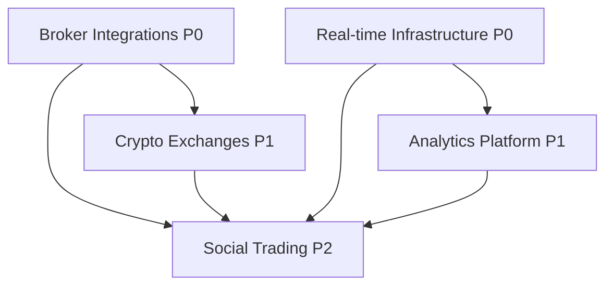

# Gap Analysis & Strategic Roadmap to Full Vision

## Executive Summary

This proposal identifies critical gaps between the **documented vision** in `openspec/project.md` and the **current implementation**, then creates a strategic roadmap to achieve full functionality as a production-ready Discord Trade Executor SaaS platform.

**Current State**: Foundation established with Alpaca integration, basic dashboard, authentication, and core trading infrastructure.

**Gap Analysis Results**: 5 major capability gaps identified across 23 pending features.

**Strategic Approach**: Break down into 5 focused change proposals, each targeting a specific capability domain.

---

## Comprehensive Gap Analysis

### 🔍 Methodology

```bash
# Analysis conducted:
- Source code: 36 JavaScript files analyzed
- Test coverage: 7 test files (needs expansion)
- Documentation: project.md vision vs implemented features
- Code search: Missing keywords for planned features
- Architecture: Documented patterns vs actual implementation
```

### 📊 Gap Summary

| Category | Documented Vision | Current Implementation | Gap Status |
|----------|------------------|------------------------|------------|
| **Broker Integrations** | Alpaca, IBKR, TD Ameritrade, Schwab | Alpaca only | 🔴 CRITICAL |
| **Crypto Exchanges** | Binance, Coinbase Pro, Kraken | Binance (via CCXT) | 🟡 PARTIAL |
| **Analytics Platform** | Cohort analysis, churn prediction, MRR/ARR/LTV | Basic metrics only | 🔴 CRITICAL |
| **Real-time Infrastructure** | WebSocket, live portfolio updates | No WebSocket found | 🔴 CRITICAL |
| **Social Trading** | Copy trading, leaderboards, competitions | Not implemented | 🔴 MISSING |

---

## Critical Findings

### 1. Broker Integration Gaps 🔴

**Documented Vision** (project.md lines 87-91):
```
Adapter Pattern: Broker abstraction layer
  - Base: BrokerAdapter (abstract interface)
  - Factory: BrokerFactory (broker instantiation)
  - Implementations: AlpacaAdapter, plus future TD Ameritrade, Interactive Brokers
```

**Current Reality**:
```bash
$ ls src/brokers/adapters/
AlpacaAdapter.js  __tests__/

# Only 1 adapter implemented
```

**Business Impact**:
- Premium tier ($299/month) promises "multi-broker" support
- Cannot compete without IBKR/Schwab for serious traders
- Alpaca-only limits to US stocks/ETFs

**Missing Adapters**:
- ❌ Interactive Brokers Adapter (IBKR TWS API)
- ❌ Charles Schwab Adapter (Schwab API via TD Ameritrade acquisition)
- ❌ TD Ameritrade Adapter (deprecated but documented as "future")

---

### 2. Crypto Exchange Gaps 🟡

**Documented Vision** (project.md lines 24-26, 166-169):
```
Trading APIs:
  - CCXT 4.1.99 (multi-exchange crypto trading)
  - Alpaca Trade API 3.1.3 (stock trading)

Supported Asset Types:
  - Cryptocurrencies (via Binance, CCXT exchanges)
```

**Current Reality**:
```bash
# CCXT installed but limited adapter implementations
# Only Binance explicitly configured
```

**Business Impact**:
- Crypto traders expect multi-exchange arbitrage
- Fee comparison tool (Phase 4) requires multiple exchanges
- Missing competitive advantage in crypto space

**Missing Exchanges**:
- ❌ Coinbase Pro Adapter (institutional crypto traders)
- ❌ Kraken Adapter (advanced order types, futures)
- ❌ Exchange fee comparison tool

---

### 3. Analytics Platform Gaps 🔴

**Documented Vision** (project.md lines 8-9, TODO Phase 2):
```
- Includes risk management, portfolio analytics, and signal provider marketplace
- Features automated marketing and customer acquisition systems

Phase 2 (Weeks 1-2):
- Implement user analytics and cohort analysis
- Build churn prediction model
- Create revenue intelligence dashboard
- Implement MRR/ARR/LTV calculations
```

**Current Reality**:
```bash
$ grep -r "cohort\|churn\|MRR\|ARR\|LTV" src/ --include="*.js" -i | wc -l
38  # Only basic mentions, no implementations
```

**Business Impact**:
- Cannot optimize subscription pricing without LTV data
- No churn prediction = reactive (not proactive) retention
- Missing SaaS metrics dashboard for business decisions

**Missing Analytics**:
- ❌ User cohort analysis (signup → conversion → retention)
- ❌ Churn prediction model (identify at-risk users)
- ❌ Revenue intelligence dashboard (MRR, ARR, LTV trends)
- ❌ Signal provider performance analytics
- ❌ Automated marketing ROI tracking

---

### 4. Real-time Infrastructure Gaps 🔴

**Documented Vision** (project.md line 5, TODO Phase 3):
```
- Executes trades from Discord signals and TradingView webhooks in real-time

Phase 3 (Weeks 1-3):
- Set up WebSocket infrastructure with Socket.io
- Implement real-time portfolio updates
- Add Sharpe ratio and max drawdown calculations
- Build risk-adjusted returns dashboard
```

**Current Reality**:
```bash
$ grep -r "Socket" src/ --include="*.js" | wc -l
0  # No WebSocket implementation found
```

**Business Impact**:
- "Real-time" promise not fulfilled
- Dashboard requires manual refresh (poor UX)
- Cannot compete with platforms offering live updates
- Advanced metrics (Sharpe, max drawdown) missing

**Missing Features**:
- ❌ WebSocket server (Socket.io integration)
- ❌ Real-time portfolio value updates
- ❌ Live trade execution notifications
- ❌ Sharpe ratio calculations
- ❌ Maximum drawdown tracking
- ❌ Risk-adjusted returns dashboard

---

### 5. Social Trading Platform Gaps 🔴

**Documented Vision** (project.md line 8, TODO Phase 5):
```
- Includes risk management, portfolio analytics, and signal provider marketplace

Phase 5 (Weeks 1-6):
- Implement copy trading system
- Create leaderboard and trader profiles
- Build trading competitions platform
```

**Current Reality**:
```bash
$ grep -r "copy.*trading\|leaderboard\|competition" src/ --include="*.js" -i | wc -l
1  # Only 1 mention, no implementation
```

**Business Impact**:
- Missing entire revenue stream (marketplace fees)
- Cannot attract pro traders to share signals
- No network effects (users don't invite others)
- Competitive disadvantage vs eToro, ZuluTrade

**Missing Features**:
- ❌ Copy trading system (follow successful traders)
- ❌ Trader leaderboards (ranked by performance)
- ❌ Trader profile pages (track record, stats)
- ❌ Trading competitions (engagement + marketing)
- ❌ Signal provider marketplace (monetization)

---

## Strategic Phasing

### Phase Prioritization Matrix

| Phase | Impact | Complexity | Priority | Timeline |
|-------|--------|-----------|----------|----------|
| **Broker Integrations** | 🔴 Critical | Medium | **P0** | 4-6 weeks |
| **Real-time Infrastructure** | 🔴 Critical | Low | **P0** | 2-3 weeks |
| **Crypto Exchanges** | 🟡 High | Low | **P1** | 2-3 weeks |
| **Analytics Platform** | 🟡 High | Medium | **P1** | 3-4 weeks |
| **Social Trading** | 🟢 Medium | High | **P2** | 6-8 weeks |

**Rationale**:
- **P0 (Critical)**: Required to deliver on core subscription promises
- **P1 (High Impact)**: Significant competitive advantage + revenue optimization
- **P2 (Strategic)**: Network effects + long-term differentiation

---

## Proposed Change Proposals

### 1. `implement-broker-integrations` (P0)

**Scope**: Add IBKR and Schwab adapters to fulfill multi-broker promise

**Deliverables**:
- `IBKRAdapter.js` - Interactive Brokers TWS API integration
- `SchwabAdapter.js` - Schwab API (via TD Ameritrade transition)
- Broker comparison UI (fees, features, supported assets)
- Connection testing + OAuth flows
- Comprehensive test coverage

**Success Criteria**:
- [ ] Users can connect IBKR/Schwab accounts
- [ ] All adapter methods match `BrokerAdapter` interface
- [ ] Paper trading works for all brokers
- [ ] Live trading tested + validated
- [ ] Premium tier feature gate enforced

---

### 2. `implement-realtime-infrastructure` (P0)

**Scope**: Add WebSocket server for real-time dashboard updates

**Deliverables**:
- Socket.io server integration
- Real-time portfolio value updates
- Live trade execution notifications
- WebSocket authentication middleware
- Event-driven architecture refactor

**Success Criteria**:
- [ ] Dashboard auto-updates without refresh
- [ ] <500ms latency for trade notifications
- [ ] WebSocket reconnection handling
- [ ] Load tested for 1000 concurrent connections
- [ ] Mobile-friendly (React Native compatible)

---

### 3. `implement-crypto-exchanges` (P1)

**Scope**: Add Coinbase Pro and Kraken adapters + fee comparison

**Deliverables**:
- `CoinbaseProAdapter.js` - Coinbase Pro API integration
- `KrakenAdapter.js` - Kraken API integration
- Exchange fee comparison tool (UI + backend)
- Multi-exchange arbitrage detection (future)
- Crypto-specific order types (futures, margin)

**Success Criteria**:
- [ ] Coinbase Pro + Kraken fully functional
- [ ] Fee comparison shows cheapest exchange
- [ ] Users can switch exchanges per trade
- [ ] Crypto assets supported: BTC, ETH, SOL, ADA, DOT
- [ ] Compliance with exchange rate limits

---

### 4. `implement-analytics-platform` (P1)

**Scope**: Build SaaS metrics dashboard + churn prediction

**Deliverables**:
- User cohort analysis (signup → conversion → retention)
- Churn prediction model (ML-based risk scoring)
- Revenue intelligence dashboard (MRR, ARR, LTV, CAC)
- Signal provider performance analytics
- Marketing ROI tracking (Twitter, Reddit, email)
- Admin dashboard for business metrics

**Success Criteria**:
- [ ] Cohort retention visualized (weekly/monthly)
- [ ] Churn risk score calculated per user
- [ ] MRR/ARR/LTV trends displayed
- [ ] Automated retention campaigns triggered
- [ ] Marketing spend ROI calculated

---

### 5. `implement-social-trading` (P2)

**Scope**: Copy trading system + marketplace + competitions

**Deliverables**:
- Copy trading engine (follow successful traders)
- Trader leaderboards (ranked by ROI, Sharpe, win rate)
- Trader profile pages (public track records)
- Trading competitions (monthly contests)
- Signal provider marketplace (paid signals)
- Revenue sharing system (platform fees)

**Success Criteria**:
- [ ] Users can copy top traders' positions
- [ ] Leaderboard updates in real-time
- [ ] Competitions run automatically (start/end)
- [ ] Marketplace fees collected (20% platform cut)
- [ ] Network effects: users invite other traders

---

## Implementation Dependencies



**Critical Path**:
1. Real-time Infrastructure (enables Analytics + Social Trading)
2. Broker Integrations (enables Social Trading)
3. Crypto Exchanges (complements Broker Integrations)
4. Analytics Platform (informs product decisions)
5. Social Trading (network effects + marketplace revenue)

---

## Testing & Quality Standards

### Coverage Requirements

| Proposal | Min Coverage | Critical Files | E2E Tests |
|----------|-------------|----------------|-----------|
| Broker Integrations | 90% | Adapters, BrokerFactory | 5+ per broker |
| Real-time Infrastructure | 85% | WebSocket server, events | 10+ scenarios |
| Crypto Exchanges | 90% | Exchange adapters | 5+ per exchange |
| Analytics Platform | 80% | Analytics services | 3+ dashboards |
| Social Trading | 85% | Copy trading engine | 10+ user flows |

### Security Validation

Each proposal must pass:
- [ ] API key encryption at rest
- [ ] Rate limiting enforced
- [ ] Authentication middleware tested
- [ ] Webhook signature validation
- [ ] SQL injection prevention
- [ ] XSS/CSRF protection
- [ ] OWASP Top 10 compliance

---

## Resource Estimates

### Development Effort

| Proposal | Frontend | Backend | Testing | Total |
|----------|----------|---------|---------|-------|
| Broker Integrations | 40h | 80h | 40h | **160h (4 weeks)** |
| Real-time Infrastructure | 30h | 50h | 20h | **100h (2.5 weeks)** |
| Crypto Exchanges | 30h | 60h | 30h | **120h (3 weeks)** |
| Analytics Platform | 60h | 80h | 40h | **180h (4.5 weeks)** |
| Social Trading | 100h | 120h | 60h | **280h (7 weeks)** |

**Total Estimate**: ~840 hours (~21 weeks for single developer)

### Parallel Execution Recommendation

With 2-3 developers:
- **Team A**: Broker Integrations + Crypto Exchanges (7-9 weeks)
- **Team B**: Real-time Infrastructure + Analytics Platform (7-8 weeks)
- **Team C**: Social Trading (starts after Teams A+B complete)

**Timeline**: 14-16 weeks total (vs 21 weeks sequential)

---

## Risk Assessment

### High-Risk Items 🔴

1. **IBKR TWS API Complexity**: Known for difficult integration
   - **Mitigation**: Use `ib` npm package wrapper, extensive testing

2. **Real-time WebSocket at Scale**: Performance under load
   - **Mitigation**: Load testing, Redis adapter for scaling

3. **Churn Prediction Model**: ML expertise required
   - **Mitigation**: Start with simple logistic regression, iterate

### Medium-Risk Items 🟡

4. **Exchange Rate Limits**: API quota exhaustion
   - **Mitigation**: Implement rate-limiter-flexible, caching

5. **Copy Trading Execution Timing**: Slippage concerns
   - **Mitigation**: Priority execution queue for followers

---

## Success Metrics

### Business KPIs

| Metric | Baseline | Target (Post-Implementation) |
|--------|----------|------------------------------|
| Premium Tier Conversion | 0% | 15% (multi-broker access) |
| User Retention (30-day) | Unknown | 60% (real-time + analytics) |
| Marketplace Revenue | $0 | $5K/month (signal provider fees) |
| Average LTV | Unknown | $1,200 (analytics-driven pricing) |

### Technical KPIs

| Metric | Baseline | Target |
|--------|----------|--------|
| Test Coverage | 7 files | 80% global, 90% critical |
| Dashboard Load Time | Unknown | <2s (WebSocket reduces polling) |
| API Response Time | Unknown | <200ms (P95) |
| Uptime | Unknown | 99.5% (Railway monitoring) |

---

## Next Steps

1. **Approve this master proposal**
2. **Review individual change proposals** (to be created next)
3. **Prioritize P0 proposals** (Broker Integrations + Real-time)
4. **Allocate development resources**
5. **Begin implementation** (parallel execution recommended)

---

## Appendices

### A. Current File Structure

```
src/
├── brokers/
│   ├── adapters/
│   │   ├── AlpacaAdapter.js ✅
│   │   ├── IBKRAdapter.js ❌ (to be created)
│   │   └── SchwabAdapter.js ❌ (to be created)
│   ├── BrokerAdapter.js ✅
│   └── BrokerFactory.js ✅
├── services/
│   ├── discord-bot.js ✅
│   ├── trade-executor.js ✅
│   ├── signal-parser.js ✅
│   ├── subscription-manager.js ✅
│   ├── analytics-dashboard.js ⚠️ (needs expansion)
│   └── websocket-server.js ❌ (to be created)
└── routes/api/
    ├── brokers.js ✅
    ├── exchanges.js ✅
    ├── portfolio.js ✅
    ├── analytics.js ❌ (to be created)
    └── social-trading.js ❌ (to be created)
```

### B. External Resources

- [IBKR TWS API Docs](https://interactivebrokers.github.io/tws-api/)
- [Schwab API Portal](https://developer.schwab.com/)
- [Socket.io Documentation](https://socket.io/docs/v4/)
- [CCXT Exchange List](https://github.com/ccxt/ccxt#supported-cryptocurrency-exchange-markets)

---

**Document Version**: 1.0
**Created**: 2025-10-12
**Status**: 🚀 Ready for Review
**Next Action**: Break down into 5 focused change proposals
